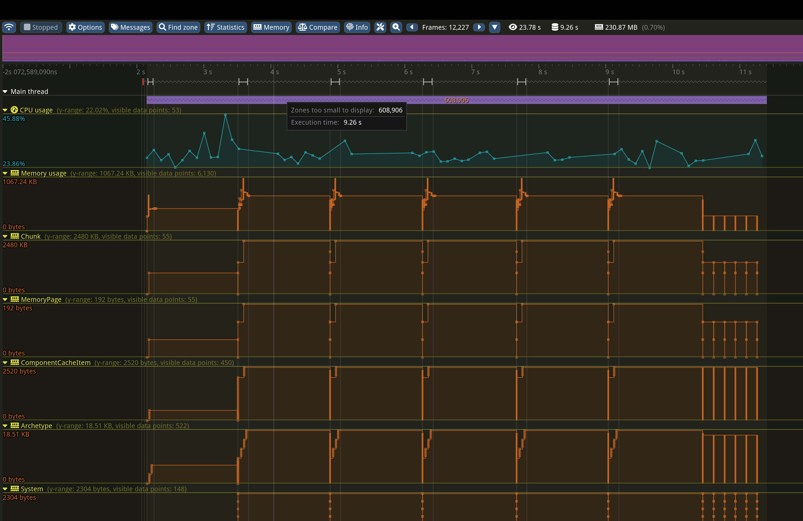

<!--
@cond TURN_OFF_DOXYGEN
-->


[![Version][badge.version]][version]
[![license][badge.license]][license]
[![language][badge.language]][language]
[![discord][badge.discord]][discord]
[![codacy][badge.codacy]][codacy]

[badge.version]: https://img.shields.io/github/v/release/richardbiely/gaia-ecs?style=for-the-badge
[badge.license]: https://img.shields.io/badge/license-MIT-blue?style=for-the-badge
[badge.language]: https://img.shields.io/badge/language-C%2B%2B17-yellow?style=for-the-badge&color=blue
[badge.discord]: https://img.shields.io/discord/1183706605108330516?style=for-the-badge&label=Discord
[badge.codacy]: https://img.shields.io/codacy/grade/bb28fa362fce4054bbaf7a6ba9aed140?style=for-the-badge

[version]: https://github.com/richardbiely/gaia-ecs/releases
[license]: https://en.wikipedia.org/wiki/MIT_License
[language]: https://en.wikipedia.org/wiki/C%2B%2B17
[discord]: https://discord.gg/wJjK72yze2
[codacy]: https://app.codacy.com/gh/richardbiely/gaia-ecs/dashboard?utm_source=gh&utm_medium=referral&utm_content=&utm_campaign=Badge_grade


**Gaia-ECS** is a fast and easy-to-use [ECS](#ecs) framework. Some of its current features and highlights are:
* very simple and safe API
* based on [C++17](https://en.cppreference.com/w/cpp/17) with no external dependencies (no STL strings or containers)
* compiles warning-free on [all major compilers](https://github.com/richardbiely/gaia-ecs/actions)
* archetype / chunk-based storage for maximum iteration speed and easy code parallelization
* supports applications with large number of components and archetypes
* automatic component registration
* supports [run-time defined tags](#create-or-delete-entity)
* supports [entity relationships](#relationships)
* supports smart pointer-like [entity lifespan](#entity-lifespan) management
* integrated [compile-time serialization](#serialization)
* comes with [multithreading](#multithreading) support with job-dependencies, supported on the [ECS level](#parallel-execution), too
* ability to [organize data as AoS or SoA](#data-layouts) on the component level with very few changes to your code
* compiles almost instantly
* stability and correctness secured by running thousands of [unit tests](#unit-testing) and debug-mode asserts in the code
* thoroughly documented both public and internal code
* exists also as a [single-header](#single-header) library so you can simply drop it into your project and start using it

NOTE: Due to its extensive use of acceleration structures and caching, this library is not a good fit for hardware with very limited memory resources (measured in MiBs or less). Micro-controllers, retro gaming consoles, and similar platforms should consider alternative solutions.

# Table of Contents

* [Introduction](#introduction)
  * [ECS](#ecs)
  * [Implementation](#implementation)
  * [Project structure](#project-structure)
* [Usage](#usage)
  * [Minimum requirements](#minimum-requirements)
  * [Basic operations](#basic-operations)
    * [Create or delete entity](#create-or-delete-entity)
    * [Name entity](#name-entity)
    * [Add or remove component](#add-or-remove-component)]
    * [Component presence](#component-presence)
    * [Component hooks](#component-hooks)
    * [Bulk editing](#bulk-editing)
    * [Set or get component value](#set-or-get-component-value)
    * [Copy entity](#copy-entity)
    * [Entity cleanup](#entity-cleanup)
    * [Batched creation](#batched-creation)
    * [Entity lifespan](#entity-lifespan)
    * [Archetype lifespan](#archetype-lifespan)
  * [Data processing](#data-processing)
    * [Query](#query)
    * [Uncached query](#uncached-query)
    * [Iteration](#iteration)
    * [Constraints](#constraints)
    * [Change detection](#change-detection)
    * [Grouping](#grouping)
    * [Parallel execution](#parallel-execution)
  * [Relationships](#relationships)
    * [Relationship basics](#relationship-basics)
    * [Entity dependencies](#entity-dependencies)
    * [Combination constraints](#combination-constraints)
    * [Exclusivity](#exclusivity)
    * [Entity inheritance](#entity-inheritance)
    * [Targets](#targets)
    * [Relations](#relations)
    * [Cleanup rules](#cleanup-rules)
  * [Unique components](#unique-components)
  * [Delayed execution](#delayed-execution)
  * [Systems](#systems)
    * [System basics](#system-basics)
    * [System dependencies](#system-dependencies)
    * [Systems and jobs](#system-jobs)
  * [Data layouts](#data-layouts)
  * [Serialization](#serialization)
  * [Multithreading](#multithreading)
    * [Jobs](#jobs)
    * [Job dependencies](#job-dependencies)
    * [Priorities](#priorities)
    * [Threads](#threads)
* [Requirements](#requirements)
  * [Compiler](#compiler)
  * [Dependencies](#dependencies)
* [Installation](#installation)
  * [CMake](#cmake)
    * [Project settings](#project-settings)
    * [Sanitizers](#sanitizers)
    * [Single-header](#single-header)
* [Repository structure](#repository-structure)
  * [Examples](#examples)
  * [Benchmarks](#benchmarks)
  * [Profiling](#profiling)
  * [Testing](#testing)
* [Future](#future)
* [Contributions](#contributions)
* [License](#license)

# Introduction

## ECS
[Entity-Component-System (ECS)](https://en.wikipedia.org/wiki/Entity_component_system) is a software architectural pattern based on organizing your code around data which follows the principle of [composition over inheritance](https://en.wikipedia.org/wiki/Composition_over_inheritance).  

Instead of looking at "items" in your program as objects you normally know from the real world (car, house, human) you look at them as pieces of data necessary for you to achieve some result.

This way of thinking is more natural for machines than people but when used correctly it allows you to write faster code (on most architectures). What is most important, however, is it allows you to write code that is easier to maintain, expand and reason about.

For instance, when moving an object from point A to point B you do not care if it is a house or a car. You only care about its position. If you want to move it at some specific speed you will consider also the object's velocity. Nothing else is necessary.

Three building blocks of ECS are:
* **Entity** (id) - an index that uniquely identifies a group of components
* **Component** (data) - a piece of data (position, velocity, age)
* **System** (processor) - a place where your program's logic is implemented

Following the example given above, a vehicle could be any entity with Position and Velocity components. If it is a car we could attach the Driving component to it. If it is an airplane we would attach the Flying component.<br/>
The actual movement is handled by [systems](#systems). Those that match the Flying component will implement the logic for flying. Systems matching the Driving component handle the land movement.

On the outside ECS is not much different from database engines. The main difference is it does not need to follow the [ACID](https://en.wikipedia.org/wiki/ACID) principle which allows it to be optimized beyond what an ordinary database engine could ever be both in terms of latency and absolute performance. At the cost of data safety.

The main strengths of an ECS done right could be summarized as:
* *decoupling of logic* - separates data (components) from logic (systems)
* *modularity and reusability* - promotes modular and reusable code with self-contained components
* *ease of maintenance* - promotes less spaghetti code with a modular structure that is easier to debug
* *flexibility* - allows dynamic object behavior through composition of entities with specific components
* *adaptability* - easily adapts to changing project requirements through component and system modifications
* *performance* - optimized for data locality, supports data- and thread-level parallelism almost out-of-the-box; scales well with a predictable performance impact as the number of entities increases

## Implementation
**Gaia-ECS** is an archetype-based entity component system. This means that unique combinations of components are grouped into archetypes. Each archetype consists of chunks - blocks of memory holding your entities and components. You can think of them as [database tables](https://en.wikipedia.org/wiki/Table_(database)) where components are columns and entities are rows.

Each chunk is either 8 or 16 KiB big depending on how much data can be effectively used by it. This size is chosen so that the entire chunk at its fullest can fit into the L1 cache on most CPUs. Chunk memory is preallocated in blocks organized into pages via the internal chunk allocator.

Components of the same type are grouped together and laid out linearly in memory. Thanks to all that data is organized in a cache-friendly way which most computer architectures like and actual heap allocations which are slow are reduced to a minimum.

The main benefits of archetype-based architecture are fast iteration and good memory layout by default. They are also easy to parallelize.

On the other hand, adding and removing components can be somewhat slower because it involves moving data around. In our case, this weakness is mitigated by building an archetype graph and having the ability to add and remove components in batches.

In this project, components are entities with the ***Component*** component attached to them. Treating components as entities allows for great design simplification and big features.

## Project structure
The entire project is implemented inside gaia ***namespace***. It is further split into multiple sub-projects each with a separate namespaces.
- ***core*** - core functionality, use by all other parts of the code
- ***mem*** - memory-related operations, memory allocators
- ***cnt*** - data containers
- ***meta*** - reflection framework
- ***ser*** - serialization framework
- ***mt*** - multithreading framework
- ***ecs*** - the ECS part of the project

A special part of the project is ***external***. It contains 3rd-party code such as a modified [robin-hood](https://github.com/martinus/robin-hood-hashing) hash-map or random number generator from [ETLCPP](https://github.com/ETLCPP/etl).

# Usage
## Minimum requirements

```cpp
#include <gaia.h>
```

The entire framework is placed in a namespace called **gaia**.
The ECS part of the library is found under **gaia::ecs** namespace.<br/>
In the code examples below we will assume we are inside gaia namespace.

## Basic operations
### Create or delete entity

Entity a unique "thing" in ***World***. Creating an entity at runtime is as easy as calling ***World::add***. Deleting is done via ***World::del***. Once deleted, entity is no longer valid and if used with some APIs it is going to trigger a debug-mode assert. Verifying that an entity is valid can be done by calling ***World::valid***.

```cpp
ecs::World w;
// Create a new entity
ecs::Entity e = w.add();
// Check if "e" is valid. Returns true.
bool isValid = w.valid(e); // true
// Delete the entity
w.del(e);
// Check if "e" is still valid. Return false.
isValid = w.valid(e); // false
```

It is also possible to attach entities to entities. This effectively means you are able to create your own components/tags at runtime.

```cpp
ecs::Entity player0 = w.add();
ecs::Entity player1 = w.add();
ecs::Entity player2 = w.add();
ecs::Entity teamA = w.add();
ecs::Entity teamB = w.add();
// Add player0 and player1 to teamA
w.add(player0, teamA);
w.add(player1, teamA);
// Add player2 to teamB
w.add(player2, teamB);
```

### Name entity

Each entity can be assigned a unique name. This is useful for debugging or entity lookup when entity id is not present for any reason.

```cpp
ecs::World w;
ecs::Entity e = w.add();

// Entity "e" named "my_unique_name".
// The string is copied and stored internally.
w.name(e, "my_unique_name");

// If you know the length of the string, you can provide it as well
w.name(e, "my_unique_name", 14);

// Pointer to the string used as entity name for entity "e"
const char* name = w.name(e);

// Entity identified by the string returned.
// In this case, "e_by_name" and "e" are equal.
ecs::Entity e_by_name = w.get("my_unique_name");

// The name can be unset by setting it to nullptr
w.name(e, nullptr);
```

If you already have a dedicated string storage it would be a waste to duplicate the memory. In this case you can use ***World::name_raw*** to name entities. It does NOT copy and does NOT store the string internally which means you are responsible for its lifetime. The pointer should be stable. Otherwise, any time your storage tries to move the string to a different place you have to unset the name before it happens and set it anew after the move is done.

```cpp
const char* pUserManagedString = ...;
w.name_raw(e, pUserManagedString);

// If you now the length, you can provide it
w.name_raw(e, pUserManagedString, userManagedStringLength);

// If the user-managed string pointer is not stable, you need to unset the name before the pointer changes location
w.name_raw(e, nullptr);
...
// ... the change of pointer happens
...
// After the user-managed string changed location and obtained a new pointer, you set the name again
w.name_raw(e, pUserManagedString);
```

Hierarchical name lookup is also possible.
```cpp
auto europe = wld.add();
auto slovakia = wld.add();
auto bratislava = wld.add();

wld.child(slovakia, europe);
wld.child(bratislava, slovakia);

wld.name(europe, "europe");
wld.name(slovakia, "slovakia");
wld.name(bratislava, "bratislava");

auto e1 = wld.get("europe.slovakia"); // returns slovakia
auto e2 = wld.get("europe.slovakia.bratislava"); // returns bratislava
```

Character '.' (dot) is used as a separator. Therefore, dots can not be used inside entity names.
```cpp
auto e = wld.add();
wld.name(e, "eur.ope"); // invalid name, the naming request is going to be ignored
```

### Add or remove component

Components can be created using ***World::add<T>***. This function returns a descriptor of the object which is created and stored in the component cache. Each component is assigned one entity to uniquely identify it. You do not have to do this yourself, the framework performs this operation automatically behind the scenes any time you call some compile-time API where you interact with your structure. However, you can use this API to quickly fetch the component's entity if necessary.

```cpp
struct Position {
  float x, y, z;
};
const ecs::ComponentCacheItem& cci = w.add<Position>();
ecs::Entity position_entity = cci.entity;
```

Because components are entities as well, adding them is very similar to what we have seen previously.

```cpp
struct Position {
  float x, y, z;
};
struct Velocity {
  float x, y, z;
};

ecs::World w;

// Create an entity with Position and Velocity.
ecs::Entity e = w.add();
w.add<Position>(e, {0, 100, 0});
w.add<Velocity>(e, {0, 0, 1});

// Remove Velocity from the entity.
w.del<Velocity>(e);
```

This also means the code above could be rewritten as following:

```cpp
// Create Position and Velocity entities
ecs::Entity position = w.add<Position>().entity;
ecs::Entity velocity = w.add<Velocity>().entity;

// Create an entity with Position and Velocity.
ecs::Entity e = w.add();
w.add(e, position, Position{0, 100, 0});
w.add(e, velocity, Velocity{0, 0, 1});

// Remove Velocity from the entity.
w.del(e, velocity);
```

When adding components following restrictions apply:
* There can be at most 32 components per entity. If you need more you can merge some of your components, or even rethink the strategy because too many components usually implies design issues (e.g. object-oriented thinking or using real-life abstractions when handling ECS entities and components).
* Maximum size of a component is 4095 bytes. This is because internally chunks of 8 kiB or 16 kiB are used to store data. Therefore, components can not get too big. If this is not enough for you, inside your component you simply store a reference to data that you hold outside of ECS. Note, this restriction applies only to components stored in archetypes. In the future when more storages types are introduced this restriction won't apply to them.
* [SoA](#data-layouts) components can have at most 4 members and each of them can be at most 255 bytes long.
* Components must be default-constructible (either the default constructor is present or you provide one yourself). If your component contains members that are not default-constructible (e.g. data from some 3rd party library that are beyond your control) you need to work this around by storing pointers to this data or come up with different means of accessing it.

### Component presence
Whether or not a certain component is associated with an entity can be checked in two different ways. Either via an instance of a World object or by the means of ***Iter*** which can be acquired when running [queries](#query).

```cpp
// Check if entity e has Velocity (via world).
const bool hasVelocity = w.has<Velocity>(e);
// Check if entity wheel is attached to the car
const bool hasWheel = w.has(car, wheel);
...

// Check if entities hidden behind the iterator have Velocity (via iterator).
ecs::Query q = w.query().any<Position, Velocity>(); 
q.each([&](ecs::Iter& it) {
  const bool hasPosition = it.has<Position>();
  const bool hasVelocity = it.has<Velocity>();
  ...
});
```

Providing entities is supported as well.

```cpp
auto p = w.add<Position>().entity;
auto v = w.add<Velocity>().entity;

// Check if entities hidden behind the iterator have Velocity (via iterator).
ecs::Query q = w.query().any(p).any(v); 
q.each([&](ecs::Iter& it) {
  const bool hasPosition = it.has(p);
  const bool hasVelocity = it.has(v);
  ...
});
```

### Component hooks

It is possible to register add/del hooks for components. Whenever a given component is added to an entity, or deleted from it, the hook triggers. This comes handy for debugging, or when specific logic is needed for a given component.
Component hooks are unique. Each component can have at most one add hook, and one delete hook.

```cpp
ecs::World w;
const ecs::ComponentCacheItem& pos_item = w.add<Position>();
ecs::ComponentCache::hooks(pos_item).func_add = [](const ecs::World& w, const ecs::ComponentCacheItem& cci, ecs::Entity src) {
  // Position component added to entity "src"
  // ...
};

ecs::Entity e = w.add();
// The add hook will trigger
w.add<Position>(e);
```

Hooks can easily be removed:
```cpp
const ecs::ComponentCacheItem& pos_item = w.add<Position>();
ecs::ComponentCache::hooks(pos_item).func_add = nullptr;

ecs::Entity e = w.add();
// The add hook will not be triggered because we removed the hook
w.add<Position>(e);
```

It is also possible to set up a "set" hook. These are triggered whenever write access to component is requested.
```cpp
ecs::World w;
const ecs::ComponentCacheItem& pos_item = w.add<Position>();
ecs::ComponentCache::hooks(pos_item).func_set = [](const ecs::World& w, const ecs::ComponentRecord& rec, Chunk& chunk) {
  // Position component value change has been requested
  // ...
};

ecs::Entity e = w.add();
w.add<Position>(e); // Don't trigger the set hook, yet
w.set<Position>(e) = {}; // Trigger the set hook
w.acc(e).set<Position>({}); // Trigger the set hook
w.acc(e).sset<Position>({}); // Don't trigger the set hook
```

Unlike *add* and *del* hooks, *set* hooks will not tell you what entity the hook triggered for. This is because any write access is done for the entire chunk, not just one of its entities. If one-entity behavior is required, the best thing you can do is moving your entity to a separate archetype (e.g. by adding some unique tag component to it).

### Bulk editing

Adding an entity to entity means it becomes a part of a new archetype. Like mentioned [previously](#implementation), becoming a part of a new archetype means that all data associated with the entity needs to be moved to a new place. The more ids in the archetype the slower the move (empty components/tags are an exception because they do not carry any data). For this reason it is not advised to perform large number of separate additions / removals per frame.

Instead, when adding or removing multiple entities/components at once it is more efficient doing it via bulk operations. This way only one archetype movement is performed in total rather than one per added/removed entity.

```cpp
ecs::World w;

// Create an entity with Position. This is one archetype movement.
ecs::Entity e = w.add();
w.add<Position>();

// Add and remove multiple components. 
// This does one archetype movement rather than 6 compared to doing these operations separate.
w.build(e)
 // add Velocity to entity e
 .add<Velocity>()
 // remove Position from entity e
 .del<Position>()
 // add Rotation to entity e
 .add<Rotation>();
```

It is also possible to manually commit all changes by calling ***ecs::EntityBuilder::commit***. This is useful in scenarios where you have some branching and do not want to duplicate your code for both branches or simply need to add/remove components based on some complex logic.

```cpp
ecs::EntityBuilder builder = w.build(e);
builder
  .add<Velocity>()
  .del<Position>();
if (some_condition) {
  builder.add<Rotation>();
}
builder.commit();
```

>**NOTE:**<br/>Once ***ecs::EntityBuilder::commit*** is called (either manually or internally when the builder's destructor is invoked) the contents of builder are returned to its default state.

### Set or get component value

```cpp
// Change Velocity's value.
w.set<Velocity>(e) = {0, 0, 2};
// Same as above but the world version is not updated so nobody gets notified of this change.
w.sset<Velocity>(e) = {4, 2, 0};
```

When setting multiple component values at once it is more efficient doing it via chaining:

```cpp
w.acc_mut(e)
// Change Velocity's value on entity "e"
  .set<Velocity>({0, 0, 2})
// Change Position's value on entity "e"
  .set<Position>({0, 100, 0})
// Change...
  .set...;
```

Similar to ***ecs::EntityBuilder::build*** you can also use the setter object in scenarios with complex logic.

```cpp
ecs::ComponentSetter setter = w.acc_mut(e);
setter.set<Velocity>({0, 0, 2});
if (some_condition)
  setter.set<Position>({0, 100, 0});
setter.set<Something>({ ... }).set<Else>({ ... });

// You can also retrieve a reference to data (for AoS) or the data accessor (for SoA)
auto& vel = setter.mut<Velocity>();
auto& pos = setter.mut<Position>();
```

Components up to 8 bytes (including) are returned by value. Bigger components are returned by const reference.

```cpp
// Read Velocity's value. As shown above Velocity is 12 bytes in size.
// Therefore, it is returned by const reference.
const auto& velRef = w.get<Velocity>(e);
// However, it is easy to store a copy.
auto velCopy = w.get<Velocity>(e);
```

Both read and write operations are also accessible via views. Check the [iteration](#iteration) sections to see how.

### Copy entity

A copy of another entity can be easily created.

```cpp
// Create an entity with Position and Velocity.
ecs::Entity e = w.add();
w.add(e, position, Position{0, 100, 0});
w.add(e, velocity, Velocity{0, 0, 1});

// Make a copy of "e". Component values on the copied entity will match the source.
// Value of Position on "e2" will be {0, 100, 0}.
// Value of Velocity on "e2" will be {0, 0, 1}.
ecs::Entity e2 = w.copy(e);
```
### Entity cleanup

Anything attached to an entity can be easily removed using ***World::clear***. This is useful when you need to quickly reset your entity and still want to keep your Entity's id (deleting the entity would mean that as some point it could be recycled and its id could be used by some newly created entity).

```cpp
ecs::Entity e = w.add();
ecs::Entity something = w.add();
// Add a Position component to our entity
w.add<Position>(e, {0, 100, 0});
// Add the "something" entity to our entity
w.add(e, something);
// Remove anything attached to out entity
w.clear(e);

bool hasPosition = w.has<Position>(e); // false
bool hasSomething = w.has(e, something); // false
```

### Batched creation

Another way to create entities is by creating many of them at once. This is more performant than creating entities one by one.

```cpp
// Create 1000 empty entities
w.add(1000);
w.add(1000, [](Entity newEntity) {
  // Do something with the new entity
  // ...
})

// Create an entity with Position and Velocity.
ecs::Entity e = w.add();
w.add(e, position, Position{0, 100, 0});
w.add(e, velocity, Velocity{0, 0, 1});

// Create 1000 more entities like "e".
// Their component values are not initialized to any particular value.
w.add_n(e, 1000);
w.add_n(e, 1000, [](Entity newEntity) {
  // Do something with the new entity
  // ...
});

// Create 1000 more entities like "e".
// Their component values are going to be the same as "e".
w.copy_n(e, 1000);
w.copy_n(e, 1000, [](Entity newEntity) {
  // Do something with the new entity
  // ...
});
w.copy_n(e, 1000, [](ecs::CopyIter& it) {
  auto entityView = it.view<ecs::Entity>();
  // You can also access the view of components attached to the entity
  auto someView = it.view<SomeComponent>();
  GAIA_EACH(it) {
    // Do something with the new entities
    // ...
  }
});
```
### Entity lifespan

Every entity in the world is reference counted. When an entity is created, the value of this counter is 1. When ***ecs::World::del*** is called the value of this counter is decremented. When it reaches zero, the entity is deleted. However, the lifetime of entities can be extended. Calling ***ecs::World::del*** any number of times on the same entity is safe because the reference counter is decremented only on the first attempt. Any further attempts are ignored.

#### SafeEntity
***ecs::SafeEntity*** is a wrapper above ***ecs::Entity*** that makes sure that an entity stays alive until the last ***ecs::SafeEntity*** referencing the entity goes out of scope. When the wrapper is instantiated it increments the entity's reference counter by 1. When it goes out of scope it decrements the counter by 1. In terms of functionality, this is reminiscent of a C++ smart pointer, std::shared_ptr.

```cpp
ecs::World w;
// Create an entity. Its reference counter is 1.
ecs::Entity player = w.add();
{
  // Make sure the entity survives so long playerSafe exists. Reference counter is incremented to 2.
  auto playerSafe = ecs::SafeEntity(w, player);

  // Try to delete the player entity. The reference counter is decremented to 1.
  // It is not zero and therefore the entity player is not deleted.
  w.del(player);
  bool isValid = w.valid(player); // true
  // We can try deleting the entity again but the request is ignored this time.
  // Calling del on an entity decrements the reference counter only once. Further
  // calls are dropped. Hence, the reference counter remains 1.
  w.del(player);
  isValid = w.valid(player); // true
}

// Here, playerSafe is out of scope. Reference counter is decremented to 0.
// Internally, w.del(player) is called.
// ... it's not safe to use player at this point anymore.
bool isValid = w.valid(player); // false
```

ecs::SafeEntity is fully compatible with ecs::Entity and can be used just like it in all scenarios.

```cpp
ecs::World w;
ecs::Entity player = w.add();
auto playerSafe = ecs::SafeEntity(w, player);
// Add a Position component to playerSafe (player)
w.add<Position>(playerSafe);
// w.add<Position>(player) <-- this would do the same thing
```

#### WeakEntity
***ecs::WeakEntity*** is a wrapper above ***ecs::Entity*** that makes sure that when the entity it references is deleted, it automatically starts acting as ***ecs::EntityBad***. In terms of functionality, this is reminiscent of a C++ smart pointer, std::weak_ptr.

***ecs::WeakEntity*** is fully compatible with ***ecs::Entity*** and can be used just like it in all scenarios. As a result, you have to keep in mind that it can become invalid at any point.

```cpp
ecs::World w;
// Create an entity. Its reference counter is 1.
ecs::Entity player = w.add();

// Create a "weak reference" to the entity player
auto playerSafe = ecs::WeakEntity(w, player);

// Add a Position component to playerSafe (player)
w.add<Position>(playerSafe);
// w.add<Position>(player) <-- this would do the same thing

// Calling del decrements the reference count of entity by 1. In this case, the reference counter
// becomes 0 and therefore the entity is deleted.
// Our playerSafe automatically becomes EntityBad.
w.del(player);

bool isValid;
isValid = w.valid(player); // false
isValid = w.valid(playerSafe); // false
```

Technically, ***ecs::WeakEntity*** is almost the same thing as ***ecs::Entity*** with one nuance difference. Because entity ids are recycled, in theory, ***ecs::Entity*** left lying around somewhere could end up being multiple different things over time. This is not an issue with ***ecs::WeakEntity*** because the moment the entity linked with it gets deleted, it is reset to ***ecs::EntityBad***.

This is an edge-case scenario, unlikely to happen even, but should you ever need it ***ec::WeakEntity*** is there to help. If you decided to change the amount of bits allocated to ***Entity::gen*** to a lower number you will increase the likelihood of double-recycling happening and increase usefulness of ***ecs::WeakEntity***.

A more useful use case, however, would be if you need an entity identifier that gets automatically reset when the entity gets deleted without any setup necessary from your end. Certain situations can be complex and using ***ecs::WeakEntity*** just might be the one way for you to address them.

### Archetype lifespan

Once all entities of given archetype are deleted (and as a result all chunks in the archetypes are empty), the archetype stays alive for another 127 ticks of ***ecs::World::update***. However, there might be cases where this behavior is insufficient. Maybe you want the archetype deleted faster, or you want to keep it around forever.

For instance, you might often end up deleting all entities of a given archetype only to create new ones seconds later. In this case, keeping the archetype around can have several performance benefits:
1) no need to recreate the archetype
2) no need to rematch queries with the archetype

```cpp
ecs::World w;
ecs::Entity player0 = w.add(); // player0 belongs to archetype A
ecs::Entity teamA = w.add(); // teamA belongs to archetype A

// Player0 becomes a part of archetype B.
w.add(player0, teamA);
// Archetype B is never going to be deleted.
w.set_max_lifespan(player0, 0);
// Archetype B is going to be deleted after 20 ticks of ecs::World::update.
w.set_max_lifespan(player0, 20);
// Reset maximum lifespan of the archetype B belongs to.
w.set_max_lifespan(player0);
```

Note, if the entity used to change an archetype's lifespan moves to a new archetype, the later's lifespan is not updated.

```cpp
ecs::World w;
ecs::Entity player0 = w.add(); // player0 belongs to archetype A
ecs::Entity teamA = w.add(); // teamA belongs to archetype A

// Player0 becomes a part of archetype B.
w.add(player0, teamA);
// Maximum lifespan of archetype B changed to 20.
w.set_max_lifespan(player0, 20);

// Player0 becomes a part of archetype A again. Lifespan of B is still 20, lifespan of A is default.
w.del(player0, team1); 
```

In case you want to affect an archetype directly without abstracting it away you can retrieve it via the entity's container returned by World::fetch() function:
```cpp
EntityContainer& ec = w.fetch(player0);
// Maximum lifespan of archetype the player0 entity belongs to changed to 50.
ec.pArchetype->set_max_lifespan(50);
```

## Data processing
### Query
For querying data you can use a Query. It can help you find all entities, components or chunks matching a list of conditions and constraints and iterate them or return them as an array. You can also use them to quickly check if any entities satisfying your requirements exist or calculate how many of them there are.

Every Query is cached internally. You likely use the same query multiple times in your program, often without noticing. Because of that, caching becomes useful as it avoids wasting memory and performance when finding matches.

Note, the first Query invocation is always slower than the subsequent ones because internals of the Query need to be initialized.

```cpp
ecs::Query q = w.query();
q.all<Position>(); // Consider only entities with Position

// Fill the entities array with entities with a Position component.
cnt::darray<ecs::Entity> entities;
q.arr(entities);

// Fill the positions array with position data.
cnt::darray<Position> positions;
q.arr(positions);

// Calculate the number of entities satisfying the query
const auto numberOfMatches = q.count();

// Check if any entities satisfy the query.
// Possibly faster than count() because it stops on the first match.
const bool hasMatches = !q.empty();
```

More complex queries can be created by combining All, Any and None in any way you can imagine:

```cpp
ecs::Query q = w.query();
// Take into account everything with Position and Velocity (mutable access for both)...
q.all<Position&, Velocity&>();
// ... at least Something or SomethingElse (immutable access for both)...
q.any<Something, SomethingElse>();
// ... and no Player component... (no access done for no())
q.not<Player>();
```

All Query operations can be chained and it is also possible to invoke various filters multiple times with unique components:

```cpp
ecs::Query q = w.query();
// Take into account everything with Position (mutable access)...
q.all<Position&>()
// ... and at the same time everything with Velocity (mutable access)...
 .all<Velocity&>()
 // ... at least Something or SomethingElse (immutable access)...
 .any<Something, SomethingElse>()
 // ... and no Player component (no access)...
 .no<Player>(); 
```

Queries can be defined using a low-level API (used internally).

```cpp
ecs::Entity p = w.add<Position>().entity;
ecs::Entity v = w.add<Velocity>().entity;
ecs::Entity s = w.add<Something>().entity;
ecs::Entity se = w.add<SomethingElse>().entity;
ecs::Entity pl = w.add<Player>().entity;

ecs::Query q = w.query();
// Take into account everything with Position (mutable access)...
q.add({p, QueryOpKind::All, QueryAccess::Write})
// ... and at the same time everything with Velocity (mutable access)...
 .add({v, QueryOpKind::All, QueryAccess::Write})
 // ... at least Something or SomethingElse (immutable access)..
 .add({s, QueryOpKind::Any, QueryAccess::Read})
 .add({se, QueryOpKind::Any, QueryAccess::Read})
 // ... and no Player component (no access)...
 .add({pl, QueryOpKind::None, QueryAccess::None}); 
```

Building cache requires memory. Because of that, sometimes it comes handy having the ability to release this data. Calling ```myQuery.reset()``` will remove any data allocated by the query. The next time the query is used to fetch results the cache is rebuilt.

```cpp
q.reset();
```

If this is a cached query, even after resetting it it still remains in the query cache. To remove it from there all queries with the matching signature will need to be destroyed first:

```cpp
ecs::Query q1 = w.query();
ecs::Query q2 = w.query();
q1.add<Position>();
q2.add<Position>();

(void)q1.count(); // do some operation that compiles the query and inserts it into the query cache
(void)q2.count(); // do some operation that compiles the query and inserts it into the query cache

q1 = w.query(); // First reference to cached query is destroyed.
q2 = w.query(); // Last reference to cache query is destroyed. The cache is cleared of queries with the given signature
```

Technically, any query could be reset by default initializing it, e.g. ```myQuery = {}```. This, however, puts the query into an invalid state. Only queries created via World::query have a valid state.

### Query string
Another way to define queries is using the string notation. This allows you to define the entire query or its parts using a string composed of simple expressions. Any spaces in between modifiers and expressions are trimmed.

Supported modifiers:
* ***;*** - separates expressions
* ***?*** - query::any
* ***!*** - query::none
* ***&*** - read-write access
* ***%e*** - entity value
* ***(rel,tgt)*** - relationship pair, a wildcard character in either rel or tgt is translated into ***All***

```cpp
// Some context for the example
struct Position {...};
struct Velocity {...};
struct RigidBody {...};
struct Fuel {...};
ecs::Entity player = w.add();

// Create the query from a string expression.
ecs::Query q = w.query()
  .add("&Position; !Velocity; ?RigidBody; (Fuel,*); %e", player.value());

// It does not matter how we split the expressions. This query is the same as the above.
ecs::Query q1 = w.query()
  .add("&Position; !Velocity;")
  .add("?RigidBody; (Fuel,*)")
  .add("%e", player.value());

// The queries above can be rewritten as following:
ecs::Query q2 = w.query()
  .all<Position&>()
  .no<Velocity>()
  .any<RigidBody>()
  .all(ecs::Pair(w.add<Fuel>().entity, All)>()
  .all(player);
```

### Uncached query
From the implementation standpoint, uncached queries are the same as ordinary queries in all but one aspect - they do not use the query cache internally. This means that two uncached queries using the same setup are going to evaluate matches separately. As a result, if there are duplicates, more memory and performance will be wasted.

On the other hand, if you design your queries carefully and they are all different, uncached queries are actually a bit faster to create and match. Creation is faster because there is no hash to compute for the query and matching is faster because no query cache lookups are involved.

Uncached queries are created via ***World::query< false >***.

```cpp
// This is a cached query
ecs::Query q1 = w.query<true>(). ...; 
// This is a cached query, shorter version of the above
ecs::Query q2 = w.query(). ...;
// This is an uncached query
ecs::QueryUncached q3 = w.query<false>(). ...; 
```

### Iteration
To process data from queries one uses the ***Query::each*** function.
It accepts either a list of components or an iterator as its argument.

```cpp
ecs::Query q = w.query();
// Take into account all entities with Position and Velocity...
q.all<Position&, Velocity>();
// ... but no Player component.
q.no<Player>();

q.each([&](Position& p, const Velocity& v) {
  // Run the scope for each entity with Position, Velocity and no Player component
  p.x += v.x * dt;
  p.y += v.y * dt;
  p.z += v.z * dt;
});
```

>**NOTE:**<br/>Iterating over components not present in the query is not supported and results in asserts and undefined behavior. This is done to prevent various logic errors which might sneak in otherwise.

Processing via an iterator gives you even more expressive power and also opens doors for new kinds of optimizations.
***Iter*** is an abstraction over underlying data structures and gives you access to their public API.

There are three types of iterators:
1) ***Iter*** - iterates over enabled entities
2) ***IterDisabled*** - iterates over disabled entities
3) ***IterAll*** - iterates over all entities

```cpp
ecs::Query q = w.query();
q.all<Position&, Velocity>();

q.each([](ecs::IterAll& it) {
  auto p = it.view_mut<Position>(); // Read-write access to Position
  auto v = it.view<Velocity>(); // Read-only access to Velocity

  // Iterate over all enabled entities and update their x-axis position.
  // GAIA_EACH(it) translates to: for (uint32_t i=0; i<it.size(); ++i)
  GAIA_EACH(it) {
    if (!it.enabled(i))
      return;
    p[i].x += 1.f;
  }

  // Iterate over all entities and update their position based on their velocity.
  GAIA_EACH(it) {
    p[i].x += v[i].x * dt;
    p[i].y += v[i].y * dt;
    p[i].z += v[i].z * dt;
  }
});
```

Performance of views can be improved slightly by explicitly providing the index of the component in the query.

```cpp
ecs::Query q = w.query();
q.any<Something>().all<Position&, Velocity>();

q.each([](ecs::IterAll& it) {
  auto s = it.view<Something>(0); // Something is fhe first defined component in the query
  auto p = it.view_mut<Position>(1); // Position is the second defined component in the query
  auto v = it.view<Velocity>(2); // Velocity is the third defined component in the query
  ....
}
```

>**NOTE:**<br/>The functor accepting an iterator can be called any number of times per one ***Query::each***. Currently, the functor is invoked once per archetype chunk that matches the query. In the future, this can change. Therefore, it is best to make no assumptions about it and simpy expect that the functor might be triggered mulitple times per a call to ***each"***.

### Constraints
Query behavior can also be modified by setting constraints. By default, only enabled entities are taken into account. However, by changing constraints, we can filter disabled entities exclusively or make the query consider both enabled and disabled entities at the same time.

Disabling/enabling an entity is a special operation that marks it invisible to queries by default. Archetype of the entity is not changed afterwards so it can be considered fast.

```cpp
ecs::Entity e1, e2;

// Create 2 entities with Position component
w.add(e1);
w.add(e2);
w.add<Position>(e1);
w.add<Position>(e2);

// Disable the first entity
w.enable(e1, false);

// Check if e1 is enabled
const bool is_e1_enabled = w.enabled(e1);
if (is_e1_enabled) { ... }

// Prepare out query
ecs::Query q = w.query().all<Position&>();

// Fills the array with only e2 because e1 is disabled.
cnt::darray<ecs::Entity> entities;
q.arr(entities);

// Fills the array with both e1 and e2.
q.arr(entities, ecs::Query::Constraint::AcceptAll);

// Fills the array with only e1 because e1 is disabled.
q.arr(entities, ecs::Query::Constraint::DisabledOnly);

q.each([](ecs::Iter& it) {
  auto p = it.view_mut<Position>(); // Read-Write access to Position
  // Iterates over enabled entities
  GAIA_EACH(it) p[i] = {}; // reset the position of each enabled entity
});
q.each([](ecs::IterDisabled& it) {
  auto p = it.view_mut<Position>(); // Read-Write access to Position
  // Iterates over disabled entities
  GAIA_EACH(it) p[i] = {}; // reset the position of each disabled entity
});
q.each([](ecs::IterAll& it) {
  auto p = it.view_mut<Position>(); // Read-Write access to Position
  // Iterates over all entities
  GAIA_EACH(it) {
    if (it.enabled(i)) {
      p[i] = {}; // reset the position of each enabled entity
    }
  }
});
```

If you do not wish to fragment entities inside the chunk you can simply create a tag component and assign it to your entity. This will move the entity to a new archetype so it is a lot slower. However, because disabled entities are now clearly separated calling some query operations might be slightly faster (no need to check if the entity is disabled or not internally).

```cpp
struct Disabled {};

...

e.add<Disabled>(); // disable entity

ecs::Query q = w.query().all<Position, Disabled>; 
q.each([&](ecs::Iter& it){
  // Processes all disabled entities
});

e.del<Disabled>(); // enable entity
```

### Change detection
Using changed we can make the iteration run only if particular components change. You can save quite a bit of performance using this technique.

```cpp
ecs::Query q = w.query();
// Take into account all entities with Position and Velocity...
q.all<Position&, Velocity>();
// ... no Player component...
q.no<Player>(); 
// ... but only iterate when Velocity changes
q.changed<Velocity>();

q.each([&](Position& p, const Velocity& v) {
  // This scope runs for each entity with Position, Velocity and no Player component
  // but only when Velocity has changed.
  p.x += v.x * dt;
  p.y += v.y * dt;
  p.z += v.z * dt;
});
```

>**NOTE:**<br/>If there are 100 Position components in the chunk and only one of them changes, the other 99 are considered changed as well. This chunk-wide behavior might seem counter-intuitive but it is in fact a performance optimization. The reason why this works is because it is easier to reason about a group of entities than checking each of them separately.

Changes are triggered as a result of:
1) adding or removing an entity
2) using **World::set** (**World::sset** aka silent set doesn't notify of changes)
3) using Iter::view_mut (**Iter::sview_mut** aka silent mutation doesn't notify of changes)
3) automatically done for mutable components passed to query (see the example above)

### Grouping

Grouping is a feature that allows you to assign an id to each archetype and group them together or filter them based on this id. Archetypes are sorted by their groupId in ascending order. If descending order is needed, you can change your groupIds (e.g. instead of 100 you use ecs::GroupIdMax - 100).

Grouping is best used with [relationships](#relationships). It can be triggered by calling ***group_by*** before the first call to ***each*** or other functions that build the query (***count***, ***empty***, ***arr***).

```cpp
ecs::Entity eats = wld.add();
ecs::Entity carrot = wld.add();
ecs::Entity salad = wld.add();
ecs::Entity apple = wld.add();

ecs::Entity ents[6];
GAIA_FOR(6) ents[i] = wld.add();
{
  // Add Position and ecs::Pair(eats, salad) to our entity
  wld.build(ents[0]).add<Position>().add({eats, salad});
  wld.build(ents[1]).add<Position>().add({eats, carrot});
  wld.build(ents[2]).add<Position>().add({eats, apple});

  wld.build(ents[3]).add<Position>().add({eats, apple}).add<Healthy>();
  wld.build(ents[4]).add<Position>().add({eats, salad}).add<Healthy>();
  wld.build(ents[5]).add<Position>().add({eats, carrot}).add<Healthy>();
}

// This query is going to group entities by what they eat.
ecs::Query qq = wld.query().all<Position>().group_by(eats);

// The query cache is going to contain following 6 archetypes in 3 groups as follows:
//  - Eats:carrot:
//     - Position, (Eats, carrot)
//     - Position, (Eats, carrot), Healthy
//  - Eats:salad:
//     - Position, (Eats, salad)
//     - Position, (Eats, salad), Healthy
//  - Eats::apple:
//     - Position, (Eats, apple)
//     - Position, (Eats, apple), Healthy
q.each([&](ecs::Iter& it) {
  auto ents = it.view<ecs::Entity>();
  GAIA_EACH(it) {
    GAIA_LOG_N("GrpId:%u, Entity:%u.%u", it.group_id(), ents[i].id(), ents[i].gen());
  }
});
```

You can choose what group to iterate specifically by calling ***group_id*** prior to iteration.

```cpp
// This query is going to iterate the following group of 2 archetypes:
//  - Eats:salad:
//     - Position, (Eats, salad)
//     - Position, (Eats, salad), Healthy
q.group_id(salad).each([&](ecs::Iter& it) {
  ...
});
// This query is going to iterate the following group of 2 archetypes:
//  - Eats:carrot:
//     - Position, (Eats, carrot)
//     - Position, (Eats, carrot), Healthy
q.group_id(carrot).each([&](ecs::Iter& it) {
  ...
});
```

Custom sorting function can be provided if needed.

```cpp
ecs::GroupId my_group_sort_func([[maybe_unused]] const ecs::World& world, const ecs::Archetype& archetype, ecs::Entity groupBy) {
  if (archetype.pairs() > 0) {
    auto ids = archetype.ids_view();
    for (auto id: ids) {
      if (!id.pair() || id.id() != groupBy.id())
        continue;

      // Consider the pair's target the groupId
      return id.gen();
    }
  }

  // No group
  return 0;
}

q.group_by(eats, my_group_sort_func).each(...) { ... };
```

### Parallel execution

Queries can make use of (#multithreading). By default, all queries are handles by the thread that iterates the query. However, it is possible to execute them by multiple threads at once simply by providing the right ***ecs::QueryExecType*** parameter.

```cpp
// Ordinary single-thread query (default)
q.each([](ecs::Iter& iter) { ... });
// Ordinary single-thread query (explicit)
q.each([](ecs::Iter& iter) { ... }, ecs::QueryExecType::Default);
// Multi-thread query, use any cores available
q.each([](ecs::Iter& iter) { ... }, ecs::QueryExecType::Parallel);
// Multi-thread query, use performance cores only
q.each([](ecs::Iter& iter) { ... }, ecs::QueryExecType::ParallelPerf);
// Multi-thread query, use efficiency cores only
q.each([](ecs::Iter& iter) { ... }, ecs::QueryExecType::ParallelEff);
```

Not only is multi-threaded execution possible, but you can also influence what kind of cores actually run your logic. Maybe you want to limit your systems's power consumption in which case you target only the efficiency cores. Or, if you want maximum performance, you can easily have all your system's cores participate.

Queries can't make use of job dependencies directly. To do that, you need to use [systems](#system-jobs).

## Relationships
### Relationship basics
Entity relationship is a feature that allows users to model simple relations, hierarchies or graphs in an ergonomic, easy and safe way.
Each relationship is expressed as following: "source, (relation, target)". All three elements of a relationship are entities. We call the "(relation, target)" part a relationship pair.

Relationship pair is a special kind of entity where the id of the "relation" entity becomes the pair's id and the "target" entity's id becomes the pairs generation. The pair is created by calling ***ecs::Pair(relation, target***) with two valid entities as its arguments.

Adding a relationship to any entity is as simple as adding any other entity.

```cpp
ecs::World w;
ecs::Entity rabbit = w.add();
ecs::Entity hare = w.add();
ecs::Entity carrot = w.add();
ecs::Entity eats = w.add();

w.add(rabbit, ecs::Pair(eats, carrot));
w.add(hare, ecs::Pair(eats, carrot));

// You can brace-initialize the pair as well which is shorter.
// w.add(hare, {eats, carrot});

ecs::Query q = w.query().all(ecs::Pair(eats, carrot));
q.each([](ecs::Entity entity)) {
  // Called for each entity implementing (eats, carrot) relationship.
  // Triggers for rabbit and hare.
}
```

This by itself would not be much different from adding entities/component to entities. A similar result can be achieved by creating a "eats_carrot" tag and assigning it to "hare" and "rabbit". What sets relationships apart is the ability to use wildcards in queries.

There are three kinds of wildcard queries possible:
- ***( X, * )*** - X that does anything
- ***( * , X )*** - anything that does X
- ***( * , * )*** - anything that does anything (aka any relationship)

The "*" wildcard is expressed via ***All*** entity.

```cpp
w.add(rabbit, ecs::Pair(eats, carrot));
w.add(hare, ecs::Pair(eats, carrot));
w.add(wolf, ecs::Pair(eats, rabbit));

ecs::Query q1 = w.query().all(ecs::Pair(eats, All));
q1.each([]()) {
  // Called for each entity implementing (eats, *) relationship.
  // This can be read as "entity that eats anything".
  // Triggers for rabbit, hare and wolf.
}

ecs::Query q2 = w.query().all(ecs::Pair(All, carrot));
q2.each([]()) {
  // Called for each entity implementing (*, carrot) relationship.
  // This can be read as "anything that has something with carrot".
  // Triggers for rabbit and hare.
}

ecs::Query q3 = w.query().all(ecs::Pair(All, All));
q3.each([]()) {
  // Called for each entity implementing (*, *) relationship.
  // This can be read as "anything that does/has anything".
  // Triggers for rabbit, hare and wolf.
}
```

Relationships can be ended by calling ***World::del*** (just like it is done for regular entities/components)..

```cpp
// Rabbit no longer eats carrot
w.del(rabbit, ecs::Pair(eats, carrot));
```

Whether a relationship exists can be check via ***World::has*** (just like it is done for regular entities/components).

```cpp
// Checks if rabbit eats carrot
w.has(rabbit, ecs::Pair(eats, carrot));
// Checks if rabbit eats anything
w.has(rabbit, ecs::Pair(eats, All));
```
A nice side-effect of relationships is they allow for multiple components/entities of the same kind be added to one entity.

```cpp
// "eats" is added twice to the entity "rabbit"
w.add(rabbit, ecs::Pair(eats, carrot));
w.add(rabbit, ecs::Pair(eats, salad));
```

Pairs do not need to be formed from tag entities only. You can use components to build a pair which means they can store data, too!
To determine the storage type of Pair(relation, target) the following logic is applied:
1) if "relation" is non-empty, the storage type is rel.
2) if "relation" is empty and "target" is non-empty, the storage type is "target".

```cpp
struct Start{};
struct Position{ int x, y; };
...
ecs::Entity e = w.add();
// Add (Start, Position) from component entities.
ecs::Entity start_entity = w.add<Start>.entity;
ecs::Entity pos_entity = w.add<Position>.entity;
w.add(e, ecs::Pair(start_entity, pos_entity));
// Add (Start, Position) pair to entity e using a compile-time component pair.
w.add<ecs::pair<Start, Position>(e);
// Add (Start, Position) pair to entity e using a compile-time component pair
// and set its value. According the rules defined above, the storage type used
// for the pair is Position.
w.add<ecs::pair<Start, Position>(e, {10, 15});

// Create a query matching all (Start, Position) pairs using component entities
ecs::Query q0 = w.query().all( ecs::Pair(start_entity, pos_entity) );
// Create a query matching all (Start, Position) pairs using compile-time
ecs::Query q1 = w.query().all< ecs::pair<Start, Position> >();
```

### Targets
Targets of a relationship can be retrieved via ***World::target*** and ***World::targets***.

```cpp
w.add(rabbit, ecs::Pair(eats, carrot));
w.add(rabbit, ecs::Pair(eats, salad));

// Returns whatever the first found target of the rabbit(eats, *) relationship is.
// In our case it is the carrot entity because it was created before salad.
ecs::Entity first_target = w.target(rabbit, eats);

// Appends carrot and salad entities to the array
cnt::sarr_ext<ecs::Entity, 32> what_rabbit_eats;
w.target(rabbit, eats, what_rabbit_eats);
```

### Relations
Relations of a relationship can be retrieved via ***World::relation*** and ***World::relations***.

```cpp
w.add(rabbit, ecs::Pair(eats, carrot));
w.add(rabbit, ecs::Pair(eats, salad));

// Returns whatever the first found relation of the rabbit(*, salad) relationship is.
// In our case it is eats.
ecs::Entity first_relation = w.relation(rabbit, salad);

// Appends eats to the array
cnt::sarr_ext<ecs::Entity, 32> related_to_salad;
w.relations(rabbit, salad, related_to_salad);
```

### Entity dependencies
Defining dependencies among entities is made possible via the (Requires, target) relationship.

When adding an entity with a dependency to some source it is guaranteed the dependency will always be present on the source as well. It will also be impossible to delete it.

```cpp
ecs::World w;
ecs::Entity rabbit = w.add();
ecs::Entity animal = w.add();
ecs::Entity herbivore = w.add();
ecs::Entity carrot = w.add();
w.add(carrot, ecs::Pair(ecs::Requires, herbivore));
w.add(herbivore, ecs::Pair(ecs::Requires, animal));

// Carrot depends on herbivore so the later is added as well.
// At the same time, herbivore depends on animal so animal is added, too.
w.add(rabbit, carrot);
const bool isHerbivore = w.has(rabbit, herbivore)); // true
const bool isAnimal = w.has(rabbit, animal); // true

// Animal will not be removed from rabbit because of the dependency chain.
// Carrot depends on herbivore which depends on animal.
w.del(rabbit, animal); // does nothing
// Herbivore will not be removed from rabbit because of the dependency chain.
// Carrot depends on herbivore.
w.del(rabbit, herbivore); // does nothing

// Carrot can be deleted. It requires that herbivore is present which is true.
w.del(rabbit, carrot); // removes carrot from rabbit
```

### Combination constraints
Entity constrains are used to define what entities can not be combined with others.

```cpp
ecs::World w;
ecs::Entity weak = w.add();
ecs::Entity strong = w.add();
w.add(weak, ecs::Pair(ecs::CantCombine, strong));

ecs::Entity e = w.add();
w.add(e, strong);
// Following line is an invalid operation.
w.add(e, weak);
```

### Exclusivity
Entities can be defined as exclusive. This means that only one relationship with this entity as a relation can exist. Any attempts to create a relationship with a different target replaces the previous relationship.

```cpp
ecs::World w;
// Helper entities defining the state of a wall switch
ecs::Entity on = w.add();
ecs::Entity off = w.add();
// Create the "toggled" entity and define it as exclusive
ecs::Entity toggled = w.add();
w.add(toggled, ecs::Exclusive);

// Create a wall switch entity. There can be only one relationship with {toggled, *} now.
// Therefore, adding {toggled, off} overrides the previous {toggled, on}.
ecs::Entity wallSwitch = w.add();
w.add(wallSwitch, ecs::Pair(toggled, on));
bool isSwitched = w.has(wallSwitch, ecs::Pair{toggled, on}); // true
w.add(wallSwitch, ecs::Pair(toggled, off));
isSwitched = w.has(wallSwitch, ecs::Pair{toggled, on}); // false
```

### Entity inheritance
Entities can inherit from other entities by using the (Is, target) relationship. This is a powerful feature that helps you identify an entire group of entities using a single entity.

```cpp
ecs::World w;
ecs::Entity animal = w.add();
ecs::Entity rabbit = w.add();
ecs::Entity wall = w.add();

// Make rabbit an animal.
// This is an equivalent of:
// 1) w.add(animal, animal) <-- makes sure animal has a separate archetype which can be matched
// 2) w.add(rabbit, ecs::Pair(ecs::Is, animal)) <-- forms the relationship
w.as(rabbit, animal);

// Check if an entity is inheriting from something
bool animal_is_animal = w.is(animal, animal); // true
bool rabbit_is_animal = w.is(rabit, animal); // true
bool wall_is_animal = w.is(wall, animal); // false
```

The Is relation ship can be very helpful when used in queries. However, before this feature can be properly utilized, one needs to make sure the entity in the Is relationship is treated as a type (has a separate archetype).

```cpp
// Iterate everything that is animal
ecs::Query q = w.query().all(Pair(ecs::Is, animal));
q.each([](ecs::Entity entity) {
  // entity = animal, rabbit
});

// Iterate everything that is animal but skip the "animal" itself
ecs::Query q2 = w.query().all(Pair(ecs::Is, animal)).no(animal);
q2.each([](ecs::Entity entity) {
  // entity = rabbit
});
```

>**NOTE:<br/>**
Currently inheritance works only for checking if something is something else.
In the future, all ids that are present on the entity we inherit from will also be presnet on the inherited entity.

```cpp
// NOT YET IMPLEMENTED, BUT THIS IS WHAT WILL HAPPEN IN THE FUTURE RELEASES.
struct Age { int value; };
...
w.add<Age>(animal, {10});
// We did not add the Age component to hare but we added it to the entity it inherits from.
// Therefore, we can ask its age.
Age age_hare = w.get<Age>(hare);
// We can decide to override the value with a custom one.
// This will only affect the hare entity (and any entity inheriting from it).
w.set<Age>(hare, {20});
Age age_animal = w.get<Age>(animal); // age_animal.value is still equal to 10
```

### Cleanup rules
When deleting an entity we might want to define how the deletion is going to happen. Do we simply want to remove the entity or does everything connected to it need to get deleted as well? This behavior can be customized via relationships called cleanup rules.

Cleanup rules are defined as ecs::Pair(Condition, Reaction).

Condition is one of the following:
* ***OnDelete*** - deleting an entity/pair
* ***OnDeleteTarget*** - deleting a pair's target

Reaction is one of the following:
* ***Remove*** - removes the entity/pair from anything referencing it
* ***Delete*** - delete everything referencing the entity
* ***Error*** - error out when deleted

The default behavior of deleting an entity is to simply remove it from the parent entity. This is an equivalent of Pair(OnDelete, Remove) relationship pair attached to the entity getting deleted.

Additionally, a behavior which can not be changed, all relationship pairs formed by this entity need to be deleted as well. This is needed because entity ids are recycled internally and we could not guarantee that the relationship entity would be be used for something unrelated later.

All core entities are defined with (OnDelete,Error). This means that instead of deleting the entity an error is thrown when an attempt to delete the entity is made. 

```cpp
ecs::Entity rabbit = w.add();
ecs::Entity hare = w.add();
ecs::Entity eats = w.add();
ecs::Entity carrot = w.add();
w.add(rabbit, ecs::Pair(eats, carrot));
w.add(hare, ecs::Pair(eats, carrot));

// Delete the rabbit. Everything else is unaffected.
w.del(rabbit);
// Delete eats. Deletes eats and all associated relationships.
w.del(eats); 
```

Creating custom rules is just a matter of adding a relationship to an entity.

```cpp
ecs::Entity bomb_exploding_on_del = w.add();
w.add(bomb_exploding_on_del, ecs::Pair(OnDelete, Delete));

// Attach a bomb to our rabbit
w.add(rabbit, bomb_exploding_on_del);

// Deleting the bomb will take out all entities associated with it. Rabbit included.
w.del(bomb_exploding_on_del); 
```

A core entity ***ChildOf*** can be used to express a physical hierarchy. It uses the (OnDeleteTarget, Delete) relationship so if the parent is deleted, all its children are deleted as well.

```cpp
ecs::Entity parent = w.add();
ecs::Entity child1 = w.add();
ecs::Entity child2 = w.add();
w.add(child1, ecs::Pair(ecs::ChildOf, parent));
w.add(child2, ecs::Pair(ecs::ChildOf, parent));

// Deleting parent deletes child1 and child2 as well.
w.del(parent); 
```


## Unique components
Unique component is a special kind of data that exists at most once per chunk. In other words, you attach data to one chunk specifically. It survives entity removals and unlike generic components, they do not transfer to a new chunk along with their entity.

If you organize your data with care (which you should) this can save you some very precious memory or performance depending on your use case.

For instance, imagine you have a grid with fields of 100 meters squared.
If you create your entities carefully they get organized in grid fields implicitly on the data level already without you having to use any sort of spatial map container.

```cpp
w.add<Position>(e1, {10,1});
w.add<Position>(e2, {19,1});
// Make both e1 and e2 share a common grid position of {1,0}
w.add<ecs::uni<GridPosition>>(e1, {1, 0});
```

## Delayed execution
Sometimes you need to delay executing a part of the code for later. This can be achieved via command buffers.

Command buffer is a container used to record commands in the order in which they were requested at a later point in time.

Typically you use them when there is a need to perform structural changes (adding or removing an entity or component) while iterating queries.

Performing an unprotected structural change is undefined behavior and most likely crashes the program. However, using a command buffer you can collect all requests first and commit them when it is safe later.

You can use either a command buffer provided by the iterator or one you created. There are two kinds of the command buffer - ***ecs::CommandBufferST*** that is not thread-safe and should only be used by one thread, and ***ecs::CommandBufferMT*** that is safe to access from multiple threads at once.

The command buffer provided by the iterator is committed in a safe manner when the world is not locked for structural changes, and is a recommended way for queuing commands.

```cpp
// Command buffer from the iterator. Commands are applied automatically when
// the iteration is over in a safe manner (takes into account other threads
// and only applies the changes when no ECS threads are doing changes).
// This is the recommended way for most use cases.
ecs::Query q = w.query().add<Position>();
q.each([&](ecs::Iter& it) {
  ecs::CommandBufferST& cb = it.cmd_buffer_st();

  auto vp = it.view<Position>();
  GAIA_EACH(it) {
    if (p[i].y < 0.0f) {
       // Queue entity e for deletion if its Y position falls below zero
      cb.del(e);
    }
  }
});
// Once the world is ready, usually where iterations are finished, the changes are committed automatically.
```

With custom command buffer you need to manage things yourself. However, if might come handy in situations where things are fully under your control.

```cpp
ecs::World w;
...
// Custom command buffer
ecs::CommandBufferST cb(w);
q.each([&](Entity e, const Position& p) {
  if (p.y < 0.0f) {
    // Queue entity e for deletion if its Y position falls below zero
    cb.del(e);
  }
});
// Make the queued command happen
cb.commit(&w);
```

If you try to make an unprotected structural change with GAIA_DEBUG enabled (set by default when Debug configuration is used) the framework will assert letting you know you are using it the wrong way.

>**NOTE:<br/>** 
There is one situation to be wary about with command buffers. Function ***add*** accepting a component as template argument needs to make sure that the component is registered in the component cache. If it is not, it will be inserted. As a result, when used from multiple threads, both CommandBufferST and CommandBufferMT are a subject to race conditions. To avoid them, make sure that the component T has been registered in the world already. If you already added the component to some entity before, everything is fine. If you did not, you need to call this anywhere before you run your system or a query:
```cpp
// Register the component YourComponent in the world
world.add<YourComponent>();
```
>Technically, template versions of functions ***set*** and ***del*** experience a similar issue. However, calling neither ***set*** nor ***del*** makes sense without a previous call to ***add***. Such attempts are undefined behaviors (and reported by triggering an assertion).

## Systems
### System basics
Systems are were your programs logic is executed. This usually means logic that is performed every frame / all the time. You can either spin your own mechanism for executing this logic or use the build-in one.

Creating a system is very similar to creating a [query](#query). In fact, the built-in systems are queries internally. Ones which are performed at a later point in time. For each system an entity is created.

```cpp
SystemBuilder mySystem = w.system()
  // System considers all entities with Position and Velocity components.
  // Position is mutable.
  .all<Position&, Velocity>()
  // Logic to execute every time the system is invoked.
  .on_each([&sys1_cnt](Position& p, const Velocity& v) {
    p.x += v.x * dt;
    p.y += v.y * dt;
    p.z += v.z * dt;
  });

// Retrieve the entity representing the system.
Entity mySystemEntity = mySystem.entity();
// Disable the entity. This effectively disables the system.
w.enable(mySystemEntity, false);
// Enable the entity. This effectively makes the system runnable again.
w.enable(mySystemEntity, true);
```

The system can be run manually or automatically.

```cpp
// Run the system manually.
mySystem.exec();

// Call each system when the time is right.
w.update();
```
Letting systems run via **World::update** automatically is the preferred way and what you would normally do. Gaia-ECS can resolve any dependencies and execute the systems in the right order.

### System dependencies
By default, the order in which the systems are run depends on their entity id. The lower the id the earlier the system is executed. If a different order is needed, there are multiple ways to influence it.

One of them is adding the DependsOn relationship to a system's entity.

```cpp
SystemBuilder system1 = w.system().all ...
SystemBuilder system2 = w.system().all ...
// Make system1 depend on system2. This way, system1 is always executed after system2.
w.add(system1.entity(), ecs::Pair{DependsOn, system2});
```

If you need a specific group of systems depend on another group it can be achieved via the ChildOf relationship.

```cpp
// Create 2 entities for system groups
Entity group1 = w.add();
Entity group2 = w.add();
// Create 3 systems
SystemBuilder system1 = w.system().all ...
SystemBuilder system2 = w.system().all ...
SystemBuilder system3 = w.system().all ...
// System1 and System2 belong in group2.
// System3 belongs in group1.
// Therefore, system3 is executed first, followed by system1 and system2.
w.add(system1.entity(), ecs::Pair{ChildOf, group2});
w.add(system2.entity(), ecs::Pair{ChildOf, group2});
w.add(system3.entity(), ecs::Pair{ChildOf, group1});
```

### System jobs
Systems support parallel execution and creating various job dependencies among them because they make use of the jobs internally. To learn more about jobs, navigate [here](#job-dependencies). The logic is virtually the same as shown in the job dependencies example:
```cpp
SystemBuilder system1 = w.system().all ...
SystemBuilder system2 = w.system().all ...

// Get system job handles
mt::JobHandle job1Handle = system1.job_handle();
mt::JobHandle job2Handle = system2.job_handle();

// Create dependencies between systems
tp.dep(job1Handle, job2Handle);

// Submit jobs so worker threads can pick them up.
// The order in which jobs are submitted does not matter.
tp.submit(job2Handle);
tp.submit(job1Handle);

// Wait for the last job to complete.
tp.wait(job1Handle);
```

Job handles created by the systems stay active until their system is deleted. Therefore, when managing system dependencies manually and their repeated use is wanted, job handles need to be refreshed before the next iteration:
```cpp
GAIA_FOR(1000) {
  tp.submit(job2Handle);
  tp.submit(job1Handle);
  tp.wait(job1Handle);

  // Work is complete, let's prepare for the next iteration
  tp.reset_state(job1handle);
  tp.reset_state(job2handle);
  tp.dep_refresh(job1Handle, job2Handle);
}
```

## Data layouts
By default, all data inside components are treated as an array of structures (AoS).
This is the natural behavior of the language and what you would normally expect.

Consider the following component:

```cpp
struct Position {
  float x, y, z;
};
```

If we imagine an ordinary array of 4 such Position components they are organized like this in memory: xyz xyz xyz xyz.

However, in specific cases, you might want to consider organizing your component's internal data as an structure or arrays (SoA): xxxx yyyy zzzz.

To achieve this you can tag the component with a GAIA_LAYOUT of your choosing. By default, GAIA_LAYOUT(AoS) is assumed.

```cpp
struct Position {
  GAIA_LAYOUT(SoA); // Treat this component as SoA
  float x, y, z;
};
```

If used correctly this can have vast performance implications. Not only do you organize your data in the most cache-friendly way this usually also means you can simplify your loops which in turn allows the compiler to optimize your code better.

```cpp
struct PositionSoA {
  GAIA_LAYOUT(SoA);
  float x, y, z;
};
struct VelocitySoA {
  GAIA_LAYOUT(SoA);
  float x, y, z;
};
...

ecs::Query q = w.query().all<PositionSoA&, VelocitySoA>;
q.each([](ecs::Iter& it) {
  // Position
  auto vp = it.view_mut<PositionSoA>(); // read-write access to PositionSoA
  auto px = vp.set<0>(); // continuous block of "x" from PositionSoA
  auto py = vp.set<1>(); // continuous block of "y" from PositionSoA
  auto pz = vp.set<2>(); // continuous block of "z" from PositionSoA

  // Velocity
  auto vv = it.view<VelocitySoA>(); // read-only access to VelocitySoA
  auto vx = vv.get<0>(); // continuous block of "x" from VelocitySoA
  auto vy = vv.get<1>(); // continuous block of "y" from VelocitySoA
  auto vz = vv.get<2>(); // continuous block of "z" from VelocitySoA

  // Handle x coordinates
  GAIA_EACH(it) px[i] += vx[i] * dt;
  // Handle y coordinates
  GAIA_EACH(it) py[i] += vy[i] * dt;
  // Handle z coordinates
  GAIA_EACH(it) pz[i] += vz[i] * dt;
});
```

You can even use SIMD intrinsics now without a worry.
Note, this is just an example not an optimal way to rewrite the loop.
Also, most compilers will auto-vectorize this code in release builds anyway.
The code bellow uses x86 SIMD intrinsics:

```cpp
...
auto process_data = [](float* p, const float* v, const uint32_t cnt) {
  uint32_t i = 0;
  // Process SSE-sized blocks first
  for (; i < cnt; i+=4) {
    const auto pVec = _mm_load_ps(p + i);
    const auto vVec = _mm_load_ps(v + i);
    const auto respVec = _mm_fmadd_ps(vVec, dtVec, pVec);
    _mm_store_ps(p + i, respVec);
  }
  // Process the rest of the elements
  for (; i < cnt; ++i) p[i] += v[i] * dt;
}

// Handle x coordinates
process_data(px.data(), vx.data(), it.size());
// Handle y coordinates
process_data(py.data(), vy.data(), it.size());
// Handle z coordinates
process_data(pz.data(), vz.data(), it.size());
...
```

Different layouts use different memory alignments. **GAIA_LAYOUT(SoA)** and **GAIA_LAYOUT(AoS)** align data to 8-byte boundaries, while **GAIA_LAYOUT(SoA8)** and **GAIA_LAYOUT(SoA16)** align to 16 and 32 bytes respectively. This makes them a good candidate for AVX and AVX512 instruction sets (or their equivalent on different platforms, such as NEON on ARM).

## Serialization
Serialization of arbitrary data is available via following functions:
- ***ser::bytes*** - calculates how many bytes the data needs to serialize
- ***ser::save*** - writes data to serialization buffer
- ***ser::load*** - loads data from serialization buffer

Any data structure can be serialized at compile-time into the provided serialization buffer. Native types, compound types, arrays and anything with data() + size() functions are supported out-of-the-box. If resize() is available it will be utilized.

Example:
```cpp
struct Position {
  float x, y, z;
};
struct Quaternion {
  float x, y, z, w;
};
struct Transform {
  Position p;
  Quaternion r;
};
struct Transform {
  cnt::darray<Transform> transforms;
  int some_int_data;
};

...
Transform in, out;
GAIA_FOR(10) t.transforms.push_back({});
t.some_int_data = 42069;

ecs::SerializationBuffer s;
// Calculate how many bytes is it necessary to serialize "in"
s.reserve(ser::bytes(in));
// Save "in" to our buffer
ser::save(s, in);
// Load the contents of buffer to "out" 
s.seek(0);
ser::load(s, out);
```

Customization is possible for data types which require special attention. We can guide the serializer by either external or internal means.

External specialization comes handy in cases where we can not or do not want to modify the source type:

```cpp
struct CustomStruct {
  char* ptr;
  uint32_t size;
};

namespace gaia::ser {
  template <>
  uint32_t bytes(const CustomStruct& data) {
    return data.size + sizeof(data.size);
  }
  
  template <typename Serializer>
  void save(Serializer& s, const CustomStruct& data) {
    // Save the size integer
    s.save(data.size);
    // Save data.size raw bytes staring at data.ptr
    s.save(data.ptr, data.size);
  }
  
  template <typename Serializer>
  void load(Serializer& s, CustomStruct& data) {
    // Load the size integer
    s.load(data.size);
    // Load data.size raw bytes to location pointed at by data.ptr
    data.ptr = new char[data.size];
    s.load(data.ptr, data.size);
  }
}

...
CustomStruct in, out;
in.ptr = new char[5];
in.ptr[0] = 'g';
in.ptr[1] = 'a';
in.ptr[2] = 'i';
in.ptr[3] = 'a';
in.ptr[4] = '\0';
in.size = 5;

ecs::SerializationBuffer s;
// Reserve enough bytes in the buffer so it can fit the entire in
s.reserve(ser::bytes(in));
ser::save(s, in);
// Move to the start of the buffer and load its contents to out
s.seek(0);
ser::load(s, out);
// Let's release the memory we allocated
delete in.ptr;
delete out.ptr;
```

You will usually use internal specialization when you have the access to your data container and at the same time do not want to expose its internal structure. Or if you simply like intrusive coding style better. In order to use it the following 3 member functions need to be provided:

```cpp
struct CustomStruct {
  char* ptr;
  uint32_t size;
  
  constexpr uint32_t bytes() const noexcept {
    return size + sizeof(size);
  }
  
  template <typename Serializer>
  void save(Serializer& s) const {
    s.save(size);
    s.save(ptr, size);
  }
  
  template <typename Serializer>
  void load(Serializer& s) {
    s.load(size);
    ptr = new char[size];
    s.load(ptr, size);
  }
};
```

 It doesn't matter which kind of specialization you use. However, note that if both are used the external one has priority.

## Multithreading

### Jobs
To fully utilize your system's potential **Gaia-ECS** allows you to spread your tasks into multiple threads. This can be achieved in multiple ways.

Tasks that can not be split into multiple parts or it does not make sense for them to be split can use ***ThreadPool::sched***. It registers a job in the job system and immediately submits it so worker threads can pick it up:
```cpp
mt::Job job0 {[]() {
  InitializeScriptEngine();
}};
mt::Job job1 {[]() {
  InitializeAudioEngine();
}};

ThreadPool &tp = ThreadPool::get();

// Schedule jobs for parallel execution
mt::JobHandle jobHandle0 = tp.sched(job0);
mt::JobHandle jobHandle1 = tp.sched(job1);

// Wait for jobs to complete
tp.wait(jobHandle0);
tp.wait(jobHandle1);
```

When crunching larger data sets it is often beneficial to split the load among threads automatically. This is what ***ThreadPool::sched_par*** is for. 

```cpp
static uint32_t SumNumbers(std::span<const uint32_t> arr) {
  uint32_t sum = 0;
  for (uint32_t val: arr)
    sum += val;
  return sum;
}
...

constexpr uint32_t N = 1'000'000;
cnt::darray<uint32_t> arr;
...

std::atomic_uint32_t sum = 0;
mt::JobParallel job {[&arr, &sum](const mt::JobArgs& args) {
  sum += SumNumbers({arr.data() + args.idxStart, args.idxEnd - args.idxStart});
  }};

// Schedule multiple jobs to run in parallel. Make each job process up to 1234 items.
mt::JobHandle jobHandle = tp.sched_par(job, N, 1234);
// Alternatively, we can tell the job system to figure out the group size on its own
// by simply omitting the group size or using 0:
// mt::JobHandle jobHandle = tp.sched_par(job, N);
// mt::JobHandle jobHandle = tp.sched_par(job, N, 0);

// Wait for jobs to complete
tp.wait(jobHandle);

// Use the result
GAIA_LOG("Sum: %u\n", sum);
```

### Job dependencies

Sometimes we need to wait for the result of another operation before we can proceed. To achieve this we need to use low-level API and handle job registration and submitting jobs on our own.
>**NOTE:<br/>** 
This is because once submitted we can not modify the job anymore. If we could, dependencies would not necessary be adhered to.<br/>
Let us say there is a job A depending on job B. If job A is submitted before creating the dependency, a worker thread could execute the job before the dependency is created. As a result, the dependency would not be respected and job A would be free to finish before job B.

```cpp
mt::Job job0;
job0.func = [&arr, i]() {
  arr[i] = i;
};
mt::Job job1;
job1.func = [&arr, i]() {
  arr[i] *= i;
};
mt::Job job2;
job2.func = [&arr, i]() {
  arr[i] += i;
};

// Register our jobs in the job system
auto job0Handle = tp.add(job0);
auto job1Handle = tp.add(job1);
auto job2Handle = tp.add(job2);

// Create dependencies
tp.dep(job0Handle, job1Handle);
tp.dep(job1Handle, job2Handle);

// Submit jobs so worker threads can pick them up.
// The order in which jobs are submitted does not matter.
tp.submit(job2Handle);
tp.submit(job1Handle);
tp.submit(job0Handle);

// Wait for the last job to complete.
tp.wait(job2Handle);
```

### Priorities

Nowadays, CPUs have multiple cores. Each of them is capable of running at different frequencies depending on the system's power-saving requirements and workload. Some CPUs contain cores designed to be used specifically in high-performance or efficiency scenarios. Or, some systems even have multiple CPUs.

Therefore, it is important to have the ability to utilize these CPU features with the right workload for our needs. Gaia-ECS allows jobs to be assigned a priority tag. You can either create a high-priority jobs (default) or low-priority ones.

The operating system should try to schedule the high-priority jobs to cores with highest level of performance (either performance cores, or cores with highest frequency etc.). Low-priority jobs are to target slowest cores (either efficiency cores, or cores with lowest frequency).

Where possible, the given system's QoS is utilized (Windows, MacOS). In case of operating systems based on Linux/FreeBSD that do not support QoS out-of-the-box, thread priorities are utilized.

Note, thread affinity is not managed and left on default because this plays better with QoS and gives the operating system more control over scheduling.

```cpp
// Create a job designated for performance cores
mt::Job job0;
job0.priority = JobPriority::High;
job0.func = ...;
tp.sched(job0);

// Create a job designated for efficiency cores
mt::Job job0;
job0.priority = JobPriority::Low;
job0.func = ...;
tp.sched(job0);
```

### Job behavior

Job behavior can be partial customized. For example, if we want to manage its lifetime manually, on its creation we can tell the threadpool.
```cpp
mt::Job job;
// This job's lifetime won't be managed by the threadpool
job.flags = mt::JobCreationFlags::ManualDelete;
tp.func = ...;
mt::JobHandle handle = tp.sched(job);
tp.wait(handle);
// We release the job handle ourselves
tp.del(handle);
```

### Threads

The total number of threads created for the pool is set via ***ThreadPool::set_max_workers***. By default, the number of threads created is equal to the number of available CPU threads minus 1 (the main thread). However, no matter how many threads are requested, the final number if always capped to 31 (***ThreadPool::MaxWorkers***). The number of available threads on your hardware can be retrieved via ***ThreadPool::hw_thread_cnt***.

```cpp
auto& tp = mt::ThreadPool::get();

// Get the number of hardware threads.
const uint32_t hwThreads = tp.hw_thread_cnt();

// Create "hwThreads" worker threads. Make all of them high priority workers.
tp.set_max_workers(hwThreads, hwThreads);

// Create "hwThreads" worker threads. Make 1 of them a high priority worker.
// If more then 1 worker threads were created, the rest of them is dedicated
// for low-priority jobs.
tp.set_max_workers(hwThreads, 1);

// No workers threads are used. If there were any before, they are destroyed.
// All processing is happening on the main thread.
tp.set_max_workers(0, 0);
```

The number of worker threads for a given performance level can be adjusted via ***ThreadPool::set_workers_high_prio*** and ***ThreadPool::set_workers_low_prio***. By default, all workers created are high-priority ones.

```cpp
auto& tp = mt::ThreadPool::get();

// Get the number of worker threads available for this system.
const uint32_t workers = tp.workers();

// Set the number of worker threads dedicated for performance cores.
// E.g. if workers==5, this dedicates 4 worker threads for high-performance workloads
// and turns the remaining 1 into an efficiency worker.
tp.set_workers_high_prio(workers - 1);

// Make all workers high-performance ones.
tp.set_workers_high_prio(workers);

// Set the number of worker threads dedicated for efficiency cores.
// E.g. if workers==5, this dedicates 4 worker threads for efficiency workloads loads
// and turns the remaining 1 into a high-performance worker.
tp.set_workers_low_prio(workers - 1);

// Make all workers low-performance ones.
tp.set_workers_low_prio(workers);
```

The main thread normally does not participate as a worker thread. However, if needed, it can join workers by calling ***ThreadPool::update*** from the main thread.

```cpp
auto& tp = mt::ThreadPool::get();

ecs::World w1, w2;
while (!stopProgram) {
  // Create many jobs here
  // ...

  // Update both worlds
  w1.update();
  w2.update();

  // Help execute jobs on the main thread, too
  tp.update();
}
```

If you need to designate a certain thread as the main thread, you can do it by calling ***ThreadPool::make_main_thread*** from that thread.

Note, the operating system has the last word here. It might decide to schedule low-priority threads to high-performance cores or high-priority threads to efficiency cores depending on how the scheduler decides it should be.

# Requirements

## Compiler
Compiler with a good support of C++17 is required.<br/>
The project is [continuously tested](https://github.com/richardbiely/gaia-ecs/actions/workflows/build.yml) and guaranteed to build warning-free on the following compilers:<br/>
- [MSVC](https://visualstudio.microsoft.com/) 15 (Visual Studio 2017) or later<br/>
- [Clang](https://clang.llvm.org/) 7 or later<br/>
- [GCC](https://www.gnu.org/software/gcc/) 7 or later<br/>
- [ICX](https://www.intel.com/content/www/us/en/developer/articles/tool/oneapi-standalone-components.html#dpcpp-cpp) 2021.1.2 or later<br/>

## Dependencies
[CMake](https://cmake.org) 3.12 or later is required to prepare the build. Other tools are officially not supported at the moment. However, nothing stops you from placing [gaia.h](#single-header) into your project.

Unit testing is handled via [Catch2](https://github.com/catchorg/Catch2/). It can be controlled via -DGAIA_BUILD_UNITTEST=ON/OFF when configuring the project (OFF by default).

# Installation

## CMake
The following shows the steps needed to build the library:

```bash
# Check out the library
git clone https://github.com/richardbiely/gaia-ecs.git
# Go to the library root
cd gaia-ecs
# Make a build directory
cmake -E make_directory "build"
# Generate cmake build files (Release for Release configuration)
cmake -DCMAKE_BUILD_TYPE=Release -S . -B "build"
# ... or if you use CMake older than 3.13 you can do:
# cmake -E chdir "build" cmake -DCMAKE_BUILD_TYPE=Release ../
# Build the library
cmake --build "build" --config Release
```

To target a specific build system you can use the [***-G*** parameter](https://cmake.org/cmake/help/latest/manual/cmake-generators.7.html#manual:cmake-generators(7)):
```bash
# Microsoft Visual Studio 2022, 64-bit, x86 architecture 
cmake -G "Visual Studio 17 2022" -A x64 ...
# Microsoft Visual Studio 2022, 64-bit, ARM architecture 
cmake -G "Visual Studio 17 2022" -A ARM64 ...
# XCode
cmake -G Xcode ...
# Ninja
cmake -G Ninja
```

>**NOTE**<br/>
When using MacOS you might run into a few issues caused by the specifics of the platform unrelated to Gaia-ECS. Quick way to fix them is listed bellow.
>
> CMake issue:<br/>
> After you update to a new version of Xcode you might start getting "Ignoring CMAKE_OSX_SYSROOT value: ..." warnings when building the project. Residual cmake cache is to blame here. A solution is to delete files generated by cmake.
>
> Linker issue:<br/>
> When not building the project from Xcode and using ***ld*** as your linker, if XCode 15 or later is installed on your system you will most likely run into various issues: https://developer.apple.com/documentation/xcode-release-notes/xcode-15-release-notes#Linking. In the CMake project a workaround is implemented which adds "-Wl,-ld_classic" to linker settings but if you use a different build system or settings you might want to do same.

### Project settings
Following is a list of parameters you can use to customize your build

Parameter | Description      
-|-
**GAIA_BUILD_UNITTEST** | Builds the [unit test project](#unit-testing)
**GAIA_BUILD_BENCHMARK** | Builds the [benchmark project](#benchmarks)
**GAIA_BUILD_EXAMPLES** | Builds [example projects](#examples)
**GAIA_GENERATE_CC** | Generates ***compile_commands.json***
**GAIA_MAKE_SINGLE_HEADER** | Generates a [single-header](#single-header-library) version of the framework
**GAIA_PROFILER_CPU** | Enables CPU [profiling](#profiling) features
**GAIA_PROFILER_MEM** | Enabled memory [profiling](#profiling) features
**GAIA_PROFILER_BUILD** | Builds the [profiler](#profiling) ([Tracy](https://github.com/wolfpld/tracy) by default)
**GAIA_USE_SANITIZER** | Applies the specified set of [sanitizers](#sanitizers)

### Sanitizers
Possible options are listed in [cmake/sanitizers.cmake](https://github.com/richardbiely/gaia-ecs/blob/main/cmake/sanitizers.cmake).<br/>
Note, that some options don't work together or might not be supported by all compilers.
```bash
cmake -DCMAKE_BUILD_TYPE=Release -DGAIA_USE_SANITIZER=address -S . -B "build"
```

### Single-header
**Gaia-ECS** is shipped also as a [single header file](https://github.com/richardbiely/gaia-ecs/blob/main/single_include/gaia.h) which you can simply drop into your project and start using. To generate the header we use a wonderful Python tool [Quom](https://github.com/Viatorus/quom).

To generate the header use the following command inside your root directory.
```bash
quom ./include/gaia.h ./single_include/gaia.h -I ./include
```

You can also use the attached make_single_header.sh or create your script for your platform.

Creation of the single header can be automated via -GAIA_MAKE_SINGLE_HEADER.

# Repository structure

## Examples
The repository contains some code examples for guidance.<br/>
Examples are built if GAIA_BUILD_EXAMPLES is enabled when configuring the project (OFF by default).

Project name | Description      
-|-
[External](https://github.com/richardbiely/gaia-ecs/tree/main/src/examples/example_external)|A dummy example showing how to use the framework in an external project.
[Standalone](https://github.com/richardbiely/gaia-ecs/tree/main/src/examples/example1)|A dummy example showing how to use the framework in a standalone project.
[Basic](https://github.com/richardbiely/gaia-ecs/tree/main/src/examples/example2)|Simple example using some basic features of the framework.
[Roguelike](https://github.com/richardbiely/gaia-ecs/tree/main/src/examples/example_roguelike)|Roguelike game putting all parts of the framework to use and represents a complex example of how everything would be used in practice. It is work-in-progress and changes and evolves with the project.

## Benchmarks
To be able to reason about the project's performance and prevent regressions benchmarks were created.

Benchmarking relies on [picobench](https://github.com/iboB/picobench). It can be controlled via -DGAIA_BUILD_BENCHMARK=ON/OFF when configuring the project (OFF by default).

Project name | Description      
-|-
[Duel](https://github.com/richardbiely/gaia-ecs/tree/main/src/perf/duel)|Compares different coding approaches such as the basic model with uncontrolled OOP with data all-over-the heap, OOP where allocators are used to controlling memory fragmentation and different ways of data-oriented design and it puts them to test against our ECS framework itself. DOD performance is the target level we want to reach or at least be as close as possible to with this project because it does not get any faster than that.
[App](https://github.com/richardbiely/gaia-ecs/tree/main/src/perf/app)|Somewhat similar to Duel but measures in a more complex scenario. Inspired by [ECS benchmark](https://github.com/abeimler/ecs_benchmark).
[Iteration](https://github.com/richardbiely/gaia-ecs/tree/main/src/perf/iter)|Covers iteration performance with different numbers of entities and archetypes.
[Entity](https://github.com/richardbiely/gaia-ecs/tree/main/src/perf/entity)|Focuses on performance of creating and removing entities and components of various sizes.
[Multithreading](https://github.com/richardbiely/gaia-ecs/tree/main/src/perf/mt)|Measures performance of the job system.

## Profiling
It is possible to measure the performance and memory usage of the framework via any 3rd party tool. However, support for [Tracy](https://github.com/wolfpld/tracy) is added by default.




CPU part can be controlled via -DGAIA_PROF_CPU=ON/OFF (OFF by default).

Memory part can be controlled via -DGAIA_PROF_MEM=ON/OFF (OFF by default).

Building the profiler server can be controlled via -DGAIA_PROF_CPU=ON (OFF by default).
>**NOTE:<br/>** This is a low-level feature mostly targeted for maintainers. However, if paired with your own profiler code it can become a very helpful tool.

Custom profiler support can be added by overriding GAIA_PROF_* preprocessor definitions:
```cpp
#define GAIA_PROF_FRAME my_profilers_frame_function
#define GAIA_PROF_SCOPE my_profilers_zone_function
...
#include <gaia.h>
```

## Unit testing
The project is thoroughly unit-tested and includes thousands of unit tests covering essentially every feature of the framework. Benchmarking relies on a modified [picobench](https://github.com/iboB/picobench).

It can be controlled via -DGAIA_BUILD_UNITTEST=ON/OFF (OFF by default).

# Future
To see what the future holds for this project navigate [here](https://github.com/users/richardbiely/projects/1/views/1)

# Contributions

Requests for features, PRs, suggestions, and feedback are highly appreciated.

Make sure to visit the project's [discord](https://discord.gg/wJjK72yze2) or the [discussions section](https://github.com/richardbiely/gaia-ecs/discussions) here on GitHub. If necessary, you can contact me directly either via the e-mail (you can find it on my [profile page](https://github.com/richardbiely)) or you can visit my [X](https://www.x.com/richardbiely).

If you find the project helpful, do not forget to leave a star or [sponsor](https://www.github.com/sponsors/richardbiely) its development.

Thank you for using the project. You rock! :)

# License

Code and documentation Copyright (c) 2021-2025 Richard Biely.

Code released under the [MIT license](https://github.com/richardbiely/gaia-ecs/blob/master/LICENSE).


<!--
@endcond TURN_OFF_DOXYGEN
-->

