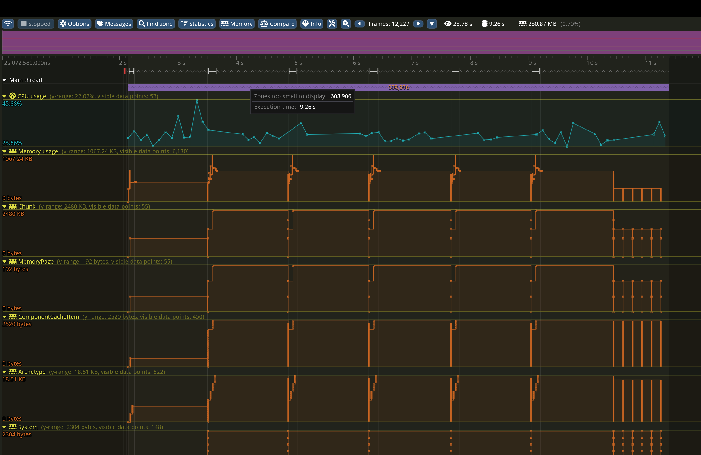
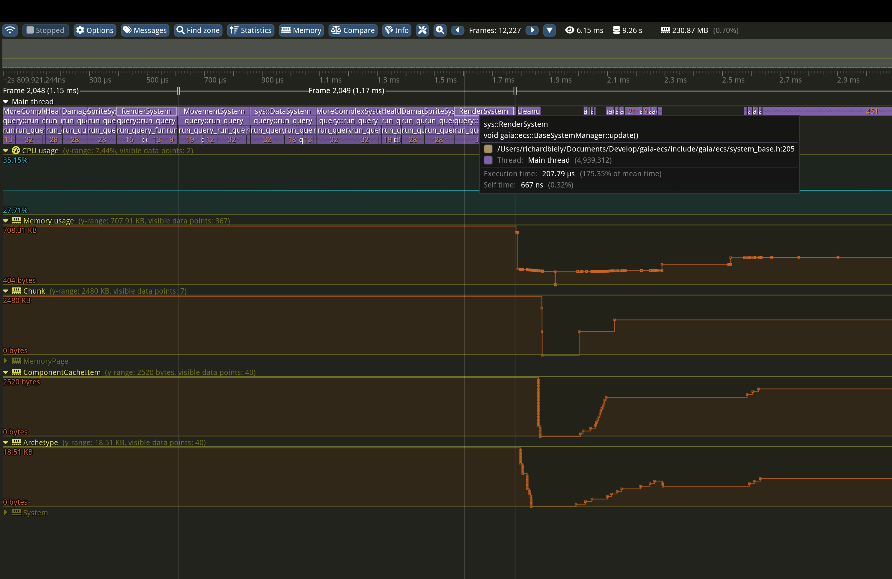

[![Version][badge.version]][version]
[![license][badge.license]][license]
[![language][badge.language]][language]
[![discord][badge.discord]][discord]
[![codacy][badge.codacy]][codacy]

[badge.version]: https://img.shields.io/github/v/release/richardbiely/gaia-ecs?style=for-the-badge
[badge.license]: https://img.shields.io/badge/license-MIT-blue?style=for-the-badge
[badge.language]: https://img.shields.io/badge/language-C%2B%2B17-yellow?style=for-the-badge&color=blue
[badge.discord]: https://img.shields.io/discord/1183706605108330516?style=for-the-badge&label=Discord
[badge.codacy]: https://img.shields.io/codacy/grade/bb28fa362fce4054bbaf7a6ba9aed140?style=for-the-badge
[](https://richardbiely.github.io/gaia-ecs/)

[version]: https://github.com/richardbiely/gaia-ecs/releases
[license]: https://en.wikipedia.org/wiki/MIT_License
[language]: https://en.wikipedia.org/wiki/C%2B%2B17
[discord]: https://discord.gg/wJjK72yze2
[codacy]: https://app.codacy.com/gh/richardbiely/gaia-ecs/dashboard?utm_source=gh&utm_medium=referral&utm_content=&utm_campaign=Badge_grade

**Gaia-ECS** is a fast, ergonomic C++17 ECS framework designed to be the option you can actually learn in an afternoon without reading a manual the size of a novel.
You get complex queries with relationship traversal, per-component AoS/SoA layouts, integrated serialization, and multithreading with job dependencies — all behind an API that stays out of your way.

***Highlights:***
* Clean, safe API — no boilerplate, no footguns
* Hybrid storage model — archetype/chunk for fast iteration, optional out-of-line storage for low-cost frequent modification
* Expressive queries: [relationships](#relationships), wildcards, hierarchy traversal (DFS/BFS), variables
* Per-component [AoS or SoA data layout](#data-layouts) with minimal code changes
* Integrated [compile-time](#compile-time-serialization) and [runtime](#runtime-serialization) serialization
* [Multithreading](#multithreading) with job dependencies, including [parallel ECS](#parallel-execution) iteration
* No external dependencies, no STL strings or containers
* [Single-header](#single-header) option — drop it in and go
* Compiles fast, runs on [all major compilers](https://github.com/richardbiely/gaia-ecs/actions), even in web browser thanks to [Emscripten](https://emscripten.org)

***Quality:***
* Thoroughly documented — both public API and internals
* Correctness ensured by thousands of [unit tests](#testing), in-code asserts, and sanitizers

NOTE: Due to its extensive use of acceleration structures and caching, this library is not a good fit for hardware with very limited memory resources (measured in MiBs or less). Micro-controllers, retro gaming consoles, and similar platforms should consider alternative solutions.

# Table of Contents

* [Introduction](#introduction)
  * [ECS](#ecs)
  * [Implementation](#implementation)
  * [Project structure](#project-structure)
* [Usage](#usage)
  * [Minimum requirements](#minimum-requirements)
  * [Basic operations](#basic-operations)
    * [Create or delete entity](#create-or-delete-entity)
    * [Add or remove component](#add-or-remove-component)
    * [Component presence](#component-presence)
    * [Component scope](#component-scope)
    * [Non-fragmenting and sparse components](#non-fragmenting-and-sparse-components)
    * [Name entity](#name-entity)
    * [Component hooks](#component-hooks)
    * [Bulk editing](#bulk-editing)
    * [Set or get component value](#set-or-get-component-value)
    * [Copy entity](#copy-entity)
    * [Entity cleanup](#entity-cleanup)
    * [Batched creation](#batched-creation)
    * [Entity lifespan](#entity-lifespan)
    * [Archetype lifespan](#archetype-lifespan)
  * [Data processing](#data-processing)
    * [Query](#query)
    * [Simple query](#simple-query)
    * [Query traversal](#query-traversal)
    * [Traversal order](#traversal-order)
    * [Query variables](#query-variables)
    * [Multi-variable queries](#multi-variable-queries)
    * [Query low-level API](#query-low-level-api)
    * [Query string](#query-string)
    * [Uncached query](#uncached-query)
    * [Query remarks](#query-remarks)
    * [Iteration](#iteration)
    * [Constraints](#constraints)
    * [Change detection](#change-detection)
    * [Grouping](#grouping)
    * [Sorting](#sorting)
    * [Parallel execution](#parallel-execution)
  * [Relationships](#relationships)
    * [Relationship basics](#relationship-basics)
    * [Relations](#relations)
    * [Targets](#targets)
    * [Entity dependencies](#entity-dependencies)
    * [Combination constraints](#combination-constraints)
    * [Exclusivity](#exclusivity)
    * [Entity inheritance](#entity-inheritance)
    * [Prefabs](#prefabs)
    * [Cleanup rules](#cleanup-rules)
    * [Hierarchies](#hierarchies)
  * [Unique components](#unique-components)
  * [Delayed execution](#delayed-execution)
    * [Command Merging rules](#command-merging-rules)
  * [Systems](#systems)
    * [System basics](#system-basics)
    * [System dependencies](#system-dependencies)
    * [Systems and jobs](#system-jobs)
  * [Data layouts](#data-layouts)
  * [Serialization](#serialization)
    * [Compile-time serialization](#compile-time-serialization)
    * [Runtime serialization](#runtime-serialization)
    * [World serialization](#world-serialization)
  * [Multithreading](#multithreading)
    * [Jobs](#jobs)
    * [Job dependencies](#job-dependencies)
    * [Priorities](#priorities)
    * [Threads](#threads)
  * [Customization](#customization)
    * [Logging](#logging)
* [Requirements](#requirements)
  * [Compiler](#compiler)
  * [Dependencies](#dependencies)
* [Installation](#installation)
  * [CMake](#cmake)
    * [Project settings](#project-settings)
    * [Sanitizers](#sanitizers)
    * [Single-header](#single-header)
  * [Conan](#conan)
* [Repository structure](#repository-structure)
  * [Examples](#examples)
  * [Benchmarks](#benchmarks)
  * [Profiling](#profiling)
  * [Testing](#testing)
  * [Documentation](#documentation)
* [Future](#future)
* [Contributions](#contributions)
* [License](#license)

# Introduction

## ECS
[Entity-Component-System (ECS)](https://en.wikipedia.org/wiki/Entity_component_system) is an architectural pattern that organizes code around data rather than objects, following the principle of [composition over inheritance](https://en.wikipedia.org/wiki/Composition_over_inheritance).

Instead of modeling your program around real-world objects (car, house, human), you think in terms of the data needed to achieve a result. When moving something from A to B you don't care if it's a car or a plane — you only care about its position and velocity. This makes code easier to maintain, extend, and reason about, while also being more naturally suited to how modern hardware works.

Think of ECS as a database engine without [ACID](https://en.wikipedia.org/wiki/ACID) constraints — optimized for latency and throughput beyond what a general-purpose database could achieve, at the cost of data safety guarantees. Queries over entities are fast by design, and data locality is a first-class concern rather than an afterthought.

The three building blocks are:
* **Entity** — a unique id that represents an object in your world
* **Component** — a piece of data attached to an entity (position, velocity, health)
* **System** — logic that operates on all entities matching a given set of components

A vehicle is any entity with Position and Velocity. Add Driving and it's a car. Add Flying and it's a plane. The movement systems only care about the components they need — nothing else.

## Implementation
**Gaia-ECS** is a hybrid ECS combining archetype-based storage with optional out-of-line component payload storage. Unique combinations of components are grouped into archetypes — think of them as [database tables](https://en.wikipedia.org/wiki/Table_(database)) where components are columns and entities are rows.

Each archetype is made up of chunks: fixed-size blocks of memory sized so that a full chunk fits in L1 cache on most CPUs. Components of the same type are laid out linearly within a chunk, minimizing heap allocations and keeping iteration cache-friendly.

The main strengths of this layout are fast iteration, predictable memory usage, and natural parallelism. The tradeoff is that adding or removing fragmenting ids requires moving data between archetypes — mitigated here by an archetype graph and support for batched component changes.

Gaia-ECS also supports selected component data living outside chunk columns when a different tradeoff is needed. That keeps the main archetype path optimized for dense iteration while still allowing more dynamic, optional, or less cache-sensitive data to use a different storage path.

Queries are compiled into bytecode and executed by an internal virtual machine, ensuring only the complexity your query actually needs is paid for.

Components are themselves entities with a `Component` tag attached. Treating components as first-class entities is what enables relationships and keeps the overall design orthogonal — the same mechanisms that handle entities handle components, without special cases.

## Project structure
The entire project is implemented inside gaia namespace. It is further split into multiple sub-projects each with a separate namespaces.
- `core` - core functionality, use by all other parts of the code
- `mem` - memory-related operations, memory allocators
- `cnt` - data containers
- `meta` - reflection framework
- `ser` - serialization framework
- `mt` - multithreading framework
- `ecs` - the ECS part of the project

The project has a dedicated `external` section that contains 3rd-party code. At present, it only includes a modified version of the [robin-hood](https://github.com/martinus/robin-hood-hashing) hash-map.

# Usage
## Minimum requirements

```cpp
#include <gaia.h>
```

The entire framework is placed in a namespace called **gaia**.
The ECS part of the library is found under **gaia::ecs** namespace.<br/>
In the code examples below we will assume we are inside gaia namespace.

## Basic operations
### Create or delete entity

Entity a unique "thing" in `ecs::World`. Creating an entity at runtime is as easy as calling `World::add`. Deleting is done via `World::del`. Once deleted, entity is no longer valid and if used with some APIs it is going to trigger a debug-mode assert. Verifying that an entity is valid can be done by calling `World::valid`.

```cpp
ecs::World w;
// Create a new entity
ecs::Entity e = w.add();
// Check if "e" is valid. Returns true.
bool isValid = w.valid(e); // true
// Delete the entity
w.del(e);
// Check if "e" is still valid. Return false.
isValid = w.valid(e); // false
```

It is also possible to attach entities to entities. This effectively means you are able to create your own components/tags at runtime.

```cpp
ecs::Entity player0 = w.add();
ecs::Entity player1 = w.add();
ecs::Entity player2 = w.add();
ecs::Entity teamA = w.add();
ecs::Entity teamB = w.add();
// Add player0 and player1 to teamA
w.add(player0, teamA);
w.add(player1, teamA);
// Add player2 to teamB
w.add(player2, teamB);
```

### Name entity

Each entity can be assigned a unique name. This is useful for debugging or entity lookup when entity id is not present for any reason.

```cpp
ecs::World w;
ecs::Entity e = w.add();

// Entity "e" named "my_unique_name".
// The string is copied and stored internally.
w.name(e, "my_unique_name");

// If you know the length of the string, you can provide it as well
w.name(e, "my_unique_name", 14);

// Non-owning util::str_view of the string used as entity name for entity "e"
auto name = w.name(e);
// returns: "my_unique_name"

// Entity identified by the string returned.
// In this case, "e_by_name" and "e" are equal.
ecs::Entity e_by_name = w.get("my_unique_name");

// The name can be unset by setting it to nullptr
w.name(e, nullptr);
auto unnamed = w.name(e);
// returns: empty util::str_view
```

If you already have a dedicated string storage it would be a waste to duplicate the memory. In this case you can use `World::name_raw` to name entities. It does NOT copy and does NOT store the string internally which means you are responsible for its lifetime. The pointer, contents, and length must stay stable while the raw name is registered. Otherwise, any time your storage tries to move or rewrite the string you have to unset the name before it happens and set it anew after the change is done.

```cpp
const char* pUserManagedString = ...;
w.name_raw(e, pUserManagedString);

// If you know the length, you can provide it
w.name_raw(e, pUserManagedString, userManagedStringLength);

// If the user-managed string pointer is not stable, you need to unset the name before the pointer changes location
w.name_raw(e, nullptr);
...
// ... the change of pointer happens
...
// After the user-managed string changed location and obtained a new pointer, you set the name again
w.name_raw(e, pUserManagedString);
```

Hierarchical name lookup is also possible.
```cpp
auto europe = wld.add();
auto slovakia = wld.add();
auto bratislava = wld.add();

wld.child(slovakia, europe);
wld.child(bratislava, slovakia);

wld.name(europe, "europe");
wld.name(slovakia, "slovakia");
wld.name(bratislava, "bratislava");

auto e1 = wld.get("europe.slovakia"); // returns slovakia
auto e2 = wld.get("europe.slovakia.bratislava"); // returns bratislava
```

Character '.' (dot) is used as a separator. Therefore, dots can not be used inside entity names.
```cpp
auto e = wld.add();
wld.name(e, "eur.ope"); // invalid name, the naming request is going to be ignored
```

### Names and lookup

`World::name` gives an entity its normal world [name](#name-entity). `World::alias` gives an entity one extra lookup name. `World::get` is the normal lookup entry point. It first tries ordinary entity names, including hierarchical paths such as `gameplay.render`, and then falls back to component lookup rules when the string does not name an entity directly.

Names and aliases are both unique lookup keys. A name is the entity’s canonical world name and participates in hierarchy. An alias is an extra flat lookup key that does not change the entity’s place in that hierarchy.

Components add a few extra naming helpers because they need more than one identity. A component symbol is the stable C++ identity, such as `gameplay_render::Position`. A component path is the scoped lookup name, such as `gameplay.render.Position`. A display name is the prettier label you would prefer to show in logs and tools.

Most code should just use `World::get`. Use a name when the entity should live in the normal world hierarchy. Use an alias when you want one extra flat lookup key without changing that hierarchy. Use a symbol when you need a stable component identity, for example in semantic JSON. Use a path when you want to refer to a component by its place in the ECS scope hierarchy. If a name does not resolve the way you expect, `World::resolve(out, name)` collects every entity the world naming rules can see for that string.

```cpp
namespace gameplay_render {
  struct Position {};
}

ecs::World w;

const ecs::Entity gameplay = w.add();
w.name(gameplay, "gameplay");

const ecs::Entity render = w.add();
w.name(render, "render");
w.child(render, gameplay);

const ecs::Entity player = w.add();
w.name(player, "player");
w.child(player, gameplay);
w.alias(player, "MainPlayer");

w.get("gameplay.player");
// player

w.get("MainPlayer");
// player

ecs::Entity positionComp = ecs::EntityBad;
w.scope(render, [&] {
  positionComp = w.add<gameplay_render::Position>().entity;
});

w.symbol(positionComp);
// "gameplay_render::Position"

w.path(positionComp);
// "gameplay.render.Position"

w.get("gameplay.render.Position");
// positionComp

w.get("Position");
// positionComp if "Position" is globally unique, otherwise the closest scoped match wins and ambiguous global short names do not resolve

w.alias(positionComp, "RenderPosition");
w.get("RenderPosition");
// positionComp
```

### Component scope

`World::scope(scope)` sets the current component scope and returns the previous one. `World::scope(scope, func)` does the same thing for the duration of one callable and restores the old scope afterwards.

`World::lookup_path(scopes)` sets an ordered list of lookup scopes used for unqualified component lookup. Each scope is searched like a temporary component scope: the scope first, then its parents. `World::lookup_path()` returns the current list.

The scope entity and its `ChildOf` ancestors should have names, because Gaia-ECS builds the scoped path from that entity hierarchy. New components registered while a scope is active use that scope to build their default path name.

For example, registering `Position` while the current component scope is the entity path `gameplay.render` gives the component the path name `gameplay.render.Position`.

Unqualified component lookup checks the active scope first, then walks up parent scopes, then searches each lookup-path scope in order while also walking up its parents, then falls back to global exact symbol lookup, global path lookup, global unique short-symbol lookup, and finally alias lookup. That means a lookup from `gameplay.render` can still find `gameplay.Position` when there is no closer match in `gameplay.render`, a lookup path such as `{tools, render}` can prefer `gameplay.tools.Device` before falling back to `gameplay.Device`, and a bare `"Position"` can resolve globally when that short symbol is unique.

String queries follow the same rules, but they capture the active scope and lookup path when the query expression is parsed. In practice that means `w.scope(render, [&] { q.add("Position"); });` or `w.lookup_path(scopes); q.add("Position");` resolve `Position` while `add(...)` runs, store the resulting component id in the query, and will not be rewritten later if the scope or component naming metadata changes. If a query uses a bare short name such as `"Position"`, that global fallback only works when the short symbol is unique.

Scoped component registration looks like this:

```cpp
namespace gameplay_types {
  struct Position {};
}

namespace render_types {
  struct Position {};
}

ecs::World w;

const ecs::Entity gameplay = w.add();
w.name(gameplay, "gameplay");

const ecs::Entity render = w.add();
w.name(render, "render");
w.child(render, gameplay);

w.scope(gameplay, [&] {
  w.add<gameplay_types::Position>();
  // the registered symbol is "gameplay_types::Position"
  // the scoped path is "gameplay.Position"

  w.scope(render, [&] {
    w.add<render_types::Position>();
    // the registered symbol is "render_types::Position"
    // the scoped path is "gameplay.render.Position"

    const auto renderLookup = w.get("Position");
    // the component entity registered under "gameplay.render.Position"
  });

  const auto gameplayLookup = w.get("Position");
  // the component entity registered under "gameplay.Position"
});
```

If you prefer creating named scopes directly from strings, `World::module(module_path)` creates or reuses the named `ChildOf` chain and returns the deepest scope entity. You can then pass that entity to `World::scope(...)` explicitly when you want to activate it.

```cpp
namespace gameplay_render {
  struct Position {};
  struct Velocity {};
}

ecs::World w;

const ecs::Entity renderModule = w.module("gameplay.render");

w.scope(renderModule, [&] {
  w.add<gameplay_render::Position>();
  w.add<gameplay_render::Velocity>();
});

const auto positionComp = w.get("Position");
// returns: the component entity registered under "gameplay.render.Position" in this example because the short name is unique

const auto velocityComp = w.get("gameplay.render.Velocity");
// returns: the component entity registered under "gameplay.render.Velocity"
```

`World::module(...)` only creates or finds the scope hierarchy. `World::scope(...)` is the step that makes registration and relative lookup happen inside that scope.

### Non-fragmenting and sparse components

By default, components and relationships are fragmenting. Adding or removing them changes the entity archetype, which is great for structural queries and dense iteration, but it also means more archetype churn and more fragmentation when the data is highly dynamic.

If this is undesired, there is also an option to use out-of-line storage and optional non-fragmenting membership. The two traits are:

- `ecs::Sparse`
- `ecs::DontFragment`

To use a non-fragmenting sparse component:

```cpp
struct Cooldown {
  float value = 0.0f;
};

ecs::World w;
const auto& cooldown = w.add<Cooldown>();
// Keep this component's data out-of-line (not stored in chunks).
w.add(cooldown.entity, ecs::Sparse);
// Make sure this component is not a part of the archetype id-wise.
// This means that adding or removing it won't make the parent entity change its archetype.
w.add(cooldown.entity, ecs::DontFragment);

auto e = w.add();
w.add<Cooldown>(e);
auto cooldownValue = w.set<Cooldown>(e);
cooldownValue.value = 1.5f;
```

That gives three practical outcomes:

- default:
  - payload stored in chunks (memory address can change)
  - the id lives in the archetype (add/del fragments)
  - best for core simulation data, dense iteration, and structural queries

- `Sparse`:
  - payload stored out-of-line (stable memory address)
  - the id lives in the archetype (add/del fragments)
  - good when the payload should stay out of chunks but the component should remain structurally visible

- `DontFragment`:
  - payload stored out-of-line (stable memory address)
  - the id does not live in the archetype (add/del does not fragment)
  - this is effectively `Sparse` plus "do not participate in archetype identity"
  - the usual choice for optional, state-like, or frequently toggled data

Rule of thumb:
- keep hot, common, frequently iterated data fragmenting and chunk-stored
- use plain `Sparse` when the payload should live out-of-line but the component should still participate in structural matching
- use `DontFragment` for cooldowns, temporary status effects, optional markers, editor/runtime state, and other frequently changing data
- avoid out-of-line storage for components like `Position` or `Velocity` which benfit greatly of sequential access, unless profiling clearly justifies it

>**NOTE:<br/>** 
SoA components do not support out-of-line storage and they stay chunk-backed. `ecs::Sparse` applies only to plain AoS generic components.<br/>

>**NOTE:<br/>** 
Changing the storage mode is only supported before the component
has instances attached to entities.<br/>

>**NOTE:<br/>**
`ecs::Sparse` and `ecs::DontFragment` are sticky component traits. Once set on a component entity, removing the
relation later does not revert the storage or fragmentation behavior. `ecs::DontFragment` also implies sparse
out-of-line storage, so adding both traits is redundant.<br/>

### Component presence
Whether or not a certain component is associated with an entity can be checked in two different ways. Either via an instance of a World object or by the means of `Iter` which can be acquired when running [queries](#query).

```cpp
// Check if entity e has Velocity (via world).
const bool hasVelocity = w.has<Velocity>(e);
// Check if entity wheel is attached to the car
const bool hasWheel = w.has(car, wheel);
...

// Check if entities optionally have Position, or Velocity.
ecs::Query q = w.query().any<Position>().any<Velocity>(); 
q.each([&](ecs::Iter& it) {
  const bool hasPosition = it.has<Position>();
  const bool hasVelocity = it.has<Velocity>();
  ...
});
```

Providing entities is supported as well.

```cpp
auto p = w.add<Position>().entity;
auto v = w.add<Velocity>().entity;

// Check if entities optionally have Position, or Velocity.
ecs::Query q = w.query().any(p).any(v); 
q.each([&](ecs::Iter& it) {
  const bool hasPosition = it.has(p);
  const bool hasVelocity = it.has(v);
  ...
});
```

### Add or remove component

Components can be created using `World::add<T>` This function returns a descriptor of the object which is created and stored in the component cache. Each component is assigned one entity to uniquely identify it. You do not have to do this yourself, the framework performs this operation automatically behind the scenes any time you call some compile-time API where you interact with your structure. However, you can use this API to quickly fetch the component's entity if necessary.

```cpp
struct Position {
  float x, y, z;
};
const ecs::ComponentCacheItem& cci = w.add<Position>();
ecs::Entity position_entity = cci.entity;
```

Because components are entities as well, adding them is very similar to what we have seen previously.

```cpp
struct Position {
  float x, y, z;
};
struct Velocity {
  float x, y, z;
};

ecs::World w;

// Create an entity with Position and Velocity.
ecs::Entity e = w.add();
w.add<Position>(e, {0, 100, 0});
w.add<Velocity>(e, {0, 0, 1});

// Remove Velocity from the entity.
w.del<Velocity>(e);
```

This also means the code above could be rewritten as following:

```cpp
// Create Position and Velocity entities
ecs::Entity position = w.add<Position>().entity;
ecs::Entity velocity = w.add<Velocity>().entity;

// Create an entity with Position and Velocity.
ecs::Entity e = w.add();
w.add(e, position, Position{0, 100, 0});
w.add(e, velocity, Velocity{0, 0, 1});

// Remove Velocity from the entity.
w.del(e, velocity);
```

When adding components following restrictions apply:
* There can be at most 32 ids in an entity's archetype (components, tags and relationships stored in archetype chunks). Components marked with `ecs::DontFragment` and stored outside archetypes do not consume these slots. If you need more archetype-resident ids you can merge some of your components, or rethink the strategy because too many fragmenting ids usually implies design issues (e.g. object-oriented thinking or mirroring real-life abstractions too directly in ECS).
* Maximum size of a registered component type is currently 4095 bytes. This limit comes from the component metadata and chunk layout used internally. If this is not enough for you, store a pointer or handle to data that lives outside ECS. Note, this limit is still enforced today even for components that use sparse storage.
* [SoA](#data-layouts) components can have at most 4 members and each of them can be at most 255 bytes long.
* Components must be default-constructible (either the default constructor is present or you provide one yourself). If your component contains members that are not default-constructible (e.g. from a 3rd party library that is beyond your control), you need to work this around. You will need to store a pointer, or come up with different means of accessing this data.
* Implicit registration only creates the default component form. If a component needs non-default traits such as `ecs::Sparse`
or `ecs::DontFragment`, register it explicitly first and then apply the trait to the component entity. Implicit registration
can also be disabled entirely with `GAIA_ECS_AUTO_COMPONENT_REGISTRATION`.


### Component hooks

It is possible to register add/del/set hooks for components. When a given component is added to an entity, deleted from it, or the value is set the hook triggers. This comes handy for debugging, or when specific logic is needed for a given component.
Component hooks are unique. Each component can have at most one add hook, and one delete hook.

```cpp
ecs::World w;
const ecs::ComponentCacheItem& pos_item = w.add<Position>();
ecs::ComponentCache::hooks(pos_item).func_add = [](const ecs::World& w, const ecs::ComponentCacheItem& cci, ecs::Entity src) {
  // Position component added to entity "src"
  // ...
};

ecs::Entity e = w.add();
// The add hook will trigger
w.add<Position>(e);
```

Hooks can easily be removed:
```cpp
const ecs::ComponentCacheItem& pos_item = w.add<Position>();
ecs::ComponentCache::hooks(pos_item).func_add = nullptr;

ecs::Entity e = w.add();
// The add hook will not be triggered because we removed the hook
w.add<Position>(e);
```

It is also possible to set up a "set" hook. For explicit setter APIs such as `w.set<T>(e) = ...` and `w.acc_mut(e).set<T>(...)`, the hook runs after the new value has been written back.

```cpp
ecs::World w;
const ecs::ComponentCacheItem& pos_item = w.add<Position>();
ecs::ComponentCache::hooks(pos_item).func_set = [](const ecs::World& w, const ecs::ComponentRecord& rec, Chunk& chunk) {
  // Position component value has been updated
  // ...
};

ecs::Entity e = w.add();
w.add<Position>(e); // Don't trigger the set hook, yet
w.set<Position>(e) = {}; // Trigger the set hook
w.acc_mut(e).set<Position>({}); // Trigger the set hook
w.acc_mut(e).sset<Position>({}); // Don't trigger the set hook
```

Unlike *add* and *del* hooks, *set* hooks will not tell you what entity the hook triggered for. This is because any write access is done for the entire chunk, not just one of its entities. If one-entity behavior is required, the best thing you can do is moving your entity to a separate archetype (e.g. by adding some unique tag component to it).

Hooks can be disabled by defining GAIA_ENABLE_HOOKS 0. Add and del hooks are controled by GAIA_ENABLE_ADD_DEL_HOOKS, set hooks by GAIA_ENABLE_SET_HOOKS. They are all enabled by default.

### Observers

Observers are a mechanism that allows you to register to certain events and listen to them triggering. Similar to hooks, you can listen to add, del or set events. However, unlike hooks there can be any number of these per given component or entity.

Observers can be looked at as reactive alternative to systems. They allow different parts of the application to react to something happening immediately.

The feature can be enabled by defining `GAIA_OBSERVERS_ENABLED 1`, and is enabled by default.

Under the hood they use the query engine, just like systems. However, systems are meant to be used as a reqular part of the frame whereas observers are meant as a reaction to something. Their cost is less predictable, and because the event needs to be evaluated for each observer, listening to the event they can also be more costly.

Because observers are query-backed, query shaping helpers such as `depth_order(...)` can be used on them as well when you want cached top-down breadth-first iteration over fragmenting hierarchies like `ChildOf`.

Observers also expose the same query cache controls as plain queries. By default an observer keeps cached query state locally. Use `scope(ecs::QueryCacheScope::Shared)` only when many identical observer query shapes are rebuilt and you want them to reuse one shared cache entry. Use `kind(ecs::QueryCacheKind::None)` only for special cases where you explicitly do not want observer query caches.

Observer events currently mean:
* `OnAdd` - an entity starts matching because ids were added
* `OnDel` - an entity stops matching because ids were removed
* `OnSet` - a value of an already present component was explicitly written

`OnSet` is triggered by APIs such as `set<T>(entity)`, `set<T>(entity, object)`, `acc_mut(entity).set<T>(...)`,
`modify<T, true>(entity)`, and `modify<T, true>(entity, object)`.
It is not triggered by `sset(...)`, `modify<T, false>(...)`, or by the initial `add<T>(entity, value)` that creates
the component.

`set<T>(entity)` uses a write-back proxy, so `OnSet` is emitted after the full expression or scope writes the final value back.

Mutable query and observer callbacks follow the same rule. When a callback writes through `Position&` or `it.view_mut<Position>()`,
`OnSet` is emitted after the callback returns, not in the middle of the callback.

Following is an observer that generates an OnAdd event every time some entity is added Position and Velocity.

```cpp
ecs::World w;
w.observer()
  .event(ObserverEvent::OnAdd)
  .all<Position>()
  .all<Velocity>()
  .on_each([&](ecs::Iter& it) {
    // Called for each entity that has Position and Velocity added
    // ...
});

ecs::Entity e = w.add();
// Observer will not trigger yet, only Position is added.
w.add<Position>(e);
// Observer will trigger for the entity "e" now, because both Position and Velocity were added to it
w.add<Velocity>(e);

// Does not the observer for e1 when creating a copy. To do so, use copy_ext,
ecs::Entity e1 = w.copy(e);

// Triggers the observer for e2 because a new entity was created that is a copy of "e", and has both Position and Velocity added.
ecs::Entity e2 = w.copy_ext(e);

// Creates 1000 observer-visible copies of "e".
w.copy_ext_n(e, 1000);
w.copy_ext_n(e, 1000, [](ecs::Entity newEntity) {
  // Do something with the new entity
  // ...
});
w.copy_ext_n(e, 1000, [](ecs::CopyIter& it) {
  auto entityView = it.view<ecs::Entity>();
  // You can also access the view of components attached to the copied entities
  auto someView = it.view<SomeComponent>();
  GAIA_EACH(it) {
    // Do something with the new entities
    // ...
  }
});

// Prepare a new entity "e3".
ecs::Entity e3 = w.add();
// We want to add Position and Velocity to "e3". Our observer won't triggered yet because changes are not committed.
ecs::EntityBuilder builder = w.build(e3);
builder
  .add<Velocity>()
  .add<Position>();
// Commit changes. The observer will triggers now.
builder.commit();
```

Listening to removal of entities looks similar:
```cpp
w.observer() //
  .event(ecs::ObserverEvent::OnDel)
  .no<Position>()
  .no<Acceleration>()
  .on_each([&cnt, &isDel](ecs::Iter& it) {
    // Called for each entity that has Position and Velocity removed from it
    // ...
  });

// Observer will not trigger yet, on Position was removed.
w.del<Position>(e);
// Observer will trigger for the entity "e" now, because both Position and Velocity were removed from it
w.del<Velocity>(e);
```

Listening to value changes uses `OnSet`:
```cpp
uint32_t hits = 0;

w.observer()
  .event(ecs::ObserverEvent::OnSet)
  .all<Position>()
  .on_each([&](ecs::Entity entity, const Position& pos) {
    ++hits;
    (void)entity;
    (void)pos;
  });

ecs::Entity e = w.add();
w.add<Position>(e, {1.0f, 2.0f, 3.0f});
// No OnSet yet. This was the initial add.

w.set<Position>(e) = {4.0f, 5.0f, 6.0f};
// OnSet triggered once.

w.acc_mut(e).sset<Position>({7.0f, 8.0f, 9.0f});
// Still one hit. sset is silent.

w.modify<Position, true>(e);
// OnSet triggered again.

w.query().all<Position&>().each([&](Position& pos) {
  // Still no new hit here. Query writes are deferred until the callback returns.
  pos = {10.0f, 11.0f, 12.0f};
});
// OnSet triggered again after the callback completed.
// For query writes, OnSet is delivered once per modified matching entity.
```

### Bulk editing

Adding an entity to entity means it becomes a part of a new archetype. Like mentioned [previously](#implementation), becoming a part of a new archetype means that all data associated with the entity needs to be moved to a new place. The more ids in the archetype the slower the move (empty components/tags are an exception because they do not carry any data). For this reason it is not advised to perform large number of separate additions / removals per frame.

Instead, when adding or removing multiple entities/components at once it is more efficient doing it via bulk operations. This way only one archetype movement is performed in total rather than one per added/removed entity.

```cpp
ecs::World w;

// Create an entity with Position. This is one archetype movement.
ecs::Entity e = w.add();
w.add<Position>();

// Add and remove multiple components. 
// This does one archetype movement rather than 6 compared to doing these operations separate.
w.build(e)
 // add Velocity to entity e
 .add<Velocity>()
 // remove Position from entity e
 .del<Position>()
 // add Rotation to entity e
 .add<Rotation>()
 // set a name for the entity if desired
 .name("MyEntity);
```

It is also possible to manually commit all changes by calling `ecs::EntityBuilder::commit`. This is useful in scenarios where you have some branching and do not want to duplicate your code for both branches or simply need to add/remove components based on some complex logic.

```cpp
ecs::EntityBuilder builder = w.build(e);
builder
  .add<Velocity>()
  .del<Position>();
if (some_condition) {
  builder.add<Rotation>();
}
builder.commit();
```

>**NOTE:**<br/>Once `ecs::EntityBuilder::commit` is called (either manually or internally when the builder's destructor is invoked) the contents of builder are returned to its default state.

### Set or get component value

```cpp
// Change Velocity's value.
w.set<Velocity>(e) = {0, 0, 2};
// Same shape as above but silent: no world-version update, no hooks, no OnSet observers.
w.sset<Velocity>(e) = {4, 2, 0};
```

`w.set<T>(entity)` returns a write-back proxy. The current value is copied out, you mutate the proxy, and the new value is written
back at the end of the full expression or scope.

```cpp
w.add<Position>(e, {1, 2, 3});

{
  auto pos = w.set<Position>(e);
  pos.x = 10;
  pos.y = 20;
  pos.z = 30;

  // The write-back did not happen yet.
  const auto& current = w.get<Position>(e);
  // current is still {1, 2, 3}
}

// The proxy went out of scope, so the new value is now stored.
const auto& updated = w.get<Position>(e);
// updated is {10, 20, 30}
```

If you need the write to happen immediately, use `acc_mut(entity).set<T>(...)` instead of `w.set<T>(entity)`.
For runtime object/component entities, the immediate form is `acc_mut(entity).set<T>(object, value)`.

When setting multiple component values at once it is more efficient doing it via chaining:

```cpp
w.acc_mut(e)
// Change Velocity's value on entity "e"
  .set<Velocity>({0, 0, 2})
// Change Position's value on entity "e"
  .set<Position>({0, 100, 0})
// Change...
  .set...;
```

Similar to `ecs::EntityBuilder::build` you can also use the setter object in scenarios with complex logic.

```cpp
ecs::ComponentSetter setter = w.acc_mut(e);
setter.set<Velocity>({0, 0, 2});
if (some_condition)
  setter.set<Position>({0, 100, 0});
setter.set<Something>({ ... }).set<Else>({ ... });

// You can also retrieve a reference to data (for AoS) or the data accessor (for SoA)
auto& vel = setter.mut<Velocity>();
auto& pos = setter.mut<Position>();
```

The setter object supports the same immediate object-based form:

```cpp
ecs::Entity runtimePos = w.add<Position>().entity;
w.add(e, runtimePos, Position{1, 2, 3});

ecs::ComponentSetter setter = w.acc_mut(e);
setter.set<Position>(runtimePos, Position{10, 20, 30});
```

`setter.mut<T>()` and `w.mut<T>(e)` are silent raw write paths. If you use them and want hooks or `OnSet`, call
`w.modify<T, true>(e)` after finishing the write.

The same pattern applies to object-based writes:

```cpp
ecs::Entity runtimePos = w.add<Position>().entity;
w.add(e, runtimePos, Position{1, 2, 3});

auto& pos = w.mut<Position>(e, runtimePos);
pos.x = 10;
pos.y = 20;
pos.z = 30;
w.modify<Position, true>(e, runtimePos);
```

Use the write path that matches the behavior you want:
* `set<T>(entity)` - writes back on scope/full-expression end and then triggers set hooks and `OnSet`
* `set<T>(entity, object)` - same as above for a specific runtime object/component entity
* `acc_mut(entity).set<T>(...)` - writes immediately and triggers set hooks and `OnSet`
* `acc_mut(entity).set<T>(object, value)` - immediate object-based write with set hooks and `OnSet`
* `sset<T>(entity)` / `mut<T>(entity)` - silent write paths, no hooks, no `OnSet`
* `sset<T>(entity, object)` / `mut<T>(entity, object)` - silent object-based write paths; pair them with `modify<T, true>(entity, object)` when you want set side effects

Components up to 8 bytes (including) are returned by value. Bigger components are returned by const reference.

```cpp
// Read Velocity's value. As shown above Velocity is 12 bytes in size.
// Therefore, it is returned by const reference.
const auto& velRef = w.get<Velocity>(e);
// However, it is easy to store a copy.
auto velCopy = w.get<Velocity>(e);
```

Both read and write operations are also accessible via views. Check the [iteration](#iteration) sections to see how.

### Copy entity

A copy of another entity can be easily created.

```cpp
// Create an entity with Position and Velocity.
ecs::Entity e = w.add();
w.add(e, position, Position{0, 100, 0});
w.add(e, velocity, Velocity{0, 0, 1});

// Make a copy of "e". Component values on the copied entity will match the source.
// Value of Position on "e2" will be {0, 100, 0}.
// Value of Velocity on "e2" will be {0, 0, 1}.
ecs::Entity e2 = w.copy(e);
```
### Entity cleanup

Anything attached to an entity can be easily removed using `World::clear`. This is useful when you need to quickly reset your entity and still want to keep your Entity's id (deleting the entity would mean that as some point it could be recycled and its id could be used by some newly created entity).

```cpp
ecs::Entity e = w.add();
ecs::Entity something = w.add();
// Add a Position component to our entity
w.add<Position>(e, {0, 100, 0});
// Add the "something" entity to our entity
w.add(e, something);
// Remove anything attached to out entity
w.clear(e);

bool hasPosition = w.has<Position>(e); // false
bool hasSomething = w.has(e, something); // false
```

### Batched creation

Another way to create entities is by creating many of them at once. This is more performant than creating entities one by one.

```cpp
// Create 1000 empty entities
w.add(1000);
w.add(1000, [](Entity newEntity) {
  // Do something with the new entity
  // ...
})

// Create an entity with Position and Velocity.
ecs::Entity e = w.add();
w.add(e, position, Position{0, 100, 0});
w.add(e, velocity, Velocity{0, 0, 1});

// Create 1000 more entities like "e".
// Their component values are not initialized to any particular value.
w.add_n(e, 1000);
w.add_n(e, 1000, [](Entity newEntity) {
  // Do something with the new entity
  // ...
});

// Create 1000 more entities like "e".
// Their component values are going to be the same as "e".
w.copy_n(e, 1000);
w.copy_n(e, 1000, [](Entity newEntity) {
  // Do something with the new entity
  // ...
});
w.copy_n(e, 1000, [](ecs::CopyIter& it) {
  auto entityView = it.view<ecs::Entity>();
  // You can also access the view of components attached to the entity
  auto someView = it.view<SomeComponent>();
  GAIA_EACH(it) {
    // Do something with the new entities
    // ...
  }
});

// Same as copy_n, but observers are notified for the copied ids and entities.
w.copy_ext_n(e, 1000);
w.copy_ext_n(e, 1000, [](ecs::CopyIter& it) {
  auto entityView = it.view<ecs::Entity>();
  // You can also access the view of components attached to the copied entities
  auto someView = it.view<SomeComponent>();
  GAIA_EACH(it) {
    // Do something with the new entities
    // ...
  }
});
```

### Entity lifespan

Every entity in the world is reference counted. When an entity is created, the value of this counter is 1. When `ecs::World::del` is called the value of this counter is decremented. When it reaches zero, the entity is deleted. However, the lifetime of entities can be extended. Calling `ecs::World::del` any number of times on the same entity is safe because the reference counter is decremented only on the first attempt. Any further attempts are ignored.

#### SafeEntity
`ecs::SafeEntity` is a wrapper above `ecs::Entity` that makes sure that an entity stays alive until the last `ecs::SafeEntity` referencing the entity goes out of scope. When the wrapper is instantiated it increments the entity's reference counter by 1. When it goes out of scope it decrements the counter by 1. In terms of functionality, this is reminiscent of a C++ smart pointer, std::shared_ptr.

```cpp
ecs::World w;
// Create an entity. Its reference counter is 1.
ecs::Entity player = w.add();
{
  // Make sure the entity survives so long playerSafe exists. Reference counter is incremented to 2.
  auto playerSafe = ecs::SafeEntity(w, player);

  // Try to delete the player entity. The reference counter is decremented to 1.
  // It is not zero and therefore the entity player is not deleted.
  w.del(player);
  bool isValid = w.valid(player); // true
  // We can try deleting the entity again but the request is ignored this time.
  // Calling del on an entity decrements the reference counter only once. Further
  // calls are dropped. Hence, the reference counter remains 1.
  w.del(player);
  isValid = w.valid(player); // true
}

// Here, playerSafe is out of scope. Reference counter is decremented to 0.
// Internally, w.del(player) is called.
// ... it's not safe to use player at this point anymore.
bool isValid = w.valid(player); // false
```

ecs::SafeEntity is fully compatible with ecs::Entity and can be used just like it in all scenarios.

```cpp
ecs::World w;
ecs::Entity player = w.add();
auto playerSafe = ecs::SafeEntity(w, player);
// Add a Position component to playerSafe (player)
w.add<Position>(playerSafe);
// w.add<Position>(player) <-- this would do the same thing
```

#### WeakEntity
`ecs::WeakEntity` is a wrapper above `ecs::Entity` that makes sure that when the entity it references is deleted, it automatically starts acting as `ecs::EntityBad`. In terms of functionality, this is reminiscent of a C++ smart pointer, std::weak_ptr.

`ecs::WeakEntity` is fully compatible with `ecs::Entity` and can be used just like it in all scenarios. As a result, you have to keep in mind that it can become invalid at any point.

```cpp
ecs::World w;
// Create an entity. Its reference counter is 1.
ecs::Entity player = w.add();

// Create a "weak reference" to the entity player
auto playerSafe = ecs::WeakEntity(w, player);

// Add a Position component to playerSafe (player)
w.add<Position>(playerSafe);
// w.add<Position>(player) <-- this would do the same thing

// Calling del decrements the reference count of entity by 1. In this case, the reference counter
// becomes 0 and therefore the entity is deleted.
// Our playerSafe automatically becomes EntityBad.
w.del(player);

bool isValid;
isValid = w.valid(player); // false
isValid = w.valid(playerSafe); // false
```

Technically, `ecs::WeakEntity` is almost the same thing as `ecs::Entity` with one nuance difference. Because entity ids are recycled, in theory, `ecs::Entity` left lying around somewhere could end up being multiple different things over time. This is not an issue with `ecs::WeakEntity` because the moment the entity linked with it gets deleted, it is reset to `ecs::EntityBad`.

This is an edge-case scenario, unlikely to happen even, but should you ever need it `ecs::WeakEntity` is there to help. If you decided to change the amount of bits allocated to `Entity::gen` to a lower number you will increase the likelihood of double-recycling happening and increase usefulness of `ecs::WeakEntity`.

A more useful use case, however, would be if you need an entity identifier that gets automatically reset when the entity gets deleted without any setup necessary from your end. Certain situations can be complex and using `ecs::WeakEntity` just might be the one way for you to address them.

### Archetype lifespan

Once all entities of given archetype are deleted (and as a result all chunks in the archetypes are empty), the archetype stays alive for another 127 ticks of `ecs::World::update`. However, there might be cases where this behavior is insufficient. Maybe you want the archetype deleted faster, or you want to keep it around forever.

For instance, you might often end up deleting all entities of a given archetype only to create new ones seconds later. In this case, keeping the archetype around can have several performance benefits:
1) no need to recreate the archetype
2) no need to rematch queries with the archetype

```cpp
ecs::World w;
ecs::Entity player0 = w.add(); // player0 belongs to archetype A
ecs::Entity teamA = w.add(); // teamA belongs to archetype A

// Player0 becomes a part of archetype B.
w.add(player0, teamA);
// Archetype B is never going to be deleted.
w.set_max_lifespan(player0, 0);
// Archetype B is going to be deleted after 20 ticks of ecs::World::update.
w.set_max_lifespan(player0, 20);
// Reset maximum lifespan of the archetype B belongs to.
w.set_max_lifespan(player0);
```

Note, if the entity that changed an archetype’s lifespan moves to a new archetype, the new archetype’s lifespan will not be updated.

```cpp
ecs::World w;
ecs::Entity player0 = w.add(); // player0 belongs to archetype A
ecs::Entity teamA = w.add(); // teamA belongs to archetype A

// Player0 becomes a part of archetype B.
w.add(player0, teamA);
// Maximum lifespan of archetype B changed to 20.
w.set_max_lifespan(player0, 20);

// Player0 becomes a part of archetype A again. Lifespan of B is still 20, lifespan of A is default.
w.del(player0, team1); 
```

In case you want to affect an archetype directly without abstracting it away you can retrieve it via the entity's container returned by World::fetch() function:
```cpp
EntityContainer& ec = w.fetch(player0);
// Maximum lifespan of archetype the player0 entity belongs to changed to 50.
ec.pArchetype->set_max_lifespan(50);
```

## Data processing
### Query
For querying data you can use a Query. It can help you find all entities, components, or chunks matching a list of conditions and constraints and iterate them or return them as an array. You can also use them to quickly check if any entities satisfying your requirements exist or calculate how many of them there are.

By default, `ecs::Query` keeps cached query state locally in the query object. If you want identical query shapes to reuse one shared cache entry across the world, opt into `QueryCacheScope::Shared`.

Note, the first Query invocation of a cached query is always slower than the subsequent ones because internals of the Query need to be initialized.

### Simple query

```cpp
ecs::Query q = w.query();
q.all<Position>(); // Consider only entities with Position

// Iterate matching entities.
q.each([&](ecs::Entity entity) {
  ...
});

// Fill the entities array with entities with a Position component.
cnt::darray<ecs::Entity> entities;
q.arr(entities);

// Fill the positions array with position data.
cnt::darray<Position> positions;
q.arr(positions);

// Calculate the number of entities satisfying the query
const auto numberOfMatches = q.count();

// Check if any entities satisfy the query.
// Possibly faster than count() because it stops on the first match.
const bool hasMatches = !q.empty();
```

More complex queries can be created by combining All, Or, Any (optional), and None:

```cpp
ecs::Query q = w.query();
// Take into account everything with Position and Velocity (mutable access for both)...
q.all<Position&>();
q.all<Velocity&>();
// ... may have Something, or may have SomethingElse (immutable access for both, it does not matter if none is present)...
q.any<Something>().any<SomethingElse>();
// ... and no Player component... (no access done for no())
q.no<Player>();

ecs::Query q2 = w.query();
// Take into account everything with Position and Velocity (mutable access for both)...
q2.all<Position&>();
q2.all<Velocity&>();
// ... at least Something or SomethingElse (immutable access for both, one of them has to be present)...
q2.or_<Something>().or_<SomethingElse>();
// ... and no Player component... (no access done for no())
q2.no<Player>();
```

All Query operations can be chained and it is also possible to invoke various filters multiple times with unique components:

```cpp
ecs::Query q = w.query();
  // Take into account everything with Position (mutable access)...
  .all<Position&>()
  // ... and at the same time everything with Velocity (mutable access)...
  .all<Velocity&>()
  // ... at least Something or SomethingElse (immutable access)...
  .or_<Something>()
  .or_<SomethingElse>()
  // ... and no Player component (no access)...
  .no<Player>(); 
```

`all(...)` requires the term, `any(...)` keeps the term optional, `or_(...)` creates an OR-chain that requires at least one OR term.

```cpp
struct Cable {};
struct Device {};
struct Powered {};

ecs::World w;
const ecs::Entity cablePlain = w.add();
w.add<Cable>(cablePlain);

const ecs::Entity cableDevice = w.add();
w.add<Cable>(cableDevice);
w.add<Device>(cableDevice);

const ecs::Entity cablePowered = w.add();
w.add<Cable>(cablePowered);
w.add<Powered>(cablePowered);

const ecs::Entity cableBoth = w.add();
w.add<Cable>(cableBoth);
w.add<Device>(cableBoth);
w.add<Powered>(cableBoth);

ecs::Query qAll = w.query().all<Cable>().all<Device>();
qAll.count(); // expected: 2 (cableDevice, cableBoth)

ecs::Query qAny = w.query().all<Cable>().any<Device>();
qAny.count(); // expected: 4 (cablePlain, cableDevice, cablePowered, cableBoth)

ecs::Query qOr = w.query().all<Cable>().or_<Device>().or_<Powered>();
qOr.count(); // expected: 3 (cableDevice, cablePowered, cableBoth)

ecs::Query qExpr = w.query().add("Cable, Device || Powered");
qExpr.count(); // expected: 3 (cableDevice, cablePowered, cableBoth)
```

OR terms never duplicate matches. If an entity/archetype satisfies more than one OR term, it is still returned once.
When no `all(...)` terms are present, chaining multiple `or_(...)` terms still means logical OR.

```cpp
struct Marker {};
struct A {};
struct B {};

ecs::World w;
const ecs::Entity e = w.add();
w.add<Marker>(e);
w.add<A>(e);
w.add<B>(e);

ecs::Query q = w.query()
  .all<Marker>()
  .any<A>()
  .any<B>();
q.count(); // expected: 1 (entity `e` is matched once)

ecs::Query qOr = w.query()
  .all<Marker>()
  .or_<A>()
  .or_<B>();
qOr.count(); // expected: 1

ecs::Entity e1 = w.add();
ecs::Entity e2 = w.add();
w.add(e1, e1);
w.add(e2, e2);

ecs::Query qAny = w.query()
  .or_(e1)
  .or_(e2);
qAny.count(); // expected: 2 (matches entities with e1 OR e2)

ecs::Query qBad = w.query().or_<A>();
qBad.count(); // expected (Debug): assertion failure, use all<A>() or any<A>()
```

### Query traversal

More advanced lookup settings are supported via `QueryTermOptions`. This includes source selection, traversal by relation (`ChildOf` by default), traversal filtering (`trav`, `trav_up`, `trav_parent`, `trav_self_parent`, `trav_down`, `trav_child`, `trav_self_down`, `trav_self_child`, `trav_depth`), and access type (read or write).

```cpp
struct Position {};
struct Level { int value; };

ecs::World w;
const ecs::Entity level = w.add<Level>().entity;
const ecs::Entity game = w.add();
const ecs::Entity root = w.add();
const ecs::Entity parent = w.add();
const ecs::Entity scene = w.add();
w.child(parent, root);
w.child(scene, parent);

// Create 64 entities with Position.
for (int i = 0; i < 64; ++i) {
  ecs::Entity e = w.add();
  w.add<Position>(e);
}

// Fixed source lookup. Requires Level on `game`.
ecs::Query qSrc = w.query()
  .all<Position>()
  .all(level, ecs::QueryTermOptions{}.src(game));
w.add<Level>(game, {1});
qSrc.count(); // expected: 64
w.del<Level>(game);
qSrc.count(); // expected: 0

// Hierarchical source lookup with default traversal filter (self + all parents).
ecs::Query qSelfUp = w.query()
  .all<Position>()
  .all(level, ecs::QueryTermOptions{}.src(scene).trav());
qSelfUp.count(); // expected: 0
w.add<Level>(root, {2});
qSelfUp.count(); // expected: 64

// Immediate parent only (no self, no grandparent).
ecs::Query qParent = w.query()
  .all<Position>()
  .all(level, ecs::QueryTermOptions{}.src(scene).trav_parent());
qParent.count(); // expected: 0 (Level is on root, not on parent)

// Self + immediate parent (no grandparent).
ecs::Query qSelfParent = w.query()
  .all<Position>()
  .all(level, ecs::QueryTermOptions{}.src(scene).trav().trav_depth(1));
qSelfParent.count(); // expected: 0 (no Level on scene/parent)
```

```cpp
ecs::Query qFast = w.query()
  .all<Position>()
  .all(level, ecs::QueryTermOptions{}.src(scene).trav_up());
qFast.count(); // expected: 64, because root has Level and root is an ancestor of scene

w.del<Level>(root);
w.add<Level>(scene, {3});
qFast.count(); // expected: 0, because trav_up() checks ancestors only (it does not check scene itself)

ecs::Query qDown = w.query()
  .all<Position>()
  .all(level, ecs::QueryTermOptions{}.src(root).trav_down());
qDown.count(); // expected: 64 if any descendant of root has Level

// Depth control: 0 means unlimited traversal.
ecs::Query qDownUnlimited = w.query()
  .all<Position>()
  .all(level, ecs::QueryTermOptions{}.src(root).trav_down().trav_depth(0));
```

If you know a traversed source closure is small and stable, you can opt into traversed-source snapshots explicitly:

```cpp
ecs::Query qTravCached = w.query()
  .all<Position>()
  .all(level, ecs::QueryTermOptions{}.src(scene).trav())
  .cache_src_trav(16);
```

This is not recommended as a blanket default. It is most useful for read-heavy queries with small traversal closures.
### Traversal order

Use `walk(...)` when you want to reorder the current query result in breadth-first dependency or traversal order. It does not change what the query matches, only the order in which the current result is visited.

`walk(...)` supports entity callbacks, typed callbacks, and regular `ecs::Iter&`.
Entity and typed callbacks are the best optimized paths.

The iterator-style paths can be significantly slower on heavily reordered BFS results, because breadth-first order often splits the result into many small runs. Use only when for code that is not performance critical.

```cpp
struct Time { int time; };

ecs::Entity buyGroceries = wld.add();
ecs::Entity boilWater = wld.add();
ecs::Entity chopVegetables = wld.add();
ecs::Entity cookDinner = wld.add();
ecs::Entity setTable = wld.add();

wld.add<Time>(buyGroceries, {0});
wld.add<Time>(boilWater, {0});
wld.add<Time>(chopVegetables, {0});
wld.add<Time>(cookDinner, {0});
wld.add<Time>(setTable, {0});

// buyGroceries
// ├─ boilWater
// ├─ chopVegetables
// └─ setTable
// boilWater + chopVegetables -> cookDinner
wld.add(boilWater, ecs::Pair(DependsOn, buyGroceries));
wld.add(chopVegetables, ecs::Pair(DependsOn, buyGroceries));
wld.add(setTable, ecs::Pair(DependsOn, buyGroceries));
wld.add(cookDinner, ecs::Pair(DependsOn, boilWater));
wld.add(cookDinner, ecs::Pair(DependsOn, chopVegetables));

ecs::Query q = wld.query().all<Time>();

// With walk(...), query result is reordered by dependency levels:
// buyGroceries
// boilWater, chopVegetables, setTable
// cookDinner
q.walk(DependsOn).each([&](ecs::Entity entity) {
  ...
});

// Without walk(...), the query does not use DependsOn for ordering.
// Therefore, entities are iterated in undefined order.
q.each([&](ecs::Entity entity) {
  ... // random entity order
});
```

Use `depth_order(...)` when you want cached query iteration itself to run breadth-first top-down by relation depth for a fragmenting acyclic relation such as `ChildOf` or `DependsOn`. For hierarchy-style relations, the cached depth-ordered path only applies when the relation is still fragmenting. Use `walk(...)` when the relation is non-fragmenting, such as `Parent`, or when you want traversal to be resolved per entity instead of through cached archetype ordering.

```cpp
ecs::Entity uiRoot = wld.add();
ecs::Entity topBar = wld.add();
ecs::Entity inventoryPanel = wld.add();
ecs::Entity goldLabel = wld.add();
ecs::Entity itemList = wld.add();

wld.add<Time>(uiRoot, {0});
wld.add<Time>(topBar, {0});
wld.add<Time>(inventoryPanel, {0});
wld.add<Time>(goldLabel, {0});
wld.add<Time>(itemList, {0});

// uiRoot
// ├─ topBar
// │  └─ goldLabel
// └─ inventoryPanel
//    └─ itemList
wld.child(topBar, uiRoot);
wld.child(inventoryPanel, uiRoot);
wld.child(goldLabel, topBar);
wld.child(itemList, inventoryPanel);

ecs::Query q = wld.query().all<Time>();

// With depth_order(...), query iteration becomes top-down in breadth-first levels:
// uiRoot
// topBar, inventoryPanel
// goldLabel, itemList
q.depth_order(ecs::ChildOf).each([&](ecs::Entity entity) {
  ...
});

// Without depth_order(...), ChildOf does not affect the cached iteration order.
// Parents and children do not have any defined order.
q.each([&](ecs::Entity entity) {
  ... // random entity order
});

ecs::Query qParent = wld.query().all<Time>();

// Parent is non-fragmenting, so walk(...) is the supported breadth-first path.
qParent.walk(ecs::Parent).each([&](ecs::Entity entity) {
  ...
});
```

### Query variables

Dynamic parameters (query variables) are supported via `Var0..Var7` in the API and `$name` in expression queries.

```cpp
struct Cable {};
struct Device {};
struct ConnectedTo {};

ecs::World w;
const ecs::Entity connectedTo = w.add<ConnectedTo>().entity;
const ecs::Entity deviceA = w.add();
const ecs::Entity deviceB = w.add();
w.add<Device>(deviceA);
// w.add<Device>(deviceB); deviceB is not going to be a device

const ecs::Entity cableA = w.add();
w.add<Cable>(cableA);
w.add(cableA, {connectedTo, deviceA});

const ecs::Entity cableB = w.add();
w.add<Cable>(cableB);
w.add(cableB, {connectedTo, deviceB});

ecs::Query q = w.query()
  .all<Cable>()
  .all(ecs::Pair(connectedTo, ecs::Var0))
  .all<Device>(ecs::QueryTermOptions{}.src(ecs::Var0));
q.count(); // expected 1 match, cableA

ecs::Query qExpr = w.query()
  .add("Cable, (ConnectedTo, $device), Device($device)");
qExpr.count(); // expected 1 match, cableA

ecs::Query qNot = w.query()
  .all<Cable>()
  .all(ecs::Pair(connectedTo, ecs::Var0))
  .no<Device>(ecs::QueryTermOptions{}.src(ecs::Var0));
qNot.count(); // expected 1 match (only cables connected to non-devices), cableB

ecs::Query qThis = w.query().add("Cable, Device($this)");
qThis.count(); // expected 1 match, cableA (`$this` is the default source, so this is the same as querying Device on the cable itself)
```

You can also assign variable names explicitly (`var_name`), bind them (`set_var`), and remove bindings (`clear_var`, `clear_vars`).

```cpp
const ecs::Entity cableC = w.add();
w.add<Cable>(cableC); // not connected to anything

// Match all cables. If ConnectedTo exists, require Device on the connected target.
ecs::Query qOptional = w.query().add("Cable, ?(ConnectedTo, $device), Device($device)");
// expected matches: cableA + cableC (cableB is connected to non-device)

// Runtime variable API:
ecs::Query qBound = w.query()
  .all<Cable>()
  .all(ecs::Pair(connectedTo, ecs::Var0))
  .all<Device>(ecs::QueryTermOptions{}.src(ecs::Var0))
  .var_name(ecs::Var0, "device");

qBound.count(); // expected: 1 (cableA)

// Bind by variable name:
qBound.set_var("device", deviceA);
qBound.count(); // expected: only cables connected to `deviceA` (cableA)

// Bind by variable entity:
qBound.set_var(ecs::Var0, deviceB);
qBound.count(); // expected: 0 (`deviceB` is not a Device)

// Clear just one variable binding:
qBound.clear_var(ecs::Var0);
qBound.count(); // expected: 1 (cableA)

// Clear all variable bindings:
qBound.set_var("device", deviceB);
qBound.clear_vars();
qBound.count(); // expected: 1 (cableA)
```

### Multi-variable queries

Multi-variable queries are supported as well.
In plain language: you can "remember" multiple entities while matching one cable (for example its device, power source, and backup device), and then apply additional checks on each remembered entity.

```cpp
struct PowerNode {};
struct Device {};
struct PoweredBy {};
struct ConnectedTo {};
struct BackupTo {};

const ecs::Entity poweredBy = w.add<PoweredBy>().entity;
const ecs::Entity connectedTo = w.add<ConnectedTo>().entity;
const ecs::Entity backupTo = w.add<BackupTo>().entity;
const ecs::Entity powerA = w.add();
const ecs::Entity deviceA = w.add();
const ecs::Entity backupA = w.add();
w.add<PowerNode>(powerA);
w.add<Device>(deviceA);
w.add<Device>(backupA);
w.add(cableA, {poweredBy, powerA});
w.add(cableA, {connectedTo, deviceA});
w.add(cableA, {backupTo, backupA});

// 1) Start with all cables.
// 2) For each cable, bind:
//    - $dev = entity from (ConnectedTo, $dev)
//    - $pwr = entity from (PoweredBy, $pwr)
//    - $backup = entity from (BackupTo, $backup)
// 3) Keep the cable only if:
//    - $dev has Device
//    - $pwr has PowerNode
//    - $backup has Device
ecs::Query qMulti = w.query()
  .all<Cable>()
  .all(ecs::Pair(connectedTo, ecs::Var0)) // $dev
  .all(ecs::Pair(poweredBy, ecs::Var1))   // $pwr
  .all(ecs::Pair(backupTo, ecs::Var2))    // $backup
  .all<Device>(ecs::QueryTermOptions{}.src(ecs::Var0))
  .all<PowerNode>(ecs::QueryTermOptions{}.src(ecs::Var1))
  .all<Device>(ecs::QueryTermOptions{}.src(ecs::Var2));
qMulti.count(); // expected 1 match, cableA
```

The same query can be expressed in [string representation](#query-string):

```
ecs::Query qMultiExpr = w.query().add(
  "Cable, (ConnectedTo, $dev), (PoweredBy, $pwr), (BackupTo, $backup), Device($dev), PowerNode($pwr), Device($backup)");
```

### Query low-level API

Queries can be defined using a low-level API (used internally).

```cpp
ecs::Entity p = w.add<Position>().entity;
ecs::Entity v = w.add<Velocity>().entity;
ecs::Entity s = w.add<Something>().entity;
ecs::Entity se = w.add<SomethingElse>().entity;
ecs::Entity pl = w.add<Player>().entity;

ecs::Query q = w.query();
  // Take into account everything with Position (mutable access)...
  .add({p, QueryOpKind::All, QueryAccess::Write})
  // ... and at the same time everything with Velocity (mutable access)...
  .add({v, QueryOpKind::All, QueryAccess::Write})
  // ... at least Something or SomethingElse (immutable access)..
  .add({s, QueryOpKind::Or, QueryAccess::Read})
  .add({se, QueryOpKind::Or, QueryAccess::Read})
  // ... and no Player component (no access)...
  .add({pl, QueryOpKind::Not, QueryAccess::None}); 
```

`QueryOpKind::Any` is the optional term in the low-level API (`?` in string queries).

```cpp
ecs::Entity cable = w.add<Cable>().entity;
ecs::Entity device = w.add<Device>().entity;
ecs::Entity eCable = w.add();
ecs::Entity eBoth = w.add();
w.add(eCable, cable);
w.add(eBoth, cable);
w.add(eBoth, device);

ecs::Query qAny = w.query()
  .add({cable, QueryOpKind::All, QueryAccess::Read})
  .add({device, QueryOpKind::Any, QueryAccess::None});
qAny.count(); // expected: 2 (eCable, eBoth)
```

### Query string
Another way to define queries is using the string notation. This allows you to define the entire query or its parts using a string composed of simple expressions. Any spaces in between modifiers and expressions are trimmed.

Supported modifiers:
* `,` - term separator
* `||` - QueryOpKind::Or
* `?` - QueryOpKind::Any
* `!` - QueryOpKind::Not
* `&` - read-write access modifier (QueryAccess::Write)
* `%e` - entity value
* `(rel,tgt)` - relationship pair, a wildcard character in either rel or tgt is translated into `All`
* `$name` - query variable
* `Id(src)` - source lookup, where `src` can be a variable or `$this` for the default source

```cpp
// Some context for the example
struct Position {...};
struct Velocity {...};
struct RigidBody {...};
struct Fuel {...};
ecs::Entity player = w.add();

// Create the query from a string expression.
ecs::Query q = w.query()
  .add("&Position, !Velocity, ?RigidBody, (Fuel,*), %e", player.value());
// expected matches: player (RigidBody is optional)

// It does not matter how we split the expressions. This query is the same as the above.
ecs::Query q1 = w.query()
  .add("&Position, !Velocity")
  .add("?RigidBody, (Fuel,*)")
  .add("%e", player.value());

// The queries above can be rewritten as following:
ecs::Query q2 = w.query()
  .all<Position&>()
  .no<Velocity>()
  .any<RigidBody>()
  .all(ecs::Pair(w.add<Fuel>().entity, All)>()
  .all(player);

// OR-chain:
ecs::Query q3 = w.query().add("Position, Velocity || Acceleration");
// expected matches: entities with Position and at least one of Velocity/Acceleration
```

### Uncached query
Uncached query is a special kind of query that does not build or keep persistent match cache.

`World::uquery()` is equivalent to `World::query().kind(ecs::QueryCacheKind::None)`.

Most code should use `World::query()`. Use `World::uquery()` for one-shot work or highly specialized query shapes that are unlikely to repeat. For such cases it is more efficient to use than a regular cached query because building the cache takes time and memory.

```cpp
// This query won't cache any of its results.
ecs::Query q = w.uquery().all<Position>();
// First matching attempt
q.each(...) { ... };
// Second matching attemp - will realculate all matches again (cached query would not)
q.each(...) { ... };
```

### Query remarks

Building cache requires memory. Because of that, sometimes it comes handy having the ability to release this data. Calling ```myQuery.reset()``` will remove any data allocated by the query. The next time the query is used to fetch results the cache is rebuilt.

```cpp
q.reset();
```

If this is a cached query, even after resetting it the compiled query state still remains alive. For local queries, destroying that query object releases the private cached state. For shared queries, the shared cache entry stays alive until the last query with the matching signature is destroyed:

```cpp
ecs::Query q1 = w.query().scope(ecs::QueryCacheScope::Shared);
ecs::Query q2 = w.query().scope(ecs::QueryCacheScope::Shared);
q1.add<Position>();
q2.add<Position>();

(void)q1.count(); // do some operation that compiles the query and inserts it into the query cache
(void)q2.count(); // do some operation that compiles the query and inserts it into the query cache

q1 = w.query(); // First reference to cached query is destroyed.
q2 = w.query(); // Last reference to cache query is destroyed. The cache is cleared of queries with the given signature
```

Technically, any query could be reset by default initializing it, e.g. ```myQuery = {}```. This, however, puts the query into an invalid state. Only queries created via `World::query()` or `World::uquery()` have a valid state.

#### Query cache behavior

By default, cached queries keep their cache state locally inside that query object.

`scope(ecs::QueryCacheScope::Shared)` is an advanced opt-in. It allows identical cached query shapes to reuse one shared cache entry instead of warming up separately. Use it only as an optimization for many identical live cached queries after you confirmed that it makes a difference.

Simple rule of thumb:

| Query shape | Recommended setup | Notes |
|---|---|---|
| Normal reusable query | `w.query()` | Best default choice for most user code. |
| One-shot or highly specialized query | `w.uquery()` | No persistent match cache. |
| Many identical live cached queries | `w.query().scope(ecs::QueryCacheScope::Shared)` | Advanced optimization. |

`kind(...)` is the advanced cache-policy knob. It is a hard requirement on what cache behavior the query is allowed to use.

If the query shape cannot satisfy the requested kind, the query is invalid for that kind (it won't be built and no matching will happen).

* `kind(ecs::QueryCacheKind::Default)` - normal cached behavior. The engine may use any cache layer that fits the query shape, including explicit traversed-source snapshots.
* `kind(ecs::QueryCacheKind::None)` - require uncached behavior, same as `uquery()`. The query keeps only its compiled plan and rebuilds transient matches on demand.
* `kind(ecs::QueryCacheKind::Auto)` - require automatically derived cache layers only. The engine may use immediate, lazy, or dynamic cache layers, but explicit traversed-source snapshot opt-ins are rejected.
* `kind(ecs::QueryCacheKind::All)` - require a fully immediate structural cache. Query shapes that need lazy caching, dynamic caching, or explicit traversed-source snapshots are rejected.

### Iteration
To process data from queries one uses the `Query::each` function.
It accepts either a list of components or an iterator as its argument.

```cpp
ecs::Query q = w.query();
  // Take into account all entities with Position and Velocity...
  .all<Position&>();
  .all<Velocity>();
  // ... but no Player component.
  .no<Player>();

q.each([&](Position& p, const Velocity& v) {
  // Run the scope for each entity with Position, Velocity and no Player component
  p.x += v.x * dt;
  p.y += v.y * dt;
  p.z += v.z * dt;
});
```

>**NOTE:**<br/>Iterating over components not present in the query is not supported and results in asserts and undefined behavior. This is done to prevent various logic errors which might sneak in otherwise.

Processing via an iterator gives you even more expressive power, and opens doors for new kinds of optimizations.
`Iter` is an abstraction over underlying data structures and gives you access to their public API.

The iterator exposes two families of accessors:
* `view`, `view_mut`, `sview_mut`, `view_auto`, `sview_auto` - the fast path for terms stored directly in the current chunk
* `view_any`, `view_any_mut`, `sview_any_mut`, `view_auto_any`, `sview_auto_any` - fallback accessors for inherited prefab data, sparse/out-of-line storage, and other terms that may resolve through another entity

Use plain `view*` whenever the queried term is known to be chunk-backed. If a term may be inherited or otherwise entity-backed, use the `*_any` variant explicitly.

Iterator behavior can be controlled via `Constraints`.

`Constraints` decide which subset of rows inside the current chunk the iterator exposes:
* `ecs::Constraints::EnabledOnly` - only enabled entities are visible
* `ecs::Constraints::DisabledOnly` - only disabled entities are visible
* `ecs::Constraints::AcceptAll` - both disabled and enabled entities are visible

This affects the iterator directly:
* `it.size()` returns the number of rows visible under the selected constraint
* `GAIA_EACH(it)` iterates only over those visible rows
* `it.enabled(i)` reports whether the currently visible row is enabled

In `AcceptAll` mode, disabled rows come first and enabled rows follow them inside the iterator view. In `EnabledOnly` and `DisabledOnly` modes, the iterator is already filtered, so there is usually no reason to branch on `it.enabled(i)` inside the loop.

`i` is always local to the iterator window, not an absolute row inside the chunk. That means `p[i]`, `v[i]`, and `it.enabled(i)` all operate on the currently visible subset selected by the constraint.

```cpp
ecs::Query q = w.query();
  .all<Position&>()
  .all<Velocity>();

q.each([](ecs::Iter& it) {
  auto p = it.view_mut<Position>(); // Read-write access to Position
  auto v = it.view<Velocity>(); // Read-only access to Velocity

  // AcceptAll exposes both disabled and enabled rows.
  // Disabled rows come first, so enabled(i) is relevant here.
  // GAIA_EACH(it) translates to: for (uint32_t i=0; i<it.size(); ++i)
  GAIA_EACH(it) {
    if (!it.enabled(i))
      continue;
    p[i].x += 1.f;
  }

  // Iterate over all entities and update their position based on their velocity.
  GAIA_EACH(it) {
    p[i].x += v[i].x * dt;
    p[i].y += v[i].y * dt;
    p[i].z += v[i].z * dt;
  }
}, ecs::Constraints::AcceptAll);
```

Performance of views can be improved slightly by explicitly providing the index of the component in the query.
For indexed access, plain `view(termIdx)` assumes the term maps to a chunk column. Use `view_any(termIdx)` when the indexed term may resolve through inheritance or non-direct storage.

```cpp
ecs::Query q = w.query();
q.any<Something>()
 .all<Position&>()
 .all<Velocity>();

q.each([](ecs::Iter& it) {
  auto s = it.view<Something>(0); // Something is fhe first defined component in the query
  auto p = it.view_mut<Position>(1); // Position is the second defined component in the query
  auto v = it.view<Velocity>(2); // Velocity is the third defined component in the query
  ....
}, ecs::Constraints::AcceptAll);
```

>**NOTE:**<br/>The functor accepting an iterator can be called any number of times per one `Query::each`. Currently, the functor is invoked once per archetype chunk that matches the query. In the future, this can change. Therefore, it is best to make no assumptions about it and simply expect that the functor might be triggered multiple times per call to `each`.

### Constraints
By default, Gaia queries operate on enabled entities only. `Constraints` let you switch that row-selection behavior without changing archetypes:

* `ecs::Constraints::EnabledOnly`
  The default. `Iter` exposes only enabled rows. `it.size()` is the enabled count.
* `ecs::Constraints::DisabledOnly`
  `Iter` exposes only disabled rows. `it.size()` is the disabled count.
* `ecs::Constraints::AcceptAll`
  `Iter` exposes the whole chunk slice. Disabled rows are first, enabled rows are after them.

The important consequence is that constraints are not just a post-filter on callback invocation. They change the visible iterator window itself.

Disabling or enabling an entity is a special operation that is invisible to queries. The entity’s archetype is not changed, so the operation is fast.

```cpp
ecs::Entity e1, e2;

// Create 2 entities with Position component
w.add(e1);
w.add(e2);
w.add<Position>(e1);
w.add<Position>(e2);

// Disable the first entity
w.enable(e1, false);

// Check if e1 is enabled
const bool is_e1_enabled = w.enabled(e1);
if (is_e1_enabled) { ... }

// Prepare out query
ecs::Query q = w.query().all<Position&>();

// Fills the array with only e2 because e1 is disabled.
cnt::darray<ecs::Entity> entities;
q.arr(entities);

// Fills the array with both e1 and e2.
q.arr(entities, ecs::Constraints::AcceptAll);

// Fills the array with only e1 because e1 is disabled.
q.arr(entities, ecs::Constraints::DisabledOnly);

q.each([](ecs::Iter& it) {
  auto p = it.view_mut<Position>(); // Read-Write access to Position
  // Iterates only over enabled entities.
  // Every row seen by the iterator is enabled.
  GAIA_EACH(it) p[i] = {}; // reset the position of each enabled entity
});
q.each([](ecs::Iter& it) {
  auto p = it.view_mut<Position>(); // Read-Write access to Position
  // Iterates only over disabled entities.
  // Every row seen by the iterator is disabled.
  GAIA_EACH(it) p[i] = {}; // reset the position of each disabled entity
}, ecs::Constraints::DisabledOnly);
q.each([](ecs::Iter& it) {
  auto p = it.view_mut<Position>(); // Read-Write access to Position
  // Iterates over both disabled and enabled entities.
  // In this mode, use enabled(i) if the two subsets need different handling.
  GAIA_EACH(it) {
    if (it.enabled(i)) {
      p[i] = {}; // reset the position of each enabled entity
    }
  }
}, ecs::Constraints::AcceptAll);
```

If you do not wish to fragment entities inside the chunk you can simply create a tag component and assign it to your entity. This will move the entity to a new archetype so it is a lot slower. However, because disabled entities are now clearly separated calling some query operations might be slightly faster (no need to check if the entity is disabled or not internally).

```cpp
struct Disabled {};

...

e.add<Disabled>(); // disable entity

ecs::Query q = w.query()
  .all<Position>()
  .all<Disabled>;

q.each([&](ecs::Iter& it){
  // Processes all disabled entities
});

e.del<Disabled>(); // enable entity
```

### Change detection
Using changed we can make the iteration run only if particular components change. You can save quite a bit of performance using this technique.

```cpp
ecs::Query q = w.query();
  // Take into account all entities with Position and Velocity...
  .all<Position&>()
  .all<Velocity>();
  // ... no Player component...
  .no<Player>(); 
  // ... but only iterate when Velocity changes
  .changed<Velocity>();

q.each([&](Position& p, const Velocity& v) {
  // This scope runs for each entity with Position, Velocity and no Player component
  // but only when Velocity has changed.
  p.x += v.x * dt;
  p.y += v.y * dt;
  p.z += v.z * dt;
});
```

>**NOTE:**<br/>If there are 100 Position components in the chunk and only one of them changes, the other 99 are considered changed as well. This chunk-wide behavior might seem counter-intuitive but it is in fact a performance optimization. The reason why this works is because it is easier to reason about a group of entities than checking each of them separately.

Changes are triggered as a result of:
1) adding or removing an entity
2) using **World::set** (**World::sset** aka silent set doesn't notify of changes)
3) using Iter::view_mut (**Iter::sview_mut** aka silent mutation doesn't notify of changes)
3) automatically done for mutable components passed to query (see the example above)

### Grouping

Grouping is a feature that allows you to assign an id to each archetype and group them together or filter them based on this id. Archetypes are sorted by their groupId in ascending order. If descending order is needed, you can change your groupIds (e.g. instead of 100 you use ecs::GroupIdMax - 100).

Grouping is best used with [relationships](#relationships). It can be triggered by calling `group_by` before the first call to `each` or other functions that build the query (`count`, `empty`, `arr`).

```cpp
ecs::Entity eats = wld.add();
ecs::Entity carrot = wld.add();
ecs::Entity salad = wld.add();
ecs::Entity apple = wld.add();

ecs::Entity ents[6];
GAIA_FOR(6) ents[i] = wld.add();
{
  // Add Position and ecs::Pair(eats, salad) to our entity
  wld.build(ents[0]).add<Position>().add({eats, salad});
  wld.build(ents[1]).add<Position>().add({eats, carrot});
  wld.build(ents[2]).add<Position>().add({eats, apple});

  wld.build(ents[3]).add<Position>().add({eats, apple}).add<Healthy>();
  wld.build(ents[4]).add<Position>().add({eats, salad}).add<Healthy>();
  wld.build(ents[5]).add<Position>().add({eats, carrot}).add<Healthy>();
}

// This query is going to group entities by what they eat.
ecs::Query q = wld.query()
  .all<Position>()
  .group_by(eats);

// The query cache is going to contain following 6 archetypes in 3 groups as follows:
//  - Eats:carrot:
//     - Position, (Eats, carrot)
//     - Position, (Eats, carrot), Healthy
//  - Eats:salad:
//     - Position, (Eats, salad)
//     - Position, (Eats, salad), Healthy
//  - Eats::apple:
//     - Position, (Eats, apple)
//     - Position, (Eats, apple), Healthy
q.each([&](ecs::Iter& it) {
  auto ents = it.view<ecs::Entity>();
  GAIA_EACH(it) {
    GAIA_LOG_N("GrpId:%u, Entity:%u.%u", it.group_id(), ents[i].id(), ents[i].gen());
  }
});
```

You can choose what group to iterate specifically by calling `group_id` prior to iteration.

```cpp
// This query is going to iterate the following group of 2 archetypes:
//  - Eats:salad:
//     - Position, (Eats, salad)
//     - Position, (Eats, salad), Healthy
q.group_id(salad).each([&](ecs::Iter& it) {
  ...
});
// This query is going to iterate the following group of 2 archetypes:
//  - Eats:carrot:
//     - Position, (Eats, carrot)
//     - Position, (Eats, carrot), Healthy
q.group_id(carrot).each([&](ecs::Iter& it) {
  ...
});
```

Custom sorting function can be provided if needed. If a custom `group_by(...)` callback depends on hierarchy or relation topology, declare that explicitly with `group_dep(...)` so cached grouping is refreshed when that relation changes.

```cpp
ecs::GroupId my_group_sort_func([[maybe_unused]] const ecs::World& world, const ecs::Archetype& archetype, ecs::Entity groupBy) {
  if (archetype.pairs() > 0) {
    auto ids = archetype.ids_view();
    for (auto id: ids) {
      if (!id.pair() || id.id() != groupBy.id())
        continue;

      // Consider the pair's target the groupId
      return id.gen();
    }
  }

  // No group
  return 0;
}

q.group_by(eats, my_group_sort_func).each(...) { ... };
```

### Sorting

Data stored in ECS can be sorted. We can sort either by entity index or by component of choice. To accomplish that the `Query::sort_by` function is used.

Sorting by entity indices in an descending order (largest entity indices first) could be done as follows:

```cpp
ecs::World wld;

// Create some entities
ecs::Entity e0 = wld.add();
ecs::Entity e1 = wld.add();
ecs::Entity e2 = wld.add();
ecs::Entity e3 = wld.add();

// Add a component to them
struct Something {
  int value;
};
wld.add<Something>(e0, {2});
wld.add<Something>(e1, {4});
wld.add<Something>(e2, {1});
wld.add<Something>(e3, {3});

ecs::Query q = wld.query()
  .all<Something>()
  .sort_by(
    // Entity we sort by. We use ecs::EntityBad to sort by entity
    ecs::EntityBad,
    // Sorting function
    []([[maybe_unused]] const ecs::World& world, const void* pData0, const void* pData1) {
      const auto& entity0 = *(const ecs::Entity*)pData0;
      const auto& entity1 = *(const ecs::Entity*)pData1;
      // Sort by entity ID largest to smallest
      return (int)entity1.id() - (int)entity0.id()
    });
q.each([](Iter& it) {
  // Entities are going to ordered as:
  // e3, e2, e1, e0
});
```

It is also possible to sort by component data.

```cpp
ecs::Query q = wld.query()
  .all<Something>()
  .sort_by(
    // Sort by Something
    wld.get<Something>(),
    // Sorting function
    []([[maybe_unused]] const ecs::World& world, const void* pData0, const void* pData1) {
      const auto& s0 = *(const Something*)pData0;
      const auto& s1 = *(const Something*)pData1;
      // Sort by values, smallest to largest
      return s0.value - s1.value;
    });
q.each([](Iter& it) {
  // Entities are going to ordered as:
  // e2, e0, e3, e1
});
```

A templated version of the function is available for shorter code:

```cpp
ecs::Query q = wld.query()
  .all<Something>()
  .sort_by<Something>(
    // Sorting function
    [](const ecs::World& world, const void* pData0, const void* pData1) {
      ...
    });
q.each([](Iter& it) { ... });
```

Sorting is an expensive operation and it is advised to use it only for data which is known to not change much. It is definitely not suited for actions happening all the time (unless the amount of entities to sort is small).

You can currently sort only by one criterion (you can pick only one entity/component inside an archetype). If you need more, it is recommended to store your data outside of ECS. Also, make sure multiple systems working with similar data don't end up sorting archetypes as this could trigger constant resorting.

During sorting, entities in chunks are reordered according to the sorting function. However, they are not sorted globally, only independently within chunks. To get a globally sorted view an acceleration structure is created. This way we can ensure data is moved as little as possible.

Resorting is triggered automatically any time the query matches a new archetype, or some of the archetypes it matched disappeared. Adding, deleting, or moving entities on the matched archetypes also triggers resorting.

### Parallel execution

Queries can make use of [mulithreading](#multithreading). By default, all queries are handles by the thread that iterates the query. However, it is possible to execute them by multiple threads at once simply by providing the right `ecs::QueryExecType` parameter.

```cpp
// Ordinary single-thread query (default)
q.each([](ecs::Iter& iter) { ... });
// Ordinary single-thread query (explicit)
q.each([](ecs::Iter& iter) { ... }, ecs::QueryExecType::Default);
// Multi-thread query, use any cores available
q.each([](ecs::Iter& iter) { ... }, ecs::QueryExecType::Parallel);
// Multi-thread query, use performance cores only
q.each([](ecs::Iter& iter) { ... }, ecs::QueryExecType::ParallelPerf);
// Multi-thread query, use efficiency cores only
q.each([](ecs::Iter& iter) { ... }, ecs::QueryExecType::ParallelEff);
```

Not only is multi-threaded execution possible, but you can also influence what kind of cores actually run your logic. Maybe you want to limit your system's power consumption in which case you target only the efficiency cores. Or, if you want maximum performance, you can easily have all your system's cores participate.

Queries can't make use of job dependencies directly. To do that, you need to use [systems](#system-jobs).

## Relationships
### Relationship basics
Entity relationship is a feature that allows users to model simple relations, hierarchies or graphs in an ergonomic, easy and safe way.
Each relationship is expressed as following: "source, (relation, target)". All three elements of a relationship are entities. We call the "(relation, target)" part a relationship pair.

Relationship pair is a special kind of entity where the id of the "relation" entity becomes the pair's id and the "target" entity's id becomes the pairs generation. The pair is created by calling `ecs::Pair(relation, target`) with two valid entities as its arguments.

Adding a relationship to any entity is as simple as adding any other entity.

```cpp
ecs::World w;
ecs::Entity rabbit = w.add();
ecs::Entity hare = w.add();
ecs::Entity carrot = w.add();
ecs::Entity eats = w.add();

w.add(rabbit, ecs::Pair(eats, carrot));
w.add(hare, ecs::Pair(eats, carrot));

// You can brace-initialize the pair as well which is shorter.
// w.add(hare, {eats, carrot});

ecs::Query q = w.query().all(ecs::Pair(eats, carrot));
q.each([](ecs::Entity entity)) {
  // Called for each entity implementing (eats, carrot) relationship.
  // Triggers for rabbit and hare.
}
```

This by itself would not be much different from adding entities/component to entities. A similar result can be achieved by creating a "eats_carrot" tag and assigning it to "hare" and "rabbit". What sets relationships apart is the ability to use wildcards in queries.

There are three kinds of wildcard queries possible:
- `( X, * )` - X that does anything
- `( * , X )` - anything that does X
- `( * , * )` - anything that does anything (aka any relationship)

The "*" wildcard is expressed via `All` entity.

```cpp
w.add(rabbit, ecs::Pair(eats, carrot));
w.add(hare, ecs::Pair(eats, carrot));
w.add(wolf, ecs::Pair(eats, rabbit));

ecs::Query q1 = w.query().all(ecs::Pair(eats, All));
q1.each([]()) {
  // Called for each entity implementing (eats, *) relationship.
  // This can be read as "entity that eats anything".
  // Triggers for rabbit, hare and wolf.
}

ecs::Query q2 = w.query().all(ecs::Pair(All, carrot));
q2.each([]()) {
  // Called for each entity implementing (*, carrot) relationship.
  // This can be read as "anything that has something with carrot".
  // Triggers for rabbit and hare.
}

ecs::Query q3 = w.query().all(ecs::Pair(All, All));
q3.each([]()) {
  // Called for each entity implementing (*, *) relationship.
  // This can be read as "anything that does/has anything".
  // Triggers for rabbit, hare and wolf.
}
```

Relationships can be ended by calling `World::del` (just like it is done for regular entities/components).

```cpp
// Rabbit no longer eats carrot
w.del(rabbit, ecs::Pair(eats, carrot));
```

Whether a relationship exists can be check via `World::has` (just like it is done for regular entities/components).

```cpp
// Checks if rabbit eats carrot
w.has(rabbit, ecs::Pair(eats, carrot));
// Checks if rabbit eats anything
w.has(rabbit, ecs::Pair(eats, All));
```
A nice side-effect of relationships is they allow for multiple components/entities of the same kind be added to one entity.

```cpp
// "eats" is added twice to the entity "rabbit"
w.add(rabbit, ecs::Pair(eats, carrot));
w.add(rabbit, ecs::Pair(eats, salad));
```

Pairs do not need to be formed from tag entities only. You can use components to build a pair which means they can store data, too!
To determine the storage type of Pair(relation, target), the following logic is applied:
1) if "relation" is non-empty, the storage type is rel
2) if "relation" is empty and "target" is non-empty, the storage type is "target"

```cpp
struct Start{};
struct Position{ int x, y; };
...
ecs::Entity e = w.add();
// Add (Start, Position) from component entities.
ecs::Entity start_entity = w.add<Start>().entity;
ecs::Entity pos_entity = w.add<Position>().entity;
w.add(e, ecs::Pair(start_entity, pos_entity));
// Add (Start, Position) pair to entity e using a compile-time component pair.
w.add<ecs::pair<Start, Position>(e);
// Add (Start, Position) pair to entity e using a compile-time component pair
// and set its value. According the rules defined above, the storage type used
// for the pair is Position.
w.add<ecs::pair<Start, Position>(e, {10, 15});

// Create a query matching all (Start, Position) pairs using component entities
ecs::Query q0 = w.query().all( ecs::Pair(start_entity, pos_entity) );
// Create a query matching all (Start, Position) pairs using compile-time
ecs::Query q1 = w.query().all< ecs::pair<Start, Position> >();
```

### Targets
Targets of a relationship can be retrieved via `World::target` and `World::targets`.

```cpp
w.add(rabbit, ecs::Pair(eats, carrot));
w.add(rabbit, ecs::Pair(eats, salad));

// Returns whatever the first found target of the rabbit(eats, *) relationship is.
// In our case it is the carrot entity because it was created before salad.
ecs::Entity first_target = w.target(rabbit, eats);

// Appends carrot and salad entities to the array
cnt::sarr_ext<ecs::Entity, 32> what_rabbit_eats;
w.targets(rabbit, eats, [&what_rabbit_eats](ecs::Entity entity) {
  what_rabbit_eats.push_back(entity);
});
```

### Relations
Relations of a relationship can be retrieved via `World::relation` and `World::relations`.

```cpp
w.add(rabbit, ecs::Pair(eats, carrot));
w.add(rabbit, ecs::Pair(eats, salad));

// Returns whatever the first found relation of the rabbit(*, salad) relationship is.
// In our case it is eats.
ecs::Entity first_relation = w.relation(rabbit, salad);

// Appends eats to the array
cnt::sarr_ext<ecs::Entity, 32> related_to_salad;
w.relations(rabbit, salad, [&related_to_salad](ecs::Entity entity) {
  related_to_salad.push_back(entity);
});
```

### Entity dependencies
Defining dependencies among entities is made possible via the (Requires, target) relationship.

When adding an entity with a dependency to some source it is guaranteed the dependency will always be present on the source as well. It will also be impossible to delete it.

```cpp
ecs::World w;
ecs::Entity rabbit = w.add();
ecs::Entity animal = w.add();
ecs::Entity herbivore = w.add();
ecs::Entity carrot = w.add();
w.add(carrot, ecs::Pair(ecs::Requires, herbivore));
w.add(herbivore, ecs::Pair(ecs::Requires, animal));

// Carrot depends on herbivore so the later is added as well.
// At the same time, herbivore depends on animal so animal is added, too.
w.add(rabbit, carrot);
const bool isHerbivore = w.has(rabbit, herbivore)); // true
const bool isAnimal = w.has(rabbit, animal); // true

// Animal will not be removed from rabbit because of the dependency chain.
// Carrot depends on herbivore which depends on animal.
w.del(rabbit, animal); // does nothing
// Herbivore will not be removed from rabbit because of the dependency chain.
// Carrot depends on herbivore.
w.del(rabbit, herbivore); // does nothing

// Carrot can be deleted. It requires that herbivore is present which is true.
w.del(rabbit, carrot); // removes carrot from rabbit
```

### Combination constraints
Entity constrains are used to define what entities can not be combined with others.

```cpp
ecs::World w;
ecs::Entity weak = w.add();
ecs::Entity strong = w.add();
w.add(weak, ecs::Pair(ecs::CantCombine, strong));

ecs::Entity e = w.add();
w.add(e, strong);
// Following line is an invalid operation.
w.add(e, weak);
```

### Exclusivity
Entities can be defined as exclusive. This means that only one relationship with this entity as a relation can exist. Any attempts to create a relationship with a different target replaces the previous relationship.

```cpp
ecs::World w;
// Helper entities defining the state of a wall switch
ecs::Entity on = w.add();
ecs::Entity off = w.add();
// Create the "toggled" entity and define it as exclusive
ecs::Entity toggled = w.add();
w.add(toggled, ecs::Exclusive);

// Create a wall switch entity. There can be only one relationship with {toggled, *} now.
// Therefore, adding {toggled, off} overrides the previous {toggled, on}.
ecs::Entity wallSwitch = w.add();
w.add(wallSwitch, ecs::Pair(toggled, on));
bool isSwitched = w.has(wallSwitch, ecs::Pair{toggled, on}); // true
w.add(wallSwitch, ecs::Pair(toggled, off));
isSwitched = w.has(wallSwitch, ecs::Pair{toggled, on}); // false
```

### Entity inheritance
Entities can inherit from other entities by using the (Is, target) relationship. This is a powerful feature that helps you identify an entire group of entities using a single entity.

```cpp
ecs::World w;
ecs::Entity animal = w.add();
ecs::Entity rabbit = w.add();
ecs::Entity wall = w.add();

// Make rabbit an animal.
w.as(rabbit, animal); // the same as w.add(rabbit, ecs::Pair(ecs::Is, animal))

// Check if an entity is inheriting from something
bool animal_is_animal = w.is(animal, animal); // true, the same as w.has(animal, ecs::Pair(ecs::Is, animal))
bool rabbit_is_animal = w.is(rabbit, animal); // true
bool wall_is_animal = w.is(wall, animal); // false

// "in" is the strict variant: it excludes the entity itself.
bool animal_in_animal = w.in(animal, animal); // false
bool rabbit_in_animal = w.in(rabbit, animal); // true

// Iterate everything that is "animal"
ecs::Query q = w.query().is(animal);
q.each([](ecs::Entity entity) {
  // entity = animal, rabbit
});

// Iterate descendants of animal, but exclude animal itself
ecs::Query q2 = w.query().in(animal);
q2.each([](ecs::Entity entity) {
  // entity = rabbit
});
```

`w.query().is(X)` is the query shortcut for "entities considered an `X`", including `X` itself.
`w.query().in(X)` is the strict variant that excludes `X` itself.
If you need to know whether that exact relationship was added on the entity, use the direct form instead of semantic matching.

```cpp
// Check if rabbit stores Pair(Is, animal) directly (does not evaluate inheritance)
bool rabbit_has_direct_animal = w.has_direct(rabbit, ecs::Pair(ecs::Is, animal)); // true

ecs::QueryTermOptions directOpts;
directOpts.direct();

// Match only entities with a directly stored Pair(Is, animal)
ecs::Query q3 = w.query().is(animal, directOpts);
q3.each([](ecs::Entity entity) {
  // entity = rabbit
});
```

>**NOTE:<br/>**
`Pair(Is, X)` can also drive inherited id/data lookup when the id itself is marked with
`Pair(ecs::OnInstantiate, ecs::Inherit)`.

```cpp
ecs::Entity position = w.add<Position>().entity;
w.add(position, ecs::Pair(ecs::OnInstantiate, ecs::Inherit));
w.add<Position>(animal, {10, 0, 0});

bool rabbit_has_position = w.has<Position>(rabbit); // true
Position rabbit_pos = w.get<Position>(rabbit); // resolves through animal

// Materialize a local override explicitly.
bool createdOverride = w.override<Position>(rabbit); // true
```

Mutable query/system access does the same override step automatically before writing.

[Prefabs](#prefabs) use this same inherited-id mechanism. The prefab section below focuses on instantiation
and prefab-specific rules, but the inheritance rule itself is not prefab-only.

### Prefabs
Prefabs are entities tagged with `ecs::Prefab`. They are excluded from queries by default unless the query mentions `Prefab` explicitly or opts in with `match_prefab()`.

```cpp
ecs::World w;
ecs::Entity prefab = w.prefab();
ecs::Entity instance = w.add();

w.add<Position>(prefab, {1, 0, 0});
w.as(instance, prefab);
w.add<Position>(instance, {2, 0, 0});

// Default queries skip prefab entities.
ecs::Query q = w.query().all<Position>().is(prefab);
q.each([](ecs::Entity entity) {
  // entity = instance
});

// Match prefab entities explicitly.
ecs::Query q2 = w.query().all<Position>().is(prefab).match_prefab();
q2.each([](ecs::Entity entity) {
  // entity = prefab, instance
});

// Or query prefabs directly.
ecs::Query q3 = w.query().all(ecs::Prefab);
q3.each([](ecs::Entity entity) {
  // entity = prefab
});
```

You can create prefabs either with `w.prefab()` or by marking an existing entity through `w.build(entity).prefab()`.

To instantiate a prefab as a normal entity:

```cpp
ecs::Entity instance = w.instantiate(prefab);

// The instance is not a prefab itself.
bool isPrefab = w.has_direct(instance, ecs::Prefab); // false

// The instance directly inherits from the prefab.
bool directInstance = w.has_direct(instance, ecs::Pair(ecs::Is, prefab)); // true
```

You can also instantiate the prefab under an existing parent:

```cpp
ecs::Entity scene = w.add();
ecs::Entity instance = w.instantiate(prefab, scene);
```

Or spawn multiple root instances at once:

```cpp
w.instantiate_n(prefab, 10);
w.instantiate_n(prefab, scene, 10);
w.instantiate_n(prefab, 10, [](ecs::CopyIter& it) {
  auto entityView = it.view<ecs::Entity>();
  // You can also access the copied root-instance components in batches
  auto posView = it.view<Position>();
  GAIA_EACH(it) {
    // Do something with the spawned root instances
    // ...
  }
});
```

Both `instantiate(...)` and `instantiate_n(...)` follows the same rules:
- prefab names are not copied to spawned instances
- `Override`, `Inherit`, and `DontInherit` are applied per spawned instance
- recursively instantiated prefab children are attached under each spawned root

Instantiation keeps the prefab relationship but intentionally strips prefab-only identity details from the new entity:
* `ecs::Prefab` is not copied to the instance
* `EntityDesc` is not copied, so prefab names stay unique
* the instance gets a direct `Pair(ecs::Is, prefab)` edge instead of copying the prefab's direct `Is` edges
* `instantiate(prefab, parent)` attaches `Pair(ecs::Parent, parent)` to the new root instance
* direct `Parent`-owned prefab children are instantiated recursively under the new parent instance

If the source entity is not tagged with `ecs::Prefab`, `instantiate(...)` falls back to `copy(...)`
and `instantiate_n(...)` falls back to `copy_n(...)`. The parented overloads still attach the
requested `ecs::Parent` relationship in that fallback path.

Only children that are themselves tagged with `ecs::Prefab` are instantiated recursively. Plain `Parent` children under a prefab are ignored.

Inherited-id behavior for `Is`-based relationships is configured on the id itself with
`Pair(ecs::OnInstantiate, policy)`. Prefab instantiation uses the same policy:

```cpp
ecs::Entity position = w.add<Position>().entity;
w.add(position, ecs::Pair(ecs::OnInstantiate, ecs::DontInherit));
```

Currently supported policies:
* `ecs::Override` - default behavior, copy the prefab-owned id onto the instance
* `ecs::Inherit` - do not copy the id, resolve `has`/`get` through the prefab chain until the instance overrides it locally
* `ecs::DontInherit` - skip the id during instantiation and do not resolve it through the prefab chain

Typed queries and typed systems also resolve inherited prefab data and create a local override on first mutable access.

`ecs::Iter` fallback accessors (`view_any`, `view_any_mut`, `sview_any_mut`, `view_auto_any`, `sview_auto_any`) also resolve inherited prefab data and create a local override on first mutable access.

This applies to table, sparse, AoS and SoA component layouts. Mutable inherited query access always turns into a local override on the instance before the write is applied, so the prefab source data stays unchanged.

If you want to take ownership explicitly without going through a write side effect, use `override`:

```cpp
ecs::Entity instance = w.instantiate(prefab);

bool changed = w.override<Position>(instance);
// or:
bool changedById = w.override(instance, positionEntity);
```

`override` returns `true` only when it actually creates a new local copy. If the instance already owns the id, or there is no inherited source to copy from, it returns `false`.

The typed and id-based forms also work for sparse prefab data. That includes runtime-registered sparse ids when the store already has typed data attached to the prefab source.

Observers use the same matching rules. Instantiating a prefab can therefore trigger observers for inherited ids when the new instance matches the observer query semantically.

To propagate additive prefab edits to existing non-prefab instances, use:

```cpp
uint32_t changes = w.sync(prefab);
```

This adds missing copied ids to existing instances and spawns missing prefab children under existing instances.
It does not overwrite already owned instance data and it does not remove existing children.
When `sync(prefab)` creates new copied ids or spawns new child instances, normal `OnAdd` observers fire for those additions.

Inherited removals already take effect through normal semantic lookup, because `ecs::Inherit` data is not stored on the instance in the first place. Removing an inherited id from the prefab therefore makes existing instances stop resolving it.
Normal `OnDel` observers also fire for those inherited removals when an existing instance stops matching because the prefab source data disappeared.

By contrast, `sync(prefab)` is intentionally non-destructive for owned instance state:
- copied `ecs::Override` data already owned by an instance is kept
- existing instantiated child entities are kept even if the source prefab child is later removed from the prefab tree

Because that sync is non-destructive, those retained children do not emit `OnDel` during `sync(prefab)` either. `OnDel` is only emitted when an instance actually stops matching, such as when inherited prefab data is removed from the source and disappears semantically on the instance.

### Cleanup rules
When deleting an entity we might want to define how the deletion is going to happen. Do we simply want to remove the entity or does everything connected to it need to get deleted as well? This behavior can be customized via relationships called cleanup rules.

Cleanup rules are defined as ecs::Pair(Condition, Reaction).

Condition is one of the following:
* `OnDelete` - deleting an entity/pair
* `OnDeleteTarget` - deleting a pair's target

Reaction is one of the following:
* `Remove` - removes the entity/pair from anything referencing it
* `Delete` - delete everything referencing the entity
* `Error` - error out when deleted

The default behavior of deleting an entity is to simply remove it from the parent entity. This is an equivalent of Pair(OnDelete, Remove) relationship pair attached to the entity getting deleted.

Additionally, a behavior which can not be changed, all relationship pairs formed by this entity need to be deleted as well. This is needed because entity ids are recycled internally and we could not guarantee that the relationship entity would be be used for something unrelated later.

All core entities are defined with (OnDelete,Error). This means that instead of deleting the entity an error is thrown when an attempt to delete the entity is made. 

```cpp
ecs::Entity rabbit = w.add();
ecs::Entity hare = w.add();
ecs::Entity eats = w.add();
ecs::Entity carrot = w.add();
w.add(rabbit, ecs::Pair(eats, carrot));
w.add(hare, ecs::Pair(eats, carrot));

// Delete the rabbit. Everything else is unaffected.
w.del(rabbit);
// Delete eats. Deletes eats and all associated relationships.
w.del(eats); 
```

Creating custom rules is just a matter of adding a relationship to an entity.

```cpp
ecs::Entity bomb_exploding_on_del = w.add();
w.add(bomb_exploding_on_del, ecs::Pair(OnDelete, Delete));

// Attach a bomb to our rabbit
w.add(rabbit, bomb_exploding_on_del);

// Deleting the bomb will take out all entities associated with it. Rabbit included.
w.del(bomb_exploding_on_del); 
```

### Hierarchies

Two different hierarchy styles are supported: `ChildOf` and `Parent`. If you are not sure which one to use, start with `Parent`.

`ChildOf` entity can be used to express a physical hierarchy. It uses the (OnDeleteTarget, Delete) relationship so if the parent is deleted, all its children are deleted as well.

```cpp
ecs::Entity parent = w.add();
ecs::Entity child1 = w.add();
ecs::Entity child2 = w.add();
w.add(child1, ecs::Pair(ecs::ChildOf, parent));
w.add(child2, ecs::Pair(ecs::ChildOf, parent));

// Deleting parent deletes child1 and child2 as well.
w.del(parent); 
```

Properties of `ChildOf`:
- fragmenting hierarchy
- part of archetype identity
- good when parenthood is part of the entity's physical or structural identity
- adding/removing it can fragment archetypes when many entities differ only by parent
- supports cached top-down breadth-first query ordering with `query().depth_order(ecs::ChildOf)`
- disabled-subtree pruning on `query().depth_order(ecs::ChildOf)` is handled at archetype level because `ChildOf` is the built-in fragmenting hierarchy relation: it is traversable, exclusive, and part of archetype identity, so every row in the archetype shares the same direct parent and therefore the same ancestor chain

Use `ChildOf` only when you explicitly want physical ownership / structural hierarchy semantics:
- parent deletion should own child lifetime
- hierarchy membership should be part of archetype identity
- the hierarchy is part of the entity's structural shape, not just organization
- relatively shallow physical hierarchies where structural matching is the main priority

For deep hierarchies, `Parent` is usually the better starting point. Its traversal path scales better and it avoids creating many archetypes that differ only by parent. `ChildOf` is still useful there if you explicitly need structural ownership semantics, but it is no longer the default recommendation.

```cpp
ecs::Entity root = w.add();
ecs::Entity child = w.add();

// Physical hierarchy. Fragmenting.
w.add(child, ecs::Pair(ecs::ChildOf, root));

ecs::Entity logicalRoot = w.add();
ecs::Entity logicalChild = w.add();

// Logical hierarchy. Non-fragmenting.
w.add(logicalChild, ecs::Pair(ecs::Parent, logicalRoot));
```

Properites of `Parent`:
- non-fragmenting hierarchy
- stored outside archetypes
- good for logical or organizational hierarchies where reducing archetype churn matters more than pure structural query speed
- breadth-first traversal is typically better than `ChildOf`, but direct query terms over `Parent` are still less archetype-friendly than `ChildOf`
- use `query().walk(ecs::Parent)` for breadth-first traversal; `depth_order(...)` is for fragmenting cached ordering and is not the right tool for `Parent`

More generally, hierarchy semantics come from traversable exclusive parent-chain relations. `ChildOf` and `Parent` are the native built-ins:
- `ChildOf`: hierarchy + fragmenting, so cached `depth_order(...)` can work at archetype level
- `Parent`: hierarchy + non-fragmenting, so `walk(...)` is the supported path

Use `Parent` for:
- prefab ownership
- UI trees
- editor hierarchies
- logical grouping
- cases where "same entity, different parent" should not create different archetypes
- deep hierarchies where traversal cost and archetype fragmentation matter more than purely structural matching

Pros and cons:

| Hierarchy | Pros | Cons | Recommended use |
|---|---|---|---|
| `ChildOf` | Best when parenthood is part of structural identity and ownership | More archetype fragmentation, less suitable for deep or highly dynamic hierarchies | Physical/world hierarchy |
| `Parent` | Better default for logical hierarchies, lower fragmentation, better suited to deep hierarchies | Less purely structural in query execution | Logical/editor/prefab/UI hierarchy |


## Unique components
Unique component is a special kind of data that exists at most once per chunk. In other words, you attach data to one chunk specifically. It survives entity removals and unlike generic components, they do not transfer to a new chunk along with their entity.

If you organize your data with care (which you should) this can save you some very precious memory or performance depending on your use case.

For instance, imagine you have a grid with fields of 100 meters squared.
If you create your entities carefully they get organized in grid fields implicitly on the data level already without you having to use any sort of spatial map container.

```cpp
w.add<Position>(e1, {10,1});
w.add<Position>(e2, {19,1});
// Make both e1 and e2 share a common grid position of {1,0}
w.add<ecs::uni<GridPosition>>(e1, {1, 0});
```

## Delayed execution
Sometimes you need to delay executing a part of the code for later. This can be achieved via command buffers.

Command buffer is a container used to record commands in the order in which they were requested at a later point in time.

Typically you use them when there is a need to perform structural changes (adding or removing an entity or component) while iterating queries.

Performing an unprotected structural change is undefined behavior and most likely crashes the program. However, using a command buffer you can collect all requests first and commit them when it is safe later.

You can use either a command buffer provided by the iterator or one you created. There are two kinds of the command buffer - `ecs::CommandBufferST` that is not thread-safe and should only be used by one thread, and `ecs::CommandBufferMT` that is safe to access from multiple threads at once.

The command buffer provided by the iterator is committed in a safe manner when the world is not locked for structural changes, and is a recommended way for queuing commands.

```cpp
// Command buffer from the iterator. Commands are applied automatically when
// the iteration is over in a safe manner (takes into account other threads
// and only applies the changes when no ECS threads are doing changes).
// This is the recommended way for most use cases.
ecs::Query q = w.query().all<Position>();
q.each([&](ecs::Iter& it) {
  ecs::CommandBufferST& cb = it.cmd_buffer_st();

  auto vp = it.view<Position>();
  GAIA_EACH(it) {
    if (p[i].y < 0.0f) {
       // Queue entity e for deletion if its Y position falls below zero
      cb.del(e);
    }
  }
});
// Once the world is ready, usually where iterations are finished, the changes are committed automatically.
```

With custom command buffer you need to manage things yourself. However, if might come handy in situations where things are fully under your control.

```cpp
ecs::World w;
...
// Custom command buffer
ecs::CommandBufferST cb(w);
q.each([&](Entity e, const Position& p) {
  if (p.y < 0.0f) {
    // Queue entity e for deletion if its Y position falls below zero
    cb.del(e);
  }
});
// Make the queued command happen
cb.commit();
```

If you try to make an unprotected structural change with GAIA_DEBUG enabled (set by default when Debug configuration is used) the framework will assert letting you know you are using it the wrong way.

>**NOTE:<br/>** 
There is one situation to be wary about with command buffers. Function `add` accepting a component as template argument needs to make sure that the component is registered in the component cache. If it is not, it will be inserted. As a result, when used from multiple threads, both CommandBufferST and CommandBufferMT are a subject to race conditions. To avoid them, make sure that the component T has been registered in the world already. If you already added the component to some entity before, everything is fine. If you did not, you need to call this anywhere before you run your system or a query:
```cpp
// Register the component YourComponent in the world
world.add<YourComponent>();
```
>Technically, template versions of functions `set` and `del` experience a similar issue. However, calling neither `set` nor `del` makes sense without a previous call to `add`. Such attempts are undefined behaviors (and reported by triggering an assertion).

### Command Merging rules
Before applying any operations to the world, the command buffer performs operation merging and cancellation to remove redundant or meaningless actions.

#### Entity Merging
| Sequence | Result |
|-----------|---------|
| `add(e)` + `del(e)` | No effect — entity never created |
| `copy(src)` + `del(copy)` | No effect — copy canceled |
| `add(e)` + component ops + `del(e)` | No effect — full chain canceled |
| `del(e)` on an existing entity | Entity removed normally |

#### Component Merging
| Sequence | Result |
|-----------|---------|
| `add<T>(e)` + `set<T>(e, value)` | Collapsed into `add<T>(e, value)` |
| `add<T>(e, value1)` + `set<T>(e, value2)` | Only the last value is used |
| `add<T>(e)` + `del<T>(e)` | No effect — component never added |
| `add<T>(e, value)` + `del<T>(e)` | No effect — component never added |
| `set<T>(e, value1)` + `set<T>(e, value2)` | Only the last value is used |

Only the final state after all recorded operations is applied on commit. This means you can record commands freely, and the command buffer will merge your requests in such a way that the world update is always minimal and correct.

## Systems
### System basics
Systems are were your programs logic is executed. This usually means logic that is performed every frame / all the time. You can either spin your own mechanism for executing this logic or use the build-in one.

Creating a system is very similar to creating a [query](#query). In fact, the built-in systems are queries internally. Ones which are performed at a later point in time. For each system an entity is created.

Systems expose the same query cache controls as plain queries. By default a system keeps cached query state locally. Use `scope(ecs::QueryCacheScope::Shared)` only when many identical system query shapes are rebuilt and you want them to reuse one shared cache entry. Use `kind(ecs::QueryCacheKind::None)` only for advanced cases where you explicitly want an uncached system query.

```cpp
SystemBuilder mySystem = w.system()
  // Set a name for the system (optional)
  .name("PosAndVelSystem")
  // System considers all entities with Position and Velocity components.
  // Position is mutable.
  .all<Position&>()
  .all<Velocity>()
  // Logic to execute every time the system is invoked.
  .on_each([&sys1_cnt](Position& p, const Velocity& v) {
    p.x += v.x * dt;
    p.y += v.y * dt;
    p.z += v.z * dt;
  });

// Retrieve the entity representing the system.
Entity mySystemEntity = mySystem.entity();
// Disable the entity. This effectively disables the system.
w.enable(mySystemEntity, false);
// Enable the entity. This effectively makes the system runnable again.
w.enable(mySystemEntity, true);
// System is an entity. Therefore, it is easy to change its name at any point.
w.name("MoveSystem");
```

The system can be run manually or automatically.

```cpp
// Run the system manually.
mySystem.exec();

// Call each system when the time is right.
w.update();
```
Letting systems run via **World::update** automatically is the preferred way and what you would normally do. Gaia-ECS can resolve dependencies and execute systems level-by-level (BFS) so parent dependencies run before their dependents.

### System dependencies
By default, systems on the same dependency level are executed by their entity id. The lower the id the earlier the system is executed. If a different order is needed, there are multiple ways to influence it.

One of them is adding the DependsOn relationship to a system's entity.

```cpp
SystemBuilder system1 = w.system().all ...
SystemBuilder system2 = w.system().all ...
// Make system1 depend on system2. This way, system1 is always executed after system2.
w.add(system1.entity(), ecs::Pair{DependsOn, system2});
```

If you need a specific group of systems depend on another group it can be achieved via the ChildOf relationship.

```cpp
// Create 2 entities for system groups
Entity group1 = w.add();
Entity group2 = w.add();
// Create 3 systems
SystemBuilder system1 = w.system().all ...
SystemBuilder system2 = w.system().all ...
SystemBuilder system3 = w.system().all ...
// System1 and System2 belong in group2.
// System3 belongs in group1.
// Therefore, system3 is executed first, followed by system1 and system2.
w.add(system1.entity(), ecs::Pair{ChildOf, group2});
w.add(system2.entity(), ecs::Pair{ChildOf, group2});
w.add(system3.entity(), ecs::Pair{ChildOf, group1});
```

### System jobs
Systems support parallel execution and creating various job dependencies among them because they make use of the jobs internally. To learn more about jobs, navigate [here](#job-dependencies). The logic is virtually the same as shown in the job dependencies example:
```cpp
SystemBuilder system1 = w.system().all ...
SystemBuilder system2 = w.system().all ...

// Get system job handles
mt::JobHandle job1Handle = system1.job_handle();
mt::JobHandle job2Handle = system2.job_handle();

// Create dependencies between systems
tp.dep(job1Handle, job2Handle);

// Submit jobs so worker threads can pick them up.
// The order in which jobs are submitted does not matter.
tp.submit(job2Handle);
tp.submit(job1Handle);

// Wait for the last job to complete.
tp.wait(job1Handle);
```

Job handles created by the systems stay active until their system is deleted. Therefore, when managing system dependencies manually and their repeated use is wanted, job handles need to be refreshed before the next iteration:
```cpp
GAIA_FOR(1000) {
  tp.submit(job2Handle);
  tp.submit(job1Handle);
  tp.wait(job1Handle);

  // Work is complete, let's prepare for the next iteration
  tp.reset_state(job1handle);
  tp.reset_state(job2handle);
  tp.dep_refresh(job1Handle, job2Handle);
}
```

## Data layouts
By default, all data inside components are treated as an array of structures (AoS).
This is the natural behavior of the language and what you would normally expect.

Consider the following component:

```cpp
struct Position {
  float x, y, z;
};
```

If we imagine an ordinary array of 4 such Position components they are organized like this in memory: xyz xyz xyz xyz.

However, in specific cases, you might want to consider organizing your component's internal data as a structure or arrays (SoA): xxxx yyyy zzzz.

To achieve this you can tag the component with a GAIA_LAYOUT of your choosing. By default, GAIA_LAYOUT(AoS) is assumed.

```cpp
struct Position {
  GAIA_LAYOUT(SoA); // Treat this component as SoA
  float x, y, z;
};
```

If used correctly this can have vast performance implications. Not only do you organize your data in the most cache-friendly way this usually also means you can simplify your loops which in turn allows the compiler to optimize your code better.

```cpp
struct PositionSoA {
  GAIA_LAYOUT(SoA);
  float x, y, z;
};
struct VelocitySoA {
  GAIA_LAYOUT(SoA);
  float x, y, z;
};
...

ecs::Query q = w.query()
  .all<PositionSoA&>()
  .all<VelocitySoA>;

q.each([](ecs::Iter& it) {
  // Position
  auto vp = it.view_mut<PositionSoA>(); // read-write access to PositionSoA
  auto px = vp.set<0>(); // continuous block of "x" from PositionSoA
  auto py = vp.set<1>(); // continuous block of "y" from PositionSoA
  auto pz = vp.set<2>(); // continuous block of "z" from PositionSoA

  // Velocity
  auto vv = it.view<VelocitySoA>(); // read-only access to VelocitySoA
  auto vx = vv.get<0>(); // continuous block of "x" from VelocitySoA
  auto vy = vv.get<1>(); // continuous block of "y" from VelocitySoA
  auto vz = vv.get<2>(); // continuous block of "z" from VelocitySoA

  // Handle x coordinates
  GAIA_EACH(it) px[i] += vx[i] * dt;
  // Handle y coordinates
  GAIA_EACH(it) py[i] += vy[i] * dt;
  // Handle z coordinates
  GAIA_EACH(it) pz[i] += vz[i] * dt;
});
```

You can even use SIMD intrinsics now without a worry.
Note, this is just an example not an optimal way to rewrite the loop.
Also, most compilers will auto-vectorize this code in release builds anyway.
The code below uses x86 SIMD intrinsics:

```cpp
...
auto process_data = [](float* p, const float* v, const uint32_t cnt) {
  uint32_t i = 0;
  // Process SSE-sized blocks first
  for (; i < cnt; i+=4) {
    const auto pVec = _mm_load_ps(p + i);
    const auto vVec = _mm_load_ps(v + i);
    const auto respVec = _mm_fmadd_ps(vVec, dtVec, pVec);
    _mm_store_ps(p + i, respVec);
  }
  // Process the rest of the elements
  for (; i < cnt; ++i) p[i] += v[i] * dt;
}

// Handle x coordinates
process_data(px.data(), vx.data(), it.size());
// Handle y coordinates
process_data(py.data(), vy.data(), it.size());
// Handle z coordinates
process_data(pz.data(), vz.data(), it.size());
...
```

Different layouts use different memory alignments. **GAIA_LAYOUT(SoA)** and **GAIA_LAYOUT(AoS)** align data to 8-byte boundaries, while **GAIA_LAYOUT(SoA8)** and **GAIA_LAYOUT(SoA16)** align to 16 and 32 bytes respectively. This makes them a good candidate for AVX and AVX512 instruction sets (or their equivalent on different platforms, such as NEON on ARM).

## Serialization
Any data structure can be serialized into the provided serialization buffer. Native types, compound types, arrays, or any types exposing size(), begin() and end() functions are supported out of the box. If a resize() function is available, it will be used automatically.
In some cases, you may still need to provide specializations, though. Either because the default behavior does not match your expectations, or because the program will not compile otherwise.

Serialization is available in two modes:
- compile-time mode (`gaia/ser/ser_ct.h`) for static dispatch with concrete serializer types
- runtime mode (`gaia/ser/ser_rt.h`) for type-erased serializers selected at runtime

Both modes share the same traversal behavior and customization points (`save/load` members or `tag_invoke`).
These APIs are for binary serialization traversal, not for JSON document authoring/parsing.

Quick overview of serializer types:
- `ser::ser_buffer_binary` / `ser::ser_buffer_binary_dyn`: in-memory raw byte streams (no schema/version/type metadata)
- `ser::serializer`: non-owning runtime serializer reference (type-erased)
- `ser::bin_stream`: default owning in-memory binary backend for `ecs::World`

Recommended JSON API surface:
- `ser::ser_json` for low-level JSON token writing/parsing
- `ecs::component_to_json` / `ecs::json_to_component` for runtime-schema component payloads
- `ecs::World::save_json` / `ecs::World::load_json` for full world snapshots

For structured semantic load feedback, use diagnostics overloads:
- `ecs::json_to_component(..., ser::JsonDiagnostics&, componentPath)`
- `ecs::World::load_json(..., ser::JsonDiagnostics&)`

Each diagnostic includes:
- severity (`Info` / `Warning` / `Error`)
- reason enum (`JsonDiagReason`)
- logical JSON/component path
- human-readable message

### Compile-time serialization

Compile-time serialization is available via the following functions:
- `ser::bytes` - calculates how many bytes the data needs to serialize
- `ser::save` - writes data to serialization buffer
- `ser::load` - loads data from serialization buffer

It is not tied to ECS world and you can use it anywhere in your codebase.

Example:
```cpp
struct Position {
  float x, y, z;
};
struct Quaternion {
  float x, y, z, w;
};
struct Transform {
  Position p;
  Quaternion r;
};
struct TransformsContainer {
  cnt::darray<Transform> transforms;
  int some_int_data;
};

...
TransformsContainer in, out;
GAIA_FOR(10) in.transforms.push_back({});
in.some_int_data = 42069;

ser::ser_buffer_binary s;
// Save "in" to our buffer
ser::save(s, in);
// Load the contents of buffer to "out" 
s.seek(0);
ser::load(s, out);
```

Customization is possible for data types which require special attention. We can guide the serializer by either external or internal means.

External specialization comes handy in cases where we can not or do not want to modify the source type:

```cpp
// A structure with two members variables we want to custom-serialize.
// We want to serialize ptr and size, and ignore foo.
struct CustomStruct {
  //! Standard library string object. It has size(), begin() and end() functions,
  //! but to interpret the type correctly we will need a custom serializer.
  std::string str;
  //! Something not important. We won't serialize it.
  bool not_important;
  //! Something important.
  int foo;
};

namespace gaia::ser {
  template <typename Serializer>
  void tag_invoke(save_tag, Serializer& s, const CustomStruct& data) {
    const auto lenInBytes = (uint64_t)data.str.size();
    // Save the byte size of our data
    s.save(lenInBytes);
    // Save all data pointed to by ptr. Tell the serializer this "char" data
    s.save_raw(data.str.data(), lenInBytes, ser::serialization_type_id::c8);
    // Save foo
    s.save(data.foo);
  }
  
  template <typename Serializer>
  void tag_invoke(load_tag, Serializer& s, CustomStruct& data) {
    uint64_t lenInBytes;
    // Load the byte size of our data
    s.load(lengthInBytes);

    // Copy the string from our serialization buffer to std::string
    data.str.assign(s.data(), lengthInBytes);
    // Explicitely tell the serializer to move by lengthInBytes because we only gave the std::string
    // a pointer and length. We did not read data any data from the buffer, so its head did not move.
    s.seek(s.tell() + lengthInBytes);

    // Load foo
    s.load(data.foo);

    // Set not_important to some value. We did not save it, so we expect it to be set
    // externally at some point.
    data.not_important = false;
  }
}

...
CustomStruct in, out;
in.str = "gaia";

ser::ser_buffer_binary s;
ser::save(s, in);
// Move to the start of the buffer and load its contents to out
s.seek(0);
ser::load(s, out);
// Let's release the memory we allocated
delete in.ptr;
delete out.ptr;
```

You will usually use internal specialization when you have the access to your data container and at the same time do not want to expose its internal structure. Or if you simply like intrusive coding style better. In order to use it the following 3 member functions need to be provided:

```cpp
struct CustomStruct {
  std::string str;
  bool not_important;
  int foo;
  
  template <typename Serializer>
  void save(Serializer& s) const {
    const auto lenInBytes = (uint64_t)data.str.size();
    s.save(lenInBytes);
    s.save_raw(data.str.data(), lenInBytes, ser::serialization_type_id::c8);
    s.save(data.foo);
  }
  
  template <typename Serializer>
  void load(Serializer& s) {
    uint64_t lenInBytes;
    s.load(lengthInBytes);
    data.str.assign(s.data(), lengthInBytes);
    s.seek(s.tell() + lengthInBytes);
    s.load(data.foo);
    data.not_important = false;
  }
};
```

 It doesn't matter which kind of specialization you use. If both are used the external one takes priority.

### Runtime serialization

Runtime serialization uses `ser::serializer` (type erasure over serializer objects). It is primarily used by ECS world save/load, where the serializer implementation can be swapped at runtime.
By default, `ecs::World` binds an internal `ser::bin_stream`.

To create a custom runtime serializer, implement a type exposing:
- `save_raw` / `load_raw`
- `tell` / `seek`
- `bytes`, optionally `data` and `reset`

```cpp
class CustomBinarySerializer {
  // Reuse the default backend and customize behavior around it.
  ser::bin_stream m_stream;
  uint64_t m_writtenBytes = 0;

public:
  void save_raw(const void* src, uint32_t size, ser::serialization_type_id id) {
    m_writtenBytes += size;       // custom accounting/telemetry
    m_stream.save_raw(src, size, id);
  }

  void load_raw(void* dst, uint32_t size, ser::serialization_type_id id) {
    m_stream.load_raw(dst, size, id);
  }

  const char* data() const {
    return m_stream.data();
  }

  void reset() {
    m_writtenBytes = 0;
    m_stream.reset();
  }

  uint32_t tell() const {
    return m_stream.tell();
  }

  uint32_t bytes() const {
    return m_stream.bytes();
  }

  void seek(uint32_t pos) {
    m_stream.seek(pos);
  }

  uint64_t bytes_written_total() const {
    return m_writtenBytes;
  }
};
```

This way you can create your own runtime format and behavior (alignment policy, versioning, metadata handling, etc.).

Runtime serialization is tied to ECS world. You can hook it up via `World::set_serializer`.

```cpp
ecs::World world;
// Make the world use the custom serializer
CustomBinarySerializer customSerializer;
world.set_serializer(customSerializer);
// Make the world use the default serializer
world.set_serializer(nullptr);
```

When you need explicit initialization from one object, create a serializer context first:

```cpp
ser::bin_stream stream;
ser::serializer_ctx ctx = ser::serializer::bind_ctx(stream);
ser::serializer s{ctx};
```

Your serializer must remain valid for the entire time it is used by `ecs::World`. The world stores a non-owning runtime reference to it. Therefore, if the serializer disappeared and you forgot to call `set_serializer(nullptr)`, the world would end up with a dangling reference.

### World serialization

World serialization can be accessed via `World::save` and `World::load` functions. 

```cpp
// Save contents of our world into the current world serializer's buffer
ecs::World world;
world.save();

// Load contents of the current world serializer's buffer into our world
world.cleanup();
world.load();
```

World state can also be exported as JSON:

```cpp
ecs::World world;
...

ser::ser_json writer;
const bool ok = world.save_json(writer);
const std::string json = writer.str();
```

Or via convenience overload:

```cpp
bool ok = false;
const std::string json = world.save_json(ok);
```

`save_json` emits structured JSON for components with runtime schema fields.
Components without schema fallback to a raw byte array payload (`"$raw"`).
Behavior can be adjusted with flags:
- `ser::BinarySnapshot`
- `ser::RawFallback`

JSON produced by `save_json` can be loaded back via `load_json`:

```cpp
ecs::World worldOut;
...
worldOut.load_json(json);
```

If you need detailed semantic issues (unknown fields, unsupported payload shapes, lossy conversions), use:

```cpp
ser::JsonDiagnostics diagnostics;
const bool parsed = worldOut.load_json(json, diagnostics);
```

`parsed` reports JSON shape/parse success. Semantic warnings/errors are carried in `diagnostics`.

`load_json` first consumes the embedded `"binary"` snapshot payload when present. If `"binary"` is omitted, it falls back to semantic JSON loading from `"archetypes"` / `"entities"` / `"components"` data.

Semantic loading is best-effort: components must already be registered, unknown/unsupported fields are skipped, and the function returns `false` when unsupported content is encountered (for example tag-only components or SoA raw payloads).

Note that for this feature to work correctly, components must be registered in a fixed order. If you called `World::save` and registered Position, Rotation, and Foo in that order, the same order must be used when calling `World::load`.
This usually isn’t an issue when loading data within the same program on the same world, but it matters when loading data saved by a different world or program.

```cpp
ecs::World world0;
// Register components
(void)world0.add<Position>();
(void)world0.add<Rotation>();
(void)world0.add<Foo>();
// Save contents of our world into a buffer
world0.save();

ecs::World world1;
// Register components
(void)world1.add<Position>();
(void)world1.add<Rotation>();
(void)world1.add<Foo>();
// Load contents of a buffer into our second world
world1.set_serializer(world0.get_serializer());
world1.load();
```

## Multithreading

### Jobs
To fully utilize your system's potential **Gaia-ECS** allows you to spread your tasks into multiple threads. This can be achieved in multiple ways.

Tasks that can not be split into multiple parts or it does not make sense for them to be split can use `ThreadPool::sched`. It registers a job in the job system and immediately submits it so worker threads can pick it up:
```cpp
mt::Job job0 {[]() {
  InitializeScriptEngine();
}};
mt::Job job1 {[]() {
  InitializeAudioEngine();
}};

ThreadPool &tp = ThreadPool::get();

// Schedule jobs for parallel execution
mt::JobHandle jobHandle0 = tp.sched(job0);
mt::JobHandle jobHandle1 = tp.sched(job1);

// Wait for jobs to complete
tp.wait(jobHandle0);
tp.wait(jobHandle1);
```

When crunching larger data sets it is often beneficial to split the load among threads automatically. This is what `ThreadPool::sched_par` is for. 

```cpp
static uint32_t SumNumbers(std::span<const uint32_t> arr) {
  uint32_t sum = 0;
  for (uint32_t val: arr)
    sum += val;
  return sum;
}
...

constexpr uint32_t N = 1'000'000;
cnt::darray<uint32_t> arr;
...

std::atomic_uint32_t sum = 0;
mt::JobParallel job {[&arr, &sum](const mt::JobArgs& args) {
  sum += SumNumbers({arr.data() + args.idxStart, args.idxEnd - args.idxStart});
  }};

// Schedule multiple jobs to run in parallel. Make each job process up to 1234 items.
mt::JobHandle jobHandle = tp.sched_par(job, N, 1234);
// Alternatively, we can tell the job system to figure out the group size on its own
// by simply omitting the group size or using 0:
// mt::JobHandle jobHandle = tp.sched_par(job, N);
// mt::JobHandle jobHandle = tp.sched_par(job, N, 0);

// Wait for jobs to complete
tp.wait(jobHandle);

// Use the result
GAIA_LOG("Sum: %u\n", sum);
```

### Job dependencies

Sometimes we need to wait for the result of another operation before we can proceed. To achieve this we need to use low-level API and handle job registration and submitting jobs on our own.
>**NOTE:<br/>** 
This is because once submitted we can not modify the job anymore. If we could, dependencies would not necessary be adhered to.<br/>
Let us say there is a job A that depends on job B. If job A is submitted before creating the dependency, a worker thread could execute the job before the dependency is created. As a result, the dependency would not be respected and job A would be free to finish before job B.

```cpp
mt::Job job0;
job0.func = [&arr, i]() {
  arr[i] = i;
};
mt::Job job1;
job1.func = [&arr, i]() {
  arr[i] *= i;
};
mt::Job job2;
job2.func = [&arr, i]() {
  arr[i] += i;
};

// Register our jobs in the job system
auto job0Handle = tp.add(job0);
auto job1Handle = tp.add(job1);
auto job2Handle = tp.add(job2);

// Create dependencies
tp.dep(job0Handle, job1Handle);
tp.dep(job1Handle, job2Handle);

// Submit jobs so worker threads can pick them up.
// The order in which jobs are submitted does not matter.
tp.submit(job2Handle);
tp.submit(job1Handle);
tp.submit(job0Handle);

// Wait for the last job to complete.
tp.wait(job2Handle);
```

### Priorities

Nowadays, CPUs have multiple cores. Each of them is capable of running at different frequencies depending on the system's power-saving requirements and workload. Some CPUs contain cores designed to be used specifically in high-performance or efficiency scenarios. Or, some systems even have multiple CPUs.

Therefore, it is important to have the ability to utilize these CPU features with the right workload for our needs. Gaia-ECS allows jobs to be assigned a priority tag. You can either create a high-priority jobs (default) or low-priority ones.

The operating system should try to schedule the high-priority jobs to cores with highest level of performance (either performance cores, or cores with highest frequency etc.). Low-priority jobs are to target slowest cores (either efficiency cores, or cores with lowest frequency).

Where possible, the given system's QoS is utilized (Windows, MacOS). In case of operating systems based on Linux/FreeBSD that do not support QoS out-of-the-box, thread priorities are utilized.

Thread affinity is left untouched because this plays better with QoS and gives the operating system more control over scheduling.

```cpp
// Create a job designated for performance cores
mt::Job job0;
job0.priority = JobPriority::High;
job0.func = ...;
tp.sched(job0);

// Create a job designated for efficiency cores
mt::Job job0;
job0.priority = JobPriority::Low;
job0.func = ...;
tp.sched(job0);
```

### Job behavior

Job behavior can be partial customized. For example, if we want to manage its lifetime manually, on its creation we can tell the threadpool.
```cpp
mt::Job job;
// This job's lifetime won't be managed by the threadpool
job.flags = mt::JobCreationFlags::ManualDelete;
tp.func = ...;
mt::JobHandle handle = tp.sched(job);
tp.wait(handle);
// We release the job handle ourselves
tp.del(handle);
```

### Threads

The total number of threads created for the pool is set via `ThreadPool::set_max_workers`. By default, the number of threads created is equal to the number of available CPU threads minus 1 (the main thread). However, no matter how many threads are requested, the final number if always capped to 31 (`ThreadPool::MaxWorkers`). The number of available threads on your hardware can be retrieved via `ThreadPool::hw_thread_cnt`.

```cpp
auto& tp = mt::ThreadPool::get();

// Get the number of hardware threads.
const uint32_t hwThreads = tp.hw_thread_cnt();

// Create "hwThreads" worker threads. Make all of them high priority workers.
tp.set_max_workers(hwThreads, hwThreads);

// Create "hwThreads" worker threads. Make 1 of them a high priority worker.
// If more then 1 worker threads were created, the rest of them is dedicated
// for low-priority jobs.
tp.set_max_workers(hwThreads, 1);

// No workers threads are used. If there were any before, they are destroyed.
// All processing is happening on the main thread.
tp.set_max_workers(0, 0);
```

The number of worker threads for a given performance level can be adjusted via `ThreadPool::set_workers_high_prio` and `ThreadPool::set_workers_low_prio`. By default, all workers created are high-priority ones.

```cpp
auto& tp = mt::ThreadPool::get();

// Get the number of worker threads available for this system.
const uint32_t workers = tp.workers();

// Set the number of worker threads dedicated for performance cores.
// E.g. if workers==5, this dedicates 4 worker threads for high-performance workloads
// and turns the remaining 1 into an efficiency worker.
tp.set_workers_high_prio(workers - 1);

// Make all workers high-performance ones.
tp.set_workers_high_prio(workers);

// Set the number of worker threads dedicated for efficiency cores.
// E.g. if workers==5, this dedicates 4 worker threads for efficiency workloads loads
// and turns the remaining 1 into a high-performance worker.
tp.set_workers_low_prio(workers - 1);

// Make all workers low-performance ones.
tp.set_workers_low_prio(workers);
```

The main thread normally does not participate as a worker thread. However, if needed, it can join workers by calling `ThreadPool::update` from the main thread.

```cpp
auto& tp = mt::ThreadPool::get();

ecs::World w1, w2;
while (!stopProgram) {
  // Create many jobs here
  // ...

  // Update both worlds
  w1.update();
  w2.update();

  // Help execute jobs on the main thread, too
  tp.update();
}
```

If you need to designate a certain thread as the main thread, you can do it by calling `ThreadPool::make_main_thread` from that thread.

Note, the operating system has the last word here. It might decide to schedule low-priority threads to high-performance cores or high-priority threads to efficiency cores depending on how the scheduler decides it should be.

## Customization

Certain aspects of the library can be customized.

### Logging

All logging is handled via **GAIA_LOG_x** function. There are 4 logging levels:
```cpp
GAIA_LOG_D("This is a debug log");
GAIA_LOG_N("This is an info log");
GAIA_LOG_W("This is a warning log");
int x = 0;
float f = 10.123f;
GAIA_LOG_E("This is an error log. %d,%.2f", x, f);
```

Overriding how logging behaves is possible via `util::set_log_func` and `util::set_log_line_func`. The first one overrides the entire gaia logging behavior. The second one keeps the internal logic intact, and only changes how logging a single line is handled.

To override the entire logging logic you can do:
```cpp
void MyCustomLogger(util::LogLevel level, const char* fmt, va_list args) {
  char buf[2048];
  GAIA_STRFMT(buf, sizeof(buf), fmt, args);
	// Do whatever you want — e.g., forward to engine logger.
  printf("[CUSTOM] %s\n", buf);
}

util::set_log_func(MyCustomLogger);
GAIA_LOG_N("gaia-ecs"); // this will use MyLineLogger
util::set_log_func(nullptr);
GAIA_LOG_N("gaia-ecs"); // this will use the default implementation
```

If you just want to handle formatted, null-terminated messages (the usual case) and do not want to worry about anything else:
```cpp
void MyLineLogger(util::LogLevel level, const char* msg) {
  // Print a line-terminated message
  printf("[CUSTOM LINE] %s\n", msg);
}

util::set_log_line_func(MyLineLogger);
GAIA_LOG_N("gaia-ecs"); // this will use MyLineLogger
util::set_log_line_func(nullptr);
GAIA_LOG_N("gaia-ecs"); // this will use the default implementation
```

Because you might want to commit all your logs only at a specific point in time you can also override the flushing behavior:
```cpp
void MyLogFlusher(util::LogLevel level) {
  fflush(stdout);
}

util::set_log_flush_func(MyLogFlusher);
util::log_flush(); // this will use MyLogFlusher to flush flogs
util::set_log_flush_func(nullptr);
util::log_flush(); // this will use the default implementation
```

By default all loging is done directy to stdout (debug, info) or stderr (warning, error). No custom caching is implemented.

If this is undesired, and you want to use gaia-ecs also as a simple logging server, you can do so by invoking following commands before you start using the library:
```cpp
util::set_log_func(util::detail::log_cached);
util::set_log_flush_func(util::detail::log_flush_cached);
```

Once called, all logs below the level of warning are going to be cached. They will be flushed either when the cache is full, when a warning or an error is logged, or when the flush is requested manually via **util::log_flush**.

The size of the cache can be controlled via preprocessor definitions **GAIA_LOG_BUFFER_SIZE** (how large logs can grow in bytes before flush is triggered) and **GAIA_LOG_BUFFER_ENTRIES** (how many log entries are possible before flush is triggered).

# Requirements

## Compiler
Compiler with a support of [C++17](https://en.cppreference.com/w/cpp/17) is required.<br/>
The project is [continuously tested](https://github.com/richardbiely/gaia-ecs/actions/workflows/build.yml) and guaranteed to build warning-free on the following compilers:<br/>
- [MSVC](https://visualstudio.microsoft.com/) 15 (Visual Studio 2017) or later<br/>
- [Clang](https://clang.llvm.org/) 7 or later<br/>
- [GCC](https://www.gnu.org/software/gcc/) 7 or later<br/>

## Dependencies
[CMake](https://cmake.org) 3.12 or later is required to prepare the build. Other tools are officially not supported at the moment. However, nothing stops you from placing [gaia.h](#single-header) into your project.

Unit testing is handled via [doctest](https://github.com/onqtam/doctest.git). It can be controlled via -DGAIA_BUILD_UNITTEST=ON/OFF when configuring the project (OFF by default).

# Installation

## CMake
The following shows the steps needed to build the library:

```bash
# Check out the library
git clone https://github.com/richardbiely/gaia-ecs.git
# Go to the library root
cd gaia-ecs
# Make a build directory
cmake -E make_directory "build"
# Generate cmake build files (Release for Release configuration)
cmake -DCMAKE_BUILD_TYPE=Release -S . -B "build"
# ... or if you use CMake older than 3.13 you can do:
# cmake -E chdir "build" cmake -DCMAKE_BUILD_TYPE=Release ../
# Build the project
cmake --build "build" --config Release
```

To target a specific build system you can use the [`-G` parameter](https://cmake.org/cmake/help/latest/manual/cmake-generators.7.html#manual:cmake-generators(7)):
```bash
# Microsoft Visual Studio 2022, 64-bit, x86 architecture 
cmake -G "Visual Studio 17 2022" -A x64 ...
# Microsoft Visual Studio 2022, 64-bit, ARM architecture 
cmake -G "Visual Studio 17 2022" -A ARM64 ...
# XCode
cmake -G Xcode ...
# Ninja
cmake -G Ninja
```

>**NOTE**<br/>
When using MacOS you might run into a few issues caused by the specifics of the platform unrelated to Gaia-ECS. Quick way to fix them is listed below.
>
> CMake issue:<br/>
> After you update to a new version of Xcode you might start getting "Ignoring CMAKE_OSX_SYSROOT value: ..." warnings when building the project. Residual cmake cache is to blame here. A solution is to delete files generated by cmake.
>
> Linker issue:<br/>
> When not building the project from Xcode and using `ld` as your linker, if XCode 15 or later is installed on your system you will most likely run into various issues: https://developer.apple.com/documentation/xcode-release-notes/xcode-15-release-notes#Linking. In the CMake project a workaround is implemented which adds "-Wl,-ld_classic" to linker settings but if you use a different build system or settings you might want to do same. This workaround can be enabled via "-DGAIA_MACOS_BUILD_HACK=ON".

To build the project using **Emscripten** you can do the following:
```bash
# Generate cmake build files inside build-wasm directory
emcmake cmake -S . -B build-wasm -DGAIA_BUILD_EXAMPLES=ON
# Build the project
cmake --build build-wasm/src/examples/example_wasm -j
# Run the project inside the webbrowser.
emrun --browser chrome --port 8080 --serve_root build-wasm/src/examples/example_wasm gaia_example_wasm.html
```

### Project settings
Following is a list of parameters you can use to customize your build

Parameter | Description      
-|-
**GAIA_BUILD_UNITTEST** | Builds the [unit test project](#testing)
**GAIA_BUILD_BENCHMARK** | Builds the [benchmark project](#benchmarks)
**GAIA_BUILD_EXAMPLES** | Builds [example projects](#examples)
**GAIA_GENERATE_CC** | Generates `compile_commands.json`
**GAIA_GENERATE_DOCS** | Builds the [documentation](#documentation)
**GAIA_GENERATE_SINGLE_HEADER** | Generates a [single-header](#single-header) version of the framework
**GAIA_PROFILER_CPU** | Enables CPU [profiling](#profiling) features
**GAIA_PROFILER_MEM** | Enabled memory [profiling](#profiling) features
**GAIA_PROFILER_BUILD** | Builds the [profiler](#profiling) ([Tracy](https://github.com/wolfpld/tracy) by default)
**GAIA_USE_SANITIZER** | Applies the specified set of [sanitizers](#sanitizers)
**GAIA_FUNC_WRAPPER_SMALLBLOCK** | Preprocessor switch enabling SmallBlockAllocator spill storage for `SmallFunc` and `MoveFunc`; enabled by default. Set to `0` to force out-of-line callables through the platform heap.

### Sanitizers
Possible options are listed in [cmake/sanitizers.cmake](https://github.com/richardbiely/gaia-ecs/blob/main/cmake/sanitizers.cmake).<br/>
Note, that some options don't work together or might not be supported by all compilers.
```bash
cmake -DCMAKE_BUILD_TYPE=Release -DGAIA_USE_SANITIZER=address -S . -B "build"
```

### Single-header
**Gaia-ECS** is shipped also as a [single header file](https://github.com/richardbiely/gaia-ecs/blob/main/single_include/gaia.h) which you can simply drop into your project and start using.

To generate the amalgamated header use the following command inside your root directory on Unix:
```bash
./make_single_header.sh [clang-format-executable]
```

On Windows you can call:
```bash
./make_single_header.bat [clang-format-executable] 
```

Creation of the single header can be automated via `-DGAIA_GENERATE_SINGLE_HEADER=ON` (ON by default).
If `clang-format` is not available the header is still generated, it just skips the formatting pass.

## Conan
Gaia-ECS also ships with a Conan 2 recipe in [`pkg/conan`](pkg/conan).

To validate the package locally:
```bash
conan create pkg/conan --build=missing -s build_type=Release -s compiler.cppstd=17
```

Public publishing is documented in [`pkg/conan/README.md`](pkg/conan/README.md), including:
- the manual Artifactory upload workflow in [`.github/workflows/conan-publish.yml`](.github/workflows/conan-publish.yml)
- the release-time update steps for [`pkg/conan/conandata.yml`](pkg/conan/conandata.yml)
- the ConanCenter submission checklist

# Repository structure

## Examples
The repository contains some code examples for guidance.<br/>
Examples are built if GAIA_BUILD_EXAMPLES is enabled when configuring the project (OFF by default).

Project name | Description      
-|-
[External](https://github.com/richardbiely/gaia-ecs/tree/main/src/examples/example_external)|A dummy example showing how to use the framework in an external project.
[Standalone](https://github.com/richardbiely/gaia-ecs/tree/main/src/examples/example1)|A dummy example showing how to use the framework in a standalone project.
[DLL](https://github.com/richardbiely/gaia-ecs/tree/main/src/examples/app)|A dummy example showing how to use the framework as a dynamic library that is used by an executable.
[Basic](https://github.com/richardbiely/gaia-ecs/tree/main/src/examples/example2)|Simple example using some basic features of the framework.
[Roguelike](https://github.com/richardbiely/gaia-ecs/tree/main/src/examples/example_roguelike)|Roguelike game putting all parts of the framework to use and represents a complex example of how it is used in practice. It is work-in-progress and changes and evolves with the project.
[WASM](https://github.com/richardbiely/gaia-ecs/tree/main/src/examples/example_wasm)|WebAssembly example that runs in the browser and now includes a lightweight Explorer-style UI for inspecting entities/components in real time.

>**NOTE:** To build the WASM example with **Emscripten**:
```bash
emcmake cmake -S . -B build-wasm -DGAIA_BUILD_EXAMPLES=ON
cmake --build build-wasm/src/examples/example_wasm -j
emrun --browser chrome --port 8080 --serve_root build-wasm/src/examples/example_wasm gaia_example_wasm.html
```

## Benchmarks
To be able to reason about the project's performance and prevent regressions benchmarks were created.

Benchmarking relies on [picobench](https://github.com/iboB/picobench). It can be controlled via -DGAIA_BUILD_BENCHMARK=ON/OFF when configuring the project (OFF by default).

Project name | Description      
-|-
[Duel](https://github.com/richardbiely/gaia-ecs/tree/main/src/perf/duel)|Compares various coding approaches — basic OOP with scattered heap data, OOP with allocators to control memory fragmentation, and different data-oriented designs—against our ECS framework. Data-oriented performance (DOD) is the target we aim to match or approach, as it represents the fastest achievable level.
[App](https://github.com/richardbiely/gaia-ecs/tree/main/src/perf/app)|Somewhat similar to Duel but measures in a more complex scenario. Inspired by [ECS benchmark](https://github.com/abeimler/ecs_benchmark).
[Perf](https://github.com/richardbiely/gaia-ecs/tree/main/src/perf/perf)|Measures performance of various parts of the project.
[Multithreading](https://github.com/richardbiely/gaia-ecs/tree/main/src/perf/mt)|Measures performance of the job system.

## Profiling
It is possible to measure the performance and memory usage of the framework via any 3rd party tool. However, support for [Tracy](https://github.com/wolfpld/tracy) is added by default.




CPU part can be controlled via -DGAIA_PROF_CPU=ON/OFF (OFF by default).

Memory part can be controlled via -DGAIA_PROF_MEM=ON/OFF (OFF by default).

Building the profiler server can be controlled via -DGAIA_PROF_CPU=ON (OFF by default).
>**NOTE:<br/>** This is a low-level feature mostly targeted for maintainers. However, if paired with your own profiler code it can become a very helpful tool.

Custom profiler support can be added by overriding GAIA_PROF_* preprocessor definitions:
```cpp
#define GAIA_PROF_FRAME my_profilers_frame_function
#define GAIA_PROF_SCOPE my_profilers_zone_function
...
#include <gaia.h>
```

## Testing
The project is thoroughly tested via thousands of unit tests covering essentially every feature of the framework. Benchmarking relies on [picobench](https://github.com/iboB/picobench).

It can be controlled via -DGAIA_BUILD_UNITTEST=ON/OFF (OFF by default).

## Documentation

The documentation is based on [doxygen](http://www.doxygen.nl). Building it manualy is controled via -DGAIA_GENERATE_DOCS=ON/OFF (OFF by default).

The API reference is created in HTML format in ```your_build_directory/docs/html``` directory.

The lastest version is always available [online](https://richardbiely.github.io/gaia-ecs/).

# Future
To see what the future holds for this project navigate [here](https://github.com/users/richardbiely/projects/1/views/1)

# Contributions

Requests for features, PRs, suggestions, and feedback are highly appreciated.

Make sure to visit the project's [discord](https://discord.gg/wJjK72yze2) or the [discussions section](https://github.com/richardbiely/gaia-ecs/discussions) here on GitHub. If necessary, you can contact me directly either via the e-mail (you can find it on my [profile page](https://github.com/richardbiely)) or you can visit my [X](https://www.x.com/richardbiely).

If you find the project helpful, do not forget to leave a star. You can also support its development by becoming a [sponsor](https://www.github.com/sponsors/richardbiely), or making a donation via [PayPal](https://paypal.me/richardbiely).

Thank you for using the project. You rock! :)

# License

Code and documentation Copyright (c) 2021-2026 Richard Biely.

Code released under the [MIT license](https://github.com/richardbiely/gaia-ecs/blob/master/LICENSE).


